<h1 align="center">
  Документи в Политис
</h1>

## *Фактура*  
Търговски документ показващ предмета на продажбата - стока (услуга), количеството и договерената цена на продукти или услуги за вече извършена дейност от продавача (доставчика). Фактура показва, че клиента дължи плащане на доставчика според начина на плащане.
**Фактурите в Политис се издават автоматично заедно с документ *Стокова разписка* при успешно извършена доставка**. 

### Уеб
Достъп до фактурите се осъществява като от главното меню се избере *Фактури*

Отпечатване на фактури може да се извърши по няколко начина:

<bullet></bullet> Чрез контекстното меню за всяка фактура от списъка с фактури

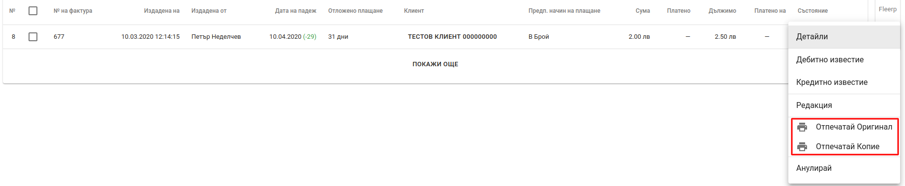

<bullet></bullet> Чрез контекстното меню от екрана с детайли за фактура

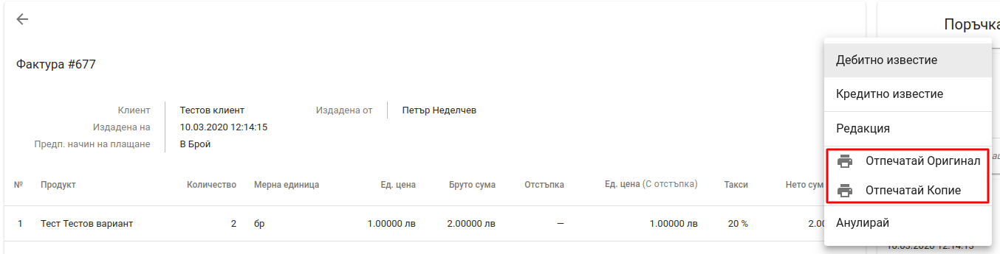

<bullet></bullet> Отпечатване на няколко фактури от списъка с фактури

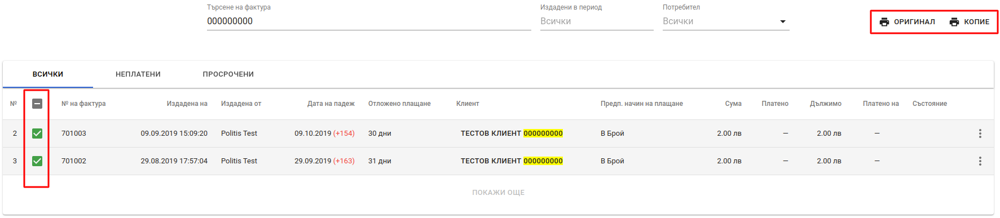

При избиране на която и да е от възможностите за печат на екрана се отваря диалогов прозорец съдържащ документа и даващ възможност за печат или запазване на фактурата във файл. Шаблонът за фактури може да бъде променян.

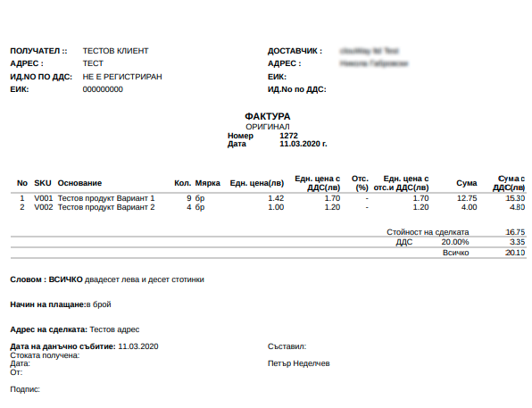

### Мобилно приложение

Достъп до фактурите от мобилното приложение се осъществява чрез меню *Клиентски обекти*. Списък с фактури се намира в детайлите за всеки клиентски обект. 

<split-panel>
  <panel>
    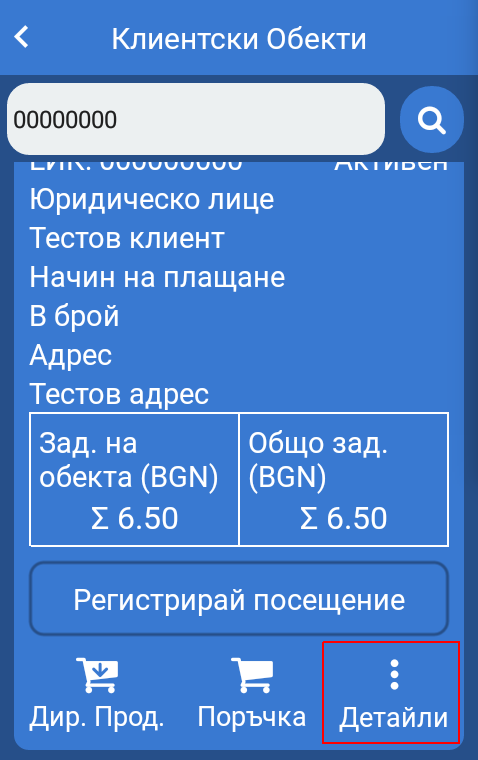
  </panel>
  <panel>
    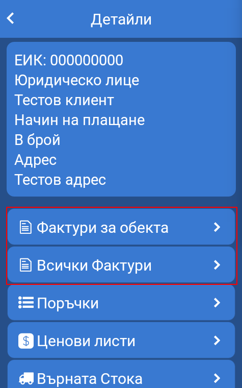
  </panel>
</split-panel>

  

Отпечатването на фактура се осъществява чрез натискане на бутон *Печат* за конкретна фактура от списъка с фактури. Фактура може да бъде разпечата от детайли за поръчка самостоятелно или заедно със стокова разписка.

<split-panel>
  <panel>
    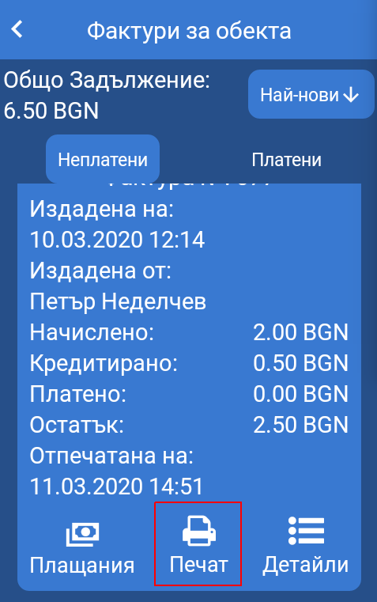
  </panel>
  <panel>
    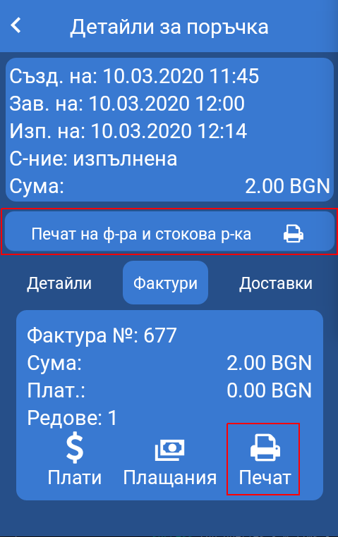
  </panel>
</split-panel>

  

## *Кредитно известие*
Счетоводен документ, с който се намалява данъчната основа на доставка или се нулира данъчната основа при развалянето на доставка, за която доставка вече е издадена фактура.   

Кредитно известие може да бъде издадено в следните случаи:

<bullet></bullet> разваляне на сделка, за която търговеца е издал фактура.
<bullet></bullet> поправяне на грешка във вече издадена фактура. Тези грешки възникват при фактуриране на по-голямо количество стоки или услуги от реалните, които са били предоставени на клиента или при фактуране на цени по-високи от договорените, което е задължило клиента да заплати по-висока стойност за доставка.
<bullet></bullet> да се направи търговска остъпка като се намали данъчната основа към вече издадена фактура.   

  

В Политис кредитно известие се създава от екрана със списък на фактурите чрез избиране на опция *Кредитно известие* от контекстното меню на всяка фактура от списъка.

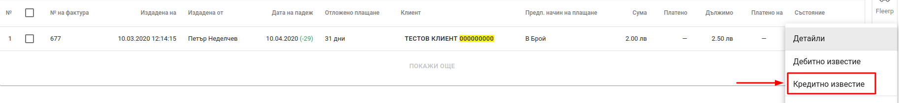

Кредитните известия се визуализират в списъка с фактури по фактурата, за която са издадени. За отпечатване на кредитно известие се използва контекстно меню, което се намира в края на реда от списъка.

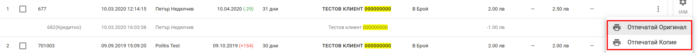

При избиране на опцията за печат на екрана се отваря диалогов прозорец съдържащ документа и даващ възможност за печат или запазване на кредитното известие във файл.

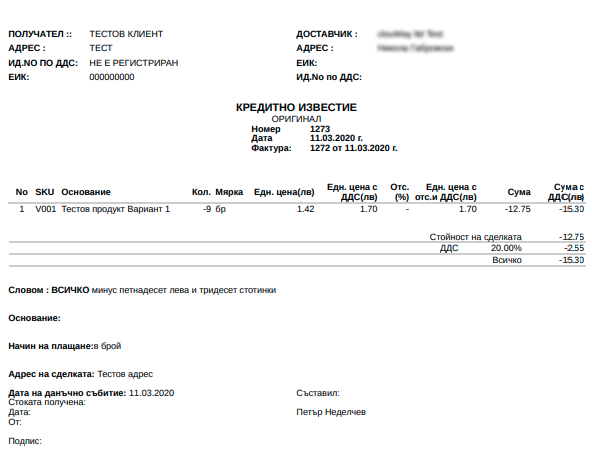

  

## *Дебитно известие*
Счетоводен документ, с който се увеличава данъчната основа на фактура за доставка на стоки и услуги.

Дебитно известие може да бъде издадено в следните случаи:

<bullet></bullet> поправяне на грешка във вече издадена фактура. Тези грешки възниква при фактуриране на по-малко количество стоки или услуги от реалните, които са били предоставени на клиента или при фактуриране на цени по-ниски от договорените, което е задължило клиента да заплати по-ниска стойност за доставка.

  

**В Политис дебитни известия през не са свързани с генерирането на документи за движение на стока**. Издадените дебитни известия следва да *съдържат само услуги*.   
Дебитно известие се създава от екрана със списък на фактурите чрез избиране на опция *Дебитно известие* от контекстното меню на всяка фактура от списъка.

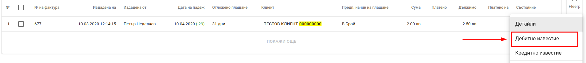

Дебитните известия се визуализират в списъка с фактури по фактурата, за която са издадени. За отпечатване на дебитно известие се използва контекстно меню, което се намира в края на реда от списъка.

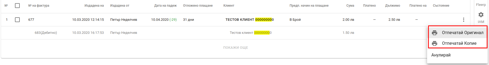

При избиране на опцията за печат на екрана се отваря диалогов прозорец съдържащ документа и даващ възможност за печат или запазване на дебитното известие във файл.

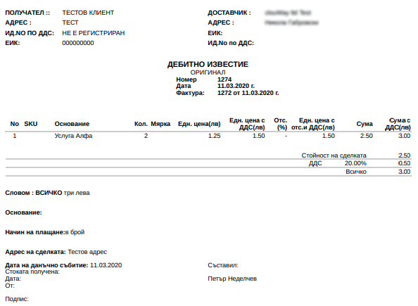

  

## *Стокова разписка*

Търговски документ служещ за приемо-предаване на стоки и услуги, което може да се извърши в различен момент от плащането и издаване на фактура. Стоковите разписки обикновено се издават заедно с фактури. При липса на фактура стоковата разписка може да бъде основание за издаването на фактура.
**Стоковите разписки в Политис се издават автоматично при успешно извършена доставка.**

### Уеб
Отпечатване на стокова разписка може да се извърши по няколко начина:

<bullet></bullet> Чрез контекстно меню в списъка с доставки. Списъка с доставки е достъпен като от главното меню се избере *Продажби* и след това таб *Доставки*.

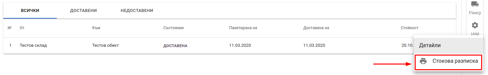

<bullet></bullet> Чрез контекстно меню в детайли за доставка, поръчка или фактура.

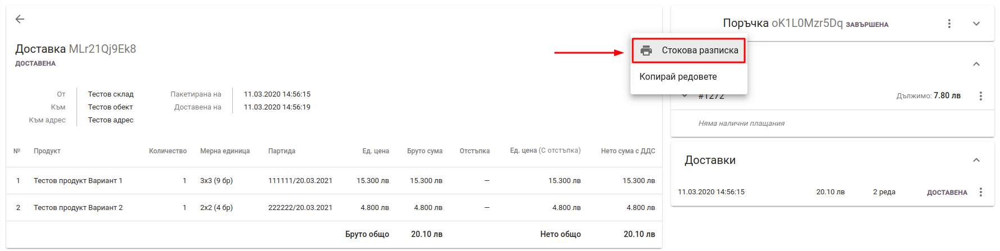

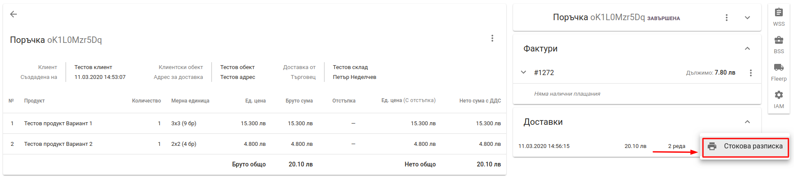

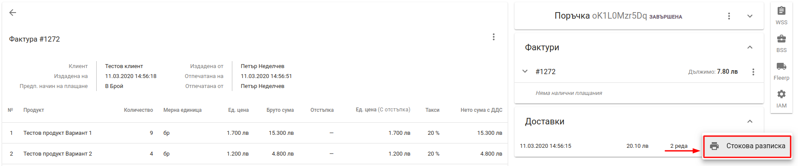

При избиране на опцията за печат на екрана се отваря диалогов прозорец съдържащ документа и даващ възможност за печат или запазване на дебитното известие във файл.

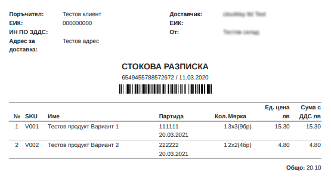

  

### Мобилно приложение

Стокова разписка от мобилното приложение може да се отпечата от екрана за детайли за поръчка самостоятелно или заедно с фактура.

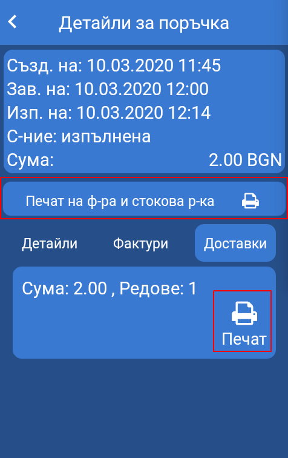

  

## *Списък за опаковане*
Списъкът за опаковане съдържа всички артикули от дадена поръчка и служи за улеснение на складовия персонал за подготовка на доставка. 
Отпечатване на списък за опаковане може да се извърши по няколко начина:

<bullet></bullet> Чрез контекстно меню в детайли за поръчка

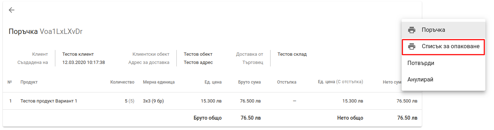

<bullet></bullet> Чрез контекстно меню в списъка с поръчки

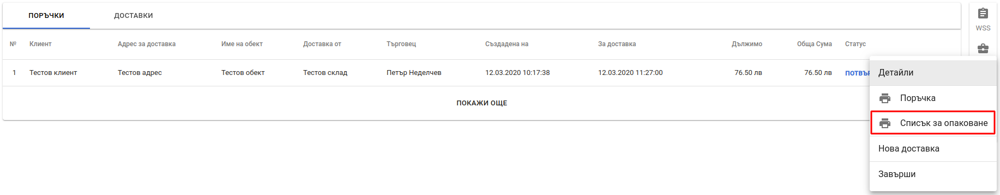

При избиране на опцията за печат на екрана се отваря диалогов прозорец съдържащ документа и даващ възможност за печат или запазване на списъка за опаковане във файл.

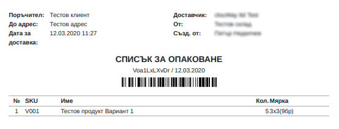

  

## *Заявка за покупка*
Заявката за покупка е документ, който представлява поръчка към даден доставчик на фирмата за предоставяне на стоки или услуги.

В Политис заявка за покупка се създава като от главното меню се избере *Стоков контрол* и след това в таб *Заявки за покупки* се използва бутон за нова заявка намиращ се в долния десен ъгъл на екрана.

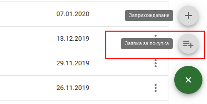

Отпечатване на заявка за покупка може да се извърши от списъка със заявки като от контекстното меню за дадена заявка се избере *Отпечатай заявка*

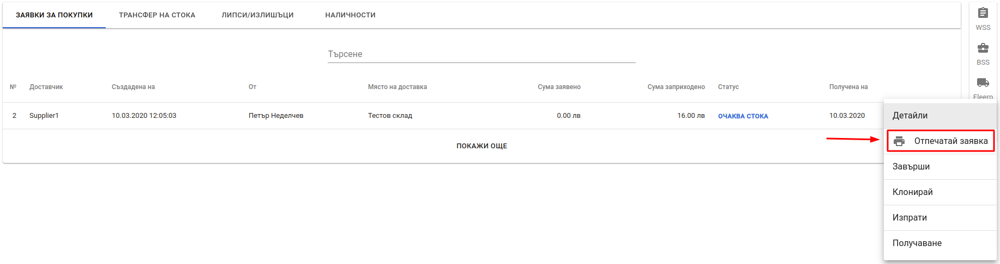

При избиране на опцията за печат на екрана се отваря диалогов прозорец съдържащ документа и даващ възможност за печат или запазване на заявката за покупка във файл.

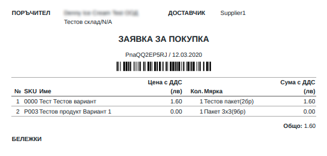

  

## *Протокол за заприхождаване*
Протокола за заприхождаване е документ, който съдържа артикулите от изпълнена заявка за покупка. 

В Политис отпечатването на протокол за заприхождаване може да се отпечата като от главното меню се избере *Стоков контрол* и след това в таб *Заявки за покупки* се избере опция *Протокол за заприхождаване* от контекстното меню на заявки със стату *ЗАВЪРШЕНА*

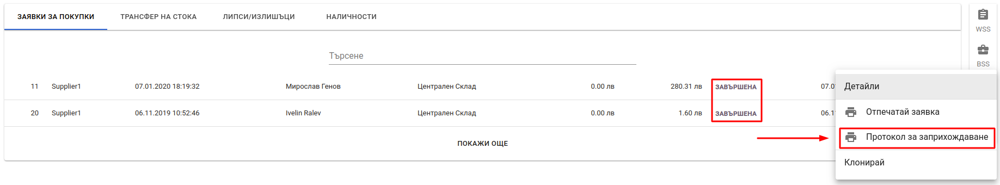

При избиране на опцията за печат на екрана се отваря диалогов прозорец съдържащ документа и даващ възможност за печат или запазване на протокола за заприхождаване във файл.

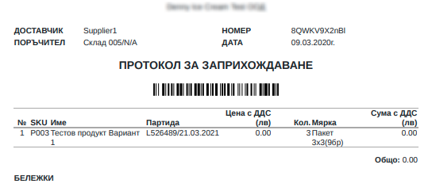

  

## *Заявка за трансфер*
Заявка за трансфер е документ, чрез който се прави искане за прехвърляне на стоки от един склад към друг.

### Уеб

В Политис заявка за трансфер се създава като от главното меню се избере *Стоков контрол* и след това в таб *Трансфер на стока* се използва бутон за нова заявка, намиращ се в долния десен ъгъл на екрана.

Отпечатване на заявка за трансфер може да се извърши от списъка със заявки като от контекстното меню за дадена заявка се избере *Отпечатай заявка*

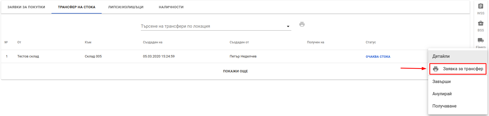

При избиране на опцията за печат на екрана се отваря диалогов прозорец съдържащ документа и даващ възможност за печат или запазване на заявката за трансфер във файл.

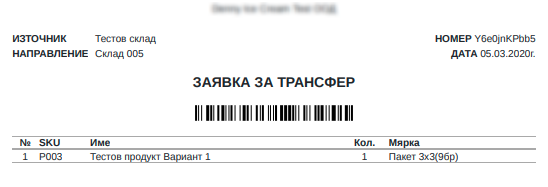

### Мобилно приложение

Заявка за трансфер от мобилното приложение може да се опечата от детайли за трансфер в списъка с трансфери. За целта от главното меню се избира *Управление на стока* и *Трансфер*

<split-panel>
  <panel>
    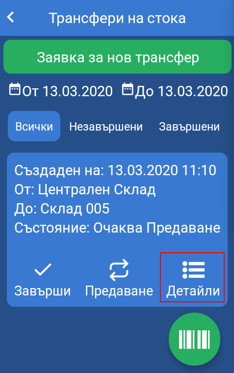
  </panel>
  <panel>
    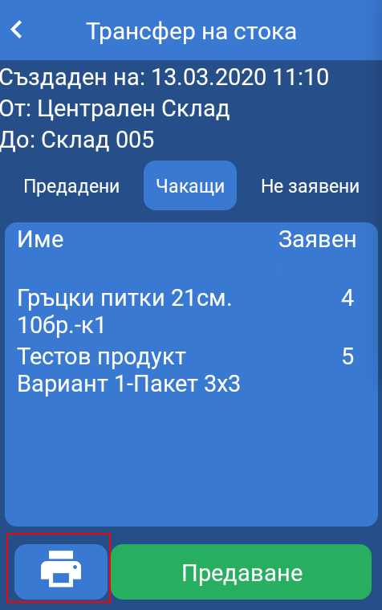
  </panel>
</split-panel>

  

## *Трансферен лист*
Транферният лист съдържа информация за физически извършен трансфер на стока между два склада на компанията. Трансферен лист може да се отпечата само за трансфери със статус *ЗАВЪРШЕН*. Отпечатване на трансферен лист може да се извърши от списъка с трансфери като от контекстното меню за даден завършен трансфер се избере *Трансферен лист*

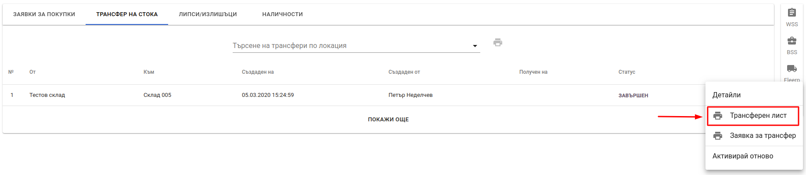

При избиране на опцията за печат на екрана се отваря диалогов прозорец съдържащ документа и даващ възможност за печат или запазване на трансферния лист във файл.

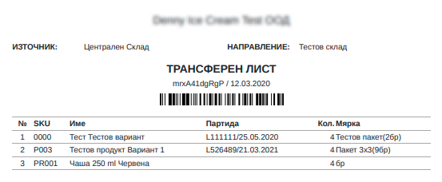

  

## *Протокол за липси и излишъци*
Протокол за липси и излишъци е документ, с който констатираните разлики (липси или излишъци) при инвентаризация се компенсират или заприхождават.

В Политис създаване на протокол за липси и излишъци се създава като от главното меню се избере *Стоков контрол* и след това в таб *Липси/Излишъци* се използва бутон за нов протокол за липси и излишъци, намиращ се в долния десен ъгъл на екрана.

Отпечатване на протокол за липси и излишъци може да се извърши от списъка с протоколи като от контекстното меню за даден протокол се избере *Отпечатай*

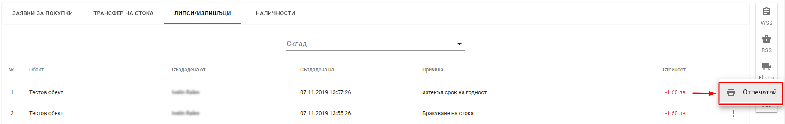

При избиране на опцията за печат на екрана се отваря диалогов прозорец съдържащ документа и даващ възможност за печат или запазване на протокола за липси и излишъци във файл.

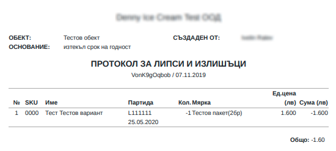