<h1 align="center">
  Работа с фактури
</h1>

Фактурите са свързани с генерирането на документи за движение на стока. Фактурите се генерират след успешно извършена продажба с доставка.

## Операции с фактури

За операции свързани с фактури от главното меню се избира *Фактури*.

На екрана се визуализира списък с издадени фактури.

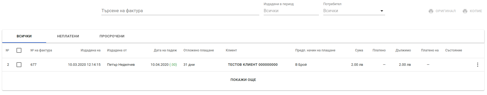

Екрана дава възможност за търсене на фактури по следните параметри: *номер на фактура, ЕИК, ЕГН (за физически лица)*. Има възможност за прилагане на филтри по дата, потребител издал фактурите и по статус на фактурите (платени, неплатени и всички).

Отпечатване на една или множество фактури от списъка с фактури се осъществява чрез поставяне на отметка за всяка фактура, която трябва да бъде отпечатана. След като фактурите са избрани се натиска бутон *Оригинал* или *Копие*, при което се отваря диалогов прозорец за печат или запазване на фактурите във файл.

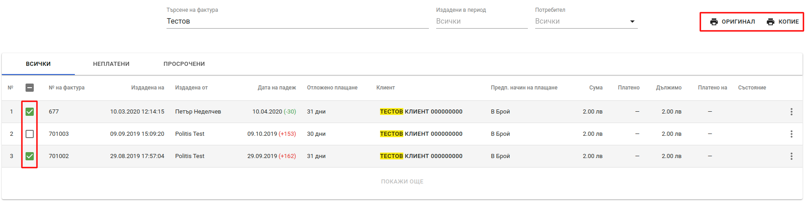

Операциите свързани с конкретна фактура са налични при натискане на бутон, който се намира на края на всеки ред от списъка с фактури. 

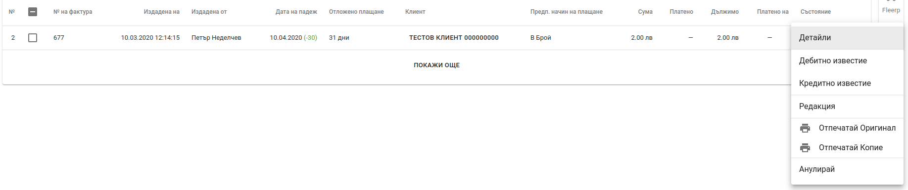

Операции, който са възможни са следните:

* **Детайли** - препратка към екрана с детайли за фактурата и плащанията към нея. Ако фактурата е свързана с движението на стоки (продажба) то информация за свързанието с нея операции *Продажба* и *Доставка* също се визуализират на екрана.

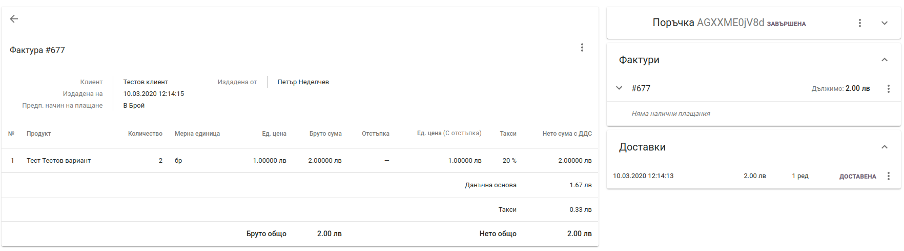

* **Дебитно известие** - създаване на дебитно известие към фактура.
* **Кредитно известие** - издаване на кредитно известие към фактура.
* **Редакция** - дава възможност за редакция на детайли за клиента на фактурата.
* **Опечатай Оригинал** - отваря диалогов прозорец, от който може да се разпетата оригинал на фактурата или да се запази във файл.
* **Отпечатай Копие** - отваря диалогов прозорец, от който може да се разпечата копие на фактурата или да се запази във файл.
* **Анулирай** - анулира фактурата. При избиране на тази операция се отваря диалогов прозорец с поле за причина за анулиране на фактурата.

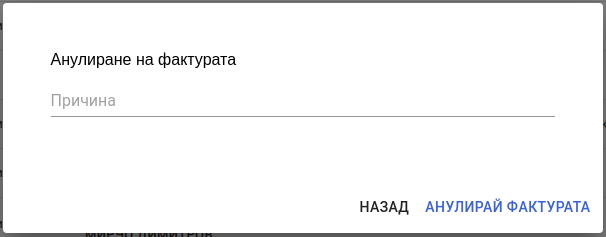

## Отразяване на плащания

Отразяване на плащания към фактури се извършва от екрана с детайли за фактурата. Вдясно от редовете на фактурата се намира информация за плащанията. От контекстното меню се избира операция *Плати*

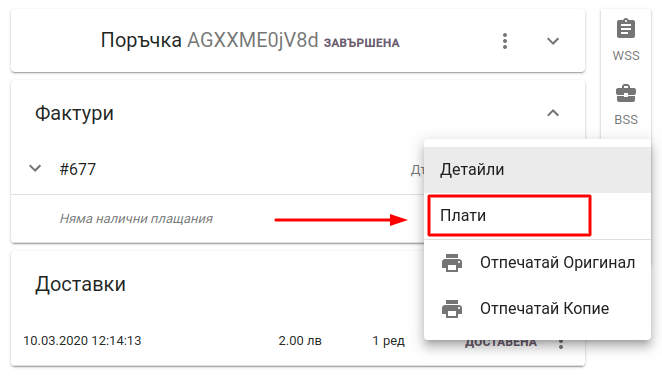

На екрана се показва форма за отразяване на плащане към фактура

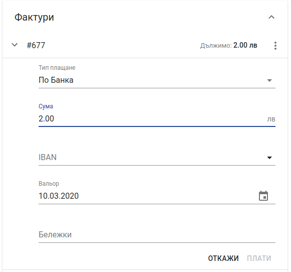

Формата съдържа следните полета:

* **Тип на плащане** - видът на плащането. Възможни са следните типове плащания - *В брой, По Банка, Онлайн, Кредитна карта*. По подразбиране плащането е от тип - **По банка**.
* **Сума** - сума на плащането.
* **IBAN** - номер на сметка, от която е постъпило плащане. Това поле е видимо само при плащания тип - *По банка*.
* **Вальор** - дата, на която е постъпило плащането. Това поле е видимо само при плащания тип - *По банка*.
* **Референт** - лицето извършило плащането. Това поле е видимо само при плащания тип - *В брой, Онлайн, Кредитна карта*.
* **Бележки** - допълнителна информаци за плащането.

**Важно** - отразяване на плащане тип *В брой* не генерира издаване на касов бон.

## Известия към фактури

Дебитното и кредитното известие са данъчни документи, с които се документира изменението на данъчната основа или развалянето на доставката. В случай на такова изменение доставчикът е длъжен да издаде съответното известие към фактурата.

### Кредитно известие
Кредитно известие се издава когато данъчната основа се е изменила в посока намаление или при разваляне на доставката.   
В Политис кредитно известие се издава чрез операциите достъпни в екрана със списъка от фактури. За целта от контекстното меню на конкретна фактура се избира операция *Кредитно известие*

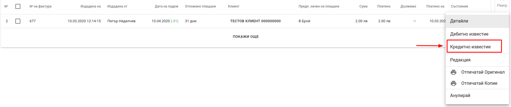

На екрана се визуализира форма за кредитно известие.

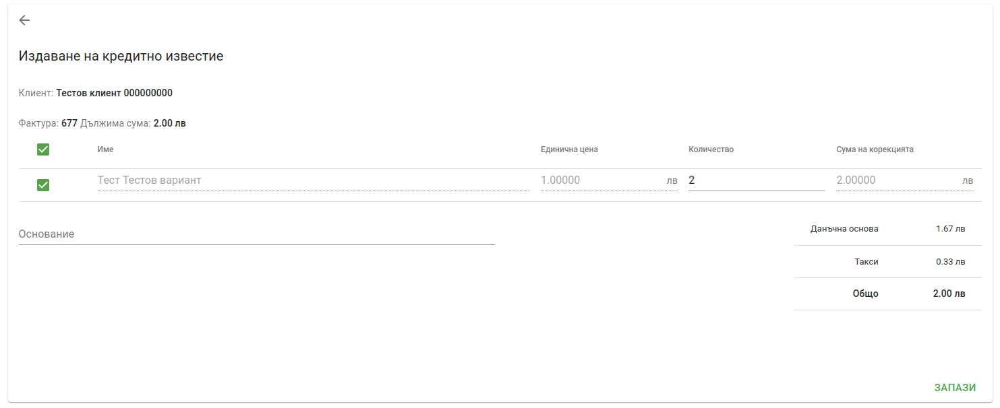

Чрез формата за кредитно известие могат да се издадат два вида кредитни известия.

<bullet></bullet> Кредитно известие за количество - при този вид кредитно известие се променя само количеството да даден ред. Количеството не може да бъде по-голямо от първоначалното количество във фактурата или отрицателно число.

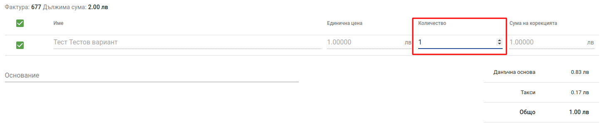

<bullet></bullet> Кредитно известие за сума - този вид кредитно известие дава възможност за промяна на общата сума на даден ред или редове от фактурата. За да се направи редакция на сумата на реда, количеството трябва да бъде променено на нула.

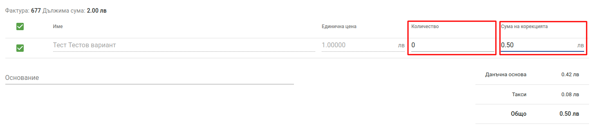

* *Основание* - причина за издаване на известието.

Кредитните известия се визуализират в списъка с фактури под фактурата, за която са издадени. Кредитните известия могат да бъдат отпечатани и анулирани.

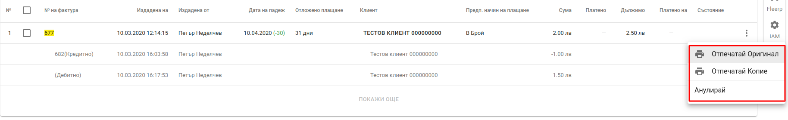

### Дебитно известие
Издадените дебитни известия през тази фунционалност, не са свързани с генерирането на документи за движение на стока. Издадените дебитни известия следва да съдържат само услуги. Дебитно известие се издава чрез операциите достъпни в екрана със списъка от фактури. За целта от контекстното меню на конкретна фактура се избира операция *Дебитно известие*

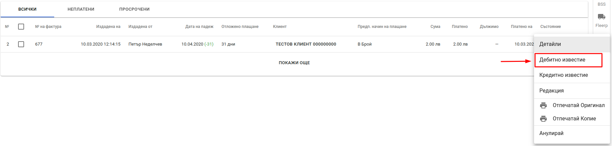

На екрана се визуализира форма за дебитно известие.

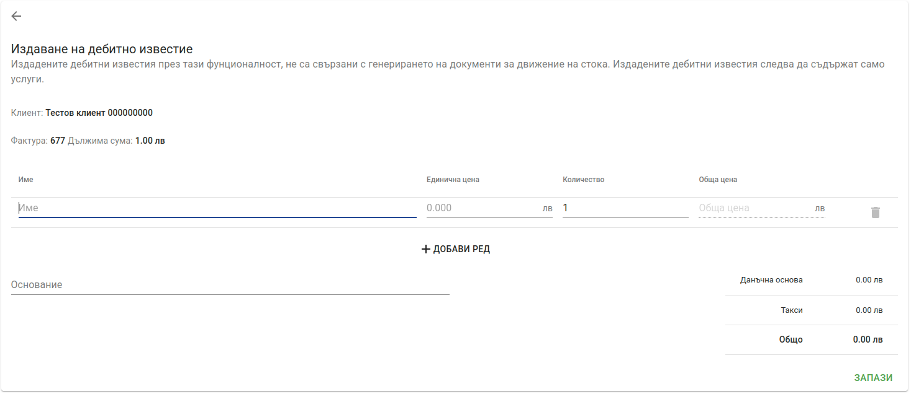

Формата предоставя следните полета:

* **Име** - наименование на услугата, за която се издава дебитно известие.
* **Единична цена** - единична цена на услугата.
* **Количество** - количество на услугата.
* **Обща цена** -  обща сума на реда изчислена като *единична цена х количество*
* **Основание** - причина за издаване на дебитно известие.

След попълване на необходимите полета се натиска бутон *Запази*.   
Дебитните известия се визуализират в списъка с фактури под фактурата, за която са издадени. За разлика от кредитните известия, дебитните известия могат да бъдат само отпечатани, но **не могат да се анулират**.

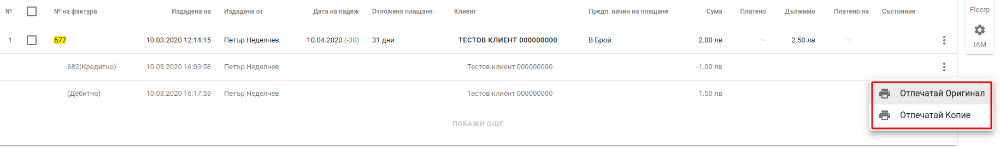
