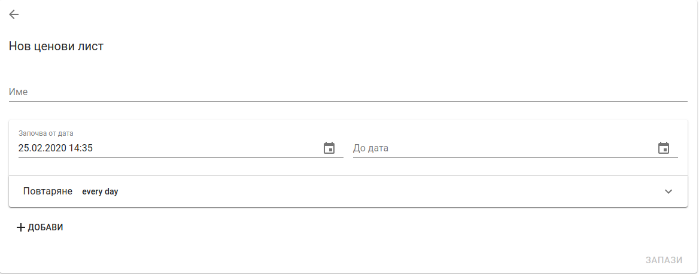

<h1 align="center">
  Управление на ценови политики
</h1>

POLITIS поддържа функционалност за създаване и управление на ценови листи. 
Налични са следните функционалности:
1. Управление на отстъпки - позволява добавяне на отстъпки за дивизии и варианти към ценови лист;
2. Сравнение  на ценови листи - позволява сравнение между два ценови листа за различни варианти;

За достъп до функционалности свързани с управлението на ценови листи се избира *Ценови политики* от главното меню

### Ценови листи

Ценовият лист е списък от цени за конкретни дивизии и/или варианти.

#### Създаване на ценови лист

От таб Ценови листи се натиска бутона за добавяне на нов ценови лист в долния десен ъгъл

След натискане на бутона се зарежда форма за нов ценови лист

Формата дава възможност за попълване на следните опции:
* **Име** - наименование на ценовия лист. Това поле е *задължително*.

След натискане на бутона *Запази* при успешно създаване на ценови лист се визуализира таб Ценови листи.

#### Редакция на ценови лист

Редакция на ценови лист се извършва като от списъка с ценови листи се избере опция *Редактирай* за съответния ценови лист

При успешно изпълнение на командата се зарежда форма за редакция на ценови лист

След нанасяне на необходимите промени се натиска бутона *Запази*

#### Изтриване на ценови лист

Изтриване на ценови лист се извършва като от списъка с ценови листи се избере опция *Изтрий* за съответния ценови лист

При избиране на опцията за изтриване се показва екран за потвърждение на операцията

#### Управление на отстъпки

Добавяне на отстъпки към ценови лист се извършва като от списъка с ценови листи се избере опция *Отстъпки* за съответния ценови лист

При успешно изпълнение на командата се зарежда екрана за отстъпки към ценовия лист.

В ценовата листа могат да се добавят два вида отстъпки:
1. Отстъпки за дивизии 
2. Отстъпки за варианти

##### Отстъпки за дивизии
* *Дивизия* - от падащ списък се избира дивизия, за която да се приложи избраната отстъпка. Това поле е *задължително*.
* *Отстъпка* - отстъпка към дивизия в проценти. *Стойността трябва да е по-голяма от 0*. 

След нанасяне на необходимите промени се натиска бутона *Запази*

##### Отстъпки за варианти
* *Име на варианта* - вариант, към който да се приложи избраната отстъпка. Предлага възможност за търсене на варианти. Това поле е *задължително*.
* *Цена на дребно* - цена на дребно за варианта от продуктовия каталог.
* *Отстъпка към дивизия* - текуща отстъпка към варианта за дивизия във формат - *цена на дребно/намаление (процент)*
* *Отстъпка* - може да се избере между два вида отстъпки: отстъпка в проценти и крайна цена. Това поле е *задължително*.

 

Отстъпката в проценти се прилага върху цената на дребно на варианта. Крайната цена замества изцяло цената на дребно за избрания вариант.

* *Намаление* - сумата, която се приспада от цената на дребно при прилагане на остъпка в проценти.
* *Крайна цена* - цена на варианта след приспадане на избраните отстъпки.

След нанасяне на необходимите промени се натиска бутона *Запази*

### Сравнение на ценови листи

За достъп до сравнение на ценови листи се избира таб *Сравни ценови лист*

 

В екрана се виждат следните полета:
* *Търсене на вариант* - предлага търсене на вариант по име, SKU или код при доставчик. Има възможност за избиране на десет варианта.
* *Търсене на ценови лист* - от падащ списък се избира ценови лист, който да се приложи към избрания вариант. Има възможност за избиране на два ценови листа.

При избиране на вариант и ценови лист се попълва таблицата под полетата

В таблицата за сравнение сa налични следните колони:
* *Име на варианта* - наименование на избрания вариант.
* *Цена на едро* - цена на едро за избрания вариант от продуктовия каталог.
* *Цена на дребно* - цена на дребно за избрания вариант от продуктовия каталог.
* *Отстъпка по подразбиране за дивизия/1* - не е налична. 
* *Отстъпка по подразбиране за дивизия/2* - не е налична.
* *Отстъпка за дивизия ценови лист: 1* - отстъпка за дивизия по ценнови лист: 1 във формат - *цена на дребно/намаление (процент)*.
* *Отстъпка за дивизия ценови лист: 2* - отстъпка за дивизия по ценнови лист: 1 във формат - *цена на дребно/намаление (процент)*.
* *Отстъпка за вариант ценови лист: 1* - отстъпка за вариант по ценнови лист: 1 във формат - *цена на дребно/намаление (процент)*.
* *Отстъпка за вариант ценови лист: 2* - отстъпка за вариант по ценнови лист: 1 във формат - *цена на дребно/намаление (процент)*.
* *Крайна цена ценови лист: 1* - крайна цена за вариант след прилагане на ценови лист: 1.
* *Крайна цена ценови лист: 2* - крайна цена за вариант след прилагане на ценови лист: 2.

### Назначаване на ценови лист към клиент и клиентски обект

За да бъдат приложени остъпки за продуктите към клиент и/или клиентския обект трябва да се назначат ценови листи. За функционалности свързани с клиенти и клиентски обекти се избира *Клиенти* от главното меню

#### Клиенти

В таб *Клиенти* след намиране на клиента се избира опция *Детайли*

След успешно изпълнение на командата се визуализират детайли за клиент. В таб *Ценови листи* се натиска бутона *Добави ценова листа*

На екрана се появява поле за търсене на ценови листи.

След избиране на ценова листа се натиска бутона за запазване. От таб "Ценови листи" може да се променят отстъпките към ценовата лист и да се премахват ценови листи от клиент.

#### Клиентски обекти

В таб *Клиентски обекти* след намиране на клиента се избира опция *Детайли*

След успешно изпълнение на командата се визуализират детайли за клиентски обект. В таб *Ценови листи* се натиска бутона *Добави ценова листа*

На екрана се появява поле за търсене на ценови листи.

След избиране на ценова листа се натиска бутона за запазване. От таб "Ценови листи" може да се променят отстъпките към ценовата лист и да се премахват ценови листи от клиент.

### Специални отстъпки

Специалните отстъпки са вид отстъпки, който се прилагат директно към клиент/клиентски обект без да е необходимо да се добавят към ценови листи. Добавянето на специални отстъпки се прави като от детайли на клиент/клиентски обект се избира таб *Специални отстъпки*.

Специалните отстъпки са два вида:
1. Отстъпки за дивизии
2. Отстъпки за варианти

##### Отстъпки за дивизии
* *Дивизия* - от падащ списък се избира дивизия, за която да се приложи избраната отстъпка. Това поле е *задължително*.
* *Отстъпка* - отстъпка към дивизия в проценти. *Стойността трябва да е по-голяма от 0*. 

След нанасяне на необходимите промени се натиска бутона *Запази*

##### Отстъпки за варианти
* *Име на варианта* - вариант, към който да се приложи избраната отстъпка. Предлага възможност за търсене на варианти. Това поле е *задължително*.
* *Цена на дребно* - цена на дребно за варианта от продуктовия каталог.
* *Отстъпка към дивизия* - текуща отстъпка към варианта за дивизия във формат - *цена на дребно/намаление (процент)*.
* *Отстъпка* - може да се избере между два вида отстъпки: отстъпка в проценти и крайна цена. Това поле е *задължително*.

### Отправни точки при ценообразуване

1. "Специалните цени" към "Клиент" или "Клиентски обект" са по висок приоритет от ценовата листа, ако има специални цени, отстъпките по ценови листи се игнорират.
2. "Специалните цени" към "Клиент" и "Клиентски обект" са с еднакъв приоритет, тоест търси се най-добрата измежду тях(взима се в предвид т.3)
3. "Фиксирана цена" има по-голям приоритет от отстъпка в ценовата листа.
4. Ако има отстъпки по точната дивизия, то отстъпките по родителите(ако има такива) на тази дивизия не се вземат под внимание. Важат само по конкретната дивизия.
5. Ако дадена дивизия има описани отстъпки в повече от една ценова листа, то тогава се избира най-голямата от тях.