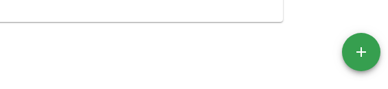

<h1 align="center">
  Управление на продукти
</h1>

### Продуктов каталог

За достъп до фунционалности свързани с управлението на продукти се избира Продуктов каталог от главното меню

### Продукти

Всеки продукт в Политис съдържа информация за име, тип, мерна единица, доставчик. Към продуктите могат да се създават варианти, а самите варианти да се организират в опаковки. Всеки продукт може да бъде зачислен към определена дивизия за по-лесна обработка  и ценообразуване.

#### Нов продукт

От продуктовия каталог се натиска бутона за добавяне на нов продукт в долния десен ъгъл

След натискане на бутона се зарежда форма за нов продукт

Регистрацията на нов продукт дава възможност за попълване на следните опции:
* **Име на продукта** - наименование на продукта. Това поле е *задължително*.
* **Тип на продукта** - типът категоризира продуктите по сходни качества. Пример за типове продукти: хранителни стоки, нехранителни стоки, дрехи, електроуреди и т.н. Това поле е *задължително*.
* **Дивизия** - дивизиите се използват за групиране на продуктите за по-лесна обработка и в ценообразуването.
* **Мерна единица** - основната мерна единица, в която се измерва продукта - грам(гр.), брой(бр.) и т.н. Това поле е *задължително*.
* **Доставчик** - името на доставчика на продукта. Това поле е *задължително*.
* **Марка** - търговско наименование, означаващо производителя.
* **Описание** - допълнителна информация за продукта, която се визуализира в детайли за продукт.
* **Тегло (гр.)** - тегло на продукта в грамове.
* **Дробни числа за количество** - тази опция е подхдяща за продукти, които се продават в мерни единици използващи десетични дробни числа - килограм, литър, метър и  т.н.
* **Проследяване на партиди** - тази опция е подходяща за продукти, чиято партида трябва да може да бъде проследена в различните етапи на продуктообмена.

След натискане на бутона *Запази* при успешно създаване на продукта се визуализират детайли за продукта

#### Редакция на продукт

Редакция на продукта се извършва като от продуктовия каталог се избере опция *Редакция*

При успешно изпълнение на командата се зарежда форма за редакция на продукт

След нанасяне на необходимите промени се натиска бутона *Запази*

#### Изтриване на продукт

Преди да се пристъпи към изтриване на продукт първо трябва последователно всички варианти с техните пакети да бъдат изтрити. След като всички варианти са изтрити, от продуктовия каталог се избира опция *Изтрий* за съответния продукт

При избиране на опцията за изтриване се показва екран за потвърждение на операцията:

### Варианти
Към всеки продукт може да се добавят различни варианти. Всеки вариант съдържа информация за име, SKU, цени. Вариантите могат да се организират в опаковки.

**Кога добавяме вариант на продукт** - вариант се добавя, когато продуктът се предлага в различни разновидности. Пример: Дреха в цветове син и черен. Всеки цвят е различен вариант. Различните варианти може да имат различни цени.

#### Добавяне на вариант

Добавяне на вариант към продукт се прави от екрана с детайли. От продуктовия каталог се избира опция *Детайли*

Бутона за първоначално добавяне на вариант се визуализира в центъра на екрана със зелен цвят.

При успешно изпълнение на командата се зарежда форма за нов вариант

Формата за нов вариант дава възможност за попълване на следните опции:
* **Име на варианта** - наименование на варианта. Това поле е *задължително*.
* **SKU** - SKU (Stock Keeping Unit) уникален идентификатор на складовата единица. Това поле е *задължително*.
* **Баркод** - баркод на варианта. Това е баркодът, който се намира върху единичната опаковка на варианта.
* **Код при доставчик** - уникален номер, чрез които варианта се завежда в системата. Код при доставчик може да се изпозлва за търсене на варианта.
* **Описание** - допълнителна информация за варианта.
* **Покупна цена** - цена, по която варианта се закупува от доставчик. Това поле е *задължително*
* **Цена на едро** - цена, по която варианта се продава при търговия на едро. Това поле е *задължително*
* **Цена на дребно** - цена, по която варианта се продава при търговия на дребно. Това поле е *задължително*
* **Идентификатори** - използва се за връзка с външни системи.

След натискане на бутона *Запази* при успешно създаване на вариант се визуализират детайли за продукта

След първоначално създаване на вариант, бутонът за нов вариант се премества в долния десен ъгъл на екрана.

#### Редакция на вариант

Редакция за вариант се извършва по един от следните начини:
* от детайли за продукта се избере опция *Редакция*

* от продуктовия каталог се избере опция *Редакция* за варианта

При успешно изпълнение на командата се зарежда форма за редакция на вариант

След нанасяне на необходимите промени се натиска бутон *Запази*. При успешно запазване се визуализират детайли за продукта.

#### Изтриване на вариант

Изтриване на вариант може да се извърши по едни от следните начини:
* от детайли за продукта се избере опция *Изтрий* за съответния вариант

*  от продуктовия каталог се избере опция *Изтрий* за съответния вариант

При избиране на опцията за изтриване се показва екран за потвърждение на операцията:

**Забележка:** - изтриването на вариант или опаковка изисква да няма наличности в работните обекти.

###Пакети
#### Добавяне на размер на пакет

Добавяне на размер на пакет може да се извърши по един от следните начини:
* от детайли за продукта се избере опция *Добави размер на пакет*

* от продуктовия каталог се избере опция *Добави размер на пакет* за варианта

При успешно изпълнение на командата се зарежда форма за нов размер на пакет

Формата за нов размер на пакет дава възможност за попълване на следните опции:
* **Име на размера** - наименование на пакета. Това поле е *задължително*.
* **Количество в пакета** - брой артикули в пакета. Това поле е *задължително*.
* **SKU** - SKU (Stock Keeping Unit) уникален идентификатор на складовата единица.
* **Баркод** - баркод на пакета. Това е баркодът, който се намира върху пакета - кутия, кашон, палет и т.н.
* **Код при доставчик** - уникален номер, чрез които пакета се завежда в системата. Код при доставчик може да се изпозлва за търсене на пакети.
* **Описание** - допълнителна информация за пакета.
* **Тегло (гр.)** - тегло на пакета в грамове.
* **Покупна цена** - цена, по която пакета се закупува от доставчик. Това поле е *задължително* ако опцията *Пропорционални цени* е изключена.
* **Цена на едро** - цена, по която пакета се продава при търговия на едро. Това поле е *задължително* ако опцията *Пропорционални цени* е изключена.
* **Цена на дребно** - цена, по която пакета се продава при търговия на дребно. Това поле е *задължително* ако опцията *Пропорционални цени* е изключена.
* **Пропорционални цени** - цените на пакета се формират автоматично като се умножи количеството на пакета по съответните цени във варианта. Когато тази опция е изключена цените на пакета трябва да се въведат ръчно. Тази опция е включена по подразбиране.  
* **Продажба на частично количество** - тази опция е подходяща за пакети, които могат да бъдат разопаковани и да се продават на частични количества. 
* **Идентификатори** - за връзка с външни системи

#### Редакция на размер на пакет

Редакция на пакет може да се извърши по един от следните начини:
* от детайли за продукта се избере *Редакция* за пакета

* от продуктовия каталог се избере опция *Редакция* за пакета

При успешно изпълнение на командата се зарежда форма за редакция на пакет

След нанасяне на необходимите промени се натиска бутон *Запази*. При успешно запазване се визуализират детайли за продукта.

#### Изтриване на размер на пакет

Изтриване на размер на пакет може да се извърши по един от следните начини:
* от детайли за продукта се избере опция *Изтрий* за съответния пакет

* от продуктовия каталог се избере опция *Изтрий* за съответния пакет

При избиране на опцията за изтриване се показва екран за потвърждение на операцията:

**Забележка:** - изтриването на вариант или опаковка изисква да няма наличности в работните обекти.