<h1 align="center">
  Product Managment
</h1>

### Product catalog

To access product management related functionality, select Product Catalog from the main menu.

### Products

Each Politis product contains information on name, type, unit of measure, supplier. Variants can be created for the products, and the variants themselves can be organized in packs. Each product can be assigned to a specific division for easier processing and pricing.

#### New product

From the product catalog, click the button to add a new product in the bottom right corner.

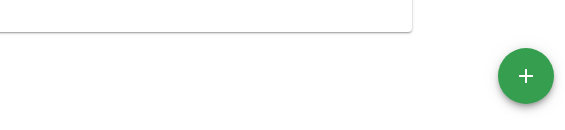

A new product form is loaded after pressing the button.

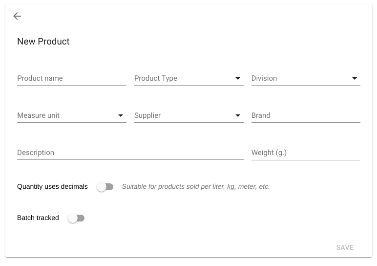

The registration of a new product enables you to fill in the following options:
* **Product name** - Product name. This field is *required*.
* **Product type** - The type categorizes products by similar qualities. An example of product types: food, non-food, clothing, electrical appliances, etc. This field is *required*.
* **Division** - Divisions are used to group products for easier processing and pricing.
* **Unit of measure** - the basic unit of measure in which the product is measured - gram (g), number (pcs), etc. This field is *required*.
* **Supplier** - the name of the product supplier. This field is *required*.
* **Brand** - trade name meaning manufacturer.
* **Description** - additional product information that is displayed in product detail.
* **Weight (g)** - Weight of the product in grams.
* **Quantity Numbers** - This option is suitable for products sold in units using decimal fractions - kilograms, liters, meters, etc.
* **Batch Tracking** - This option is suitable for products whose batch must be traceable at different stages of product exchange.

After clicking the *Save* button, product details are displayed when the product is successfully created.

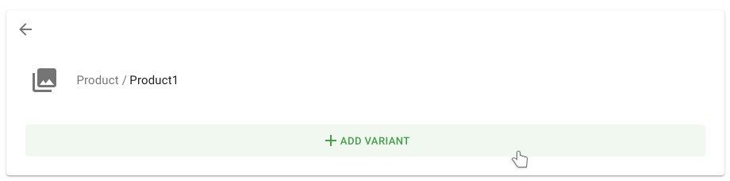

#### Edit product

Edit the product by selecting *Edit* from the product catalog.

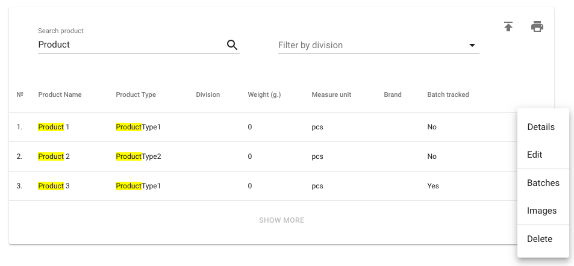

When the command is successfully executed, a product edit form is loaded.

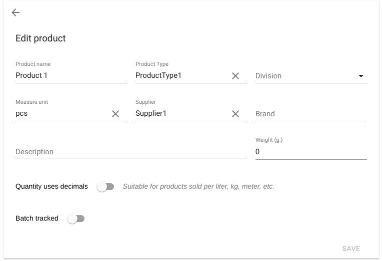

After making the necessary changes, press the button *Save*.

#### Delete product

Before deleting a product, all variants with their packs must be sequentially deleted. After all variants have been deleted, the *Delete* option for the respective product is selected from the product catalog.

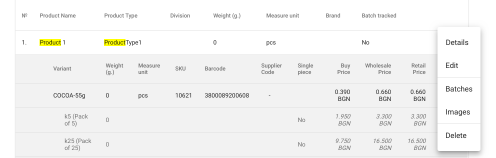

When selecting the *Delete* option, a confirmation screen is displayed:

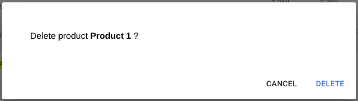

### Variants

Different variants can be added to each product. Each variant contains information about name, SKU, prices. The variants can be organized in packs.

**When we add a product variant** - A variant is added when the product is available in different varieties. Example: Clothes in blue and black. Each color is a different variant. Different variants may have different prices.

#### New variant

Adding a vatiant to a product is done from the details screen. The *Product Details* option is selected from the product catalog.

The button for initially adding a vatiant is displayed in the center of the screen in green.

When the command is successfully executed, a new variant form is loaded

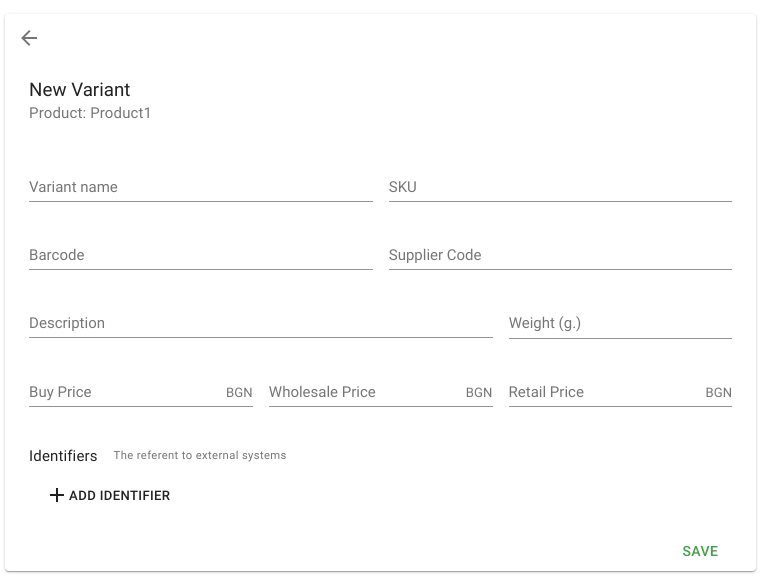

The new variant form allows you to fill in the following options:
* **Variant name** - variant name. This field is *required*.
* **SKU** - SKU (Stock Keeping Unit) is a unique identifier for a stock unit. This field is *required*.
* **Barcode** - Barcode of the variant. This is the barcode that is placed on the variant pack.
* **Provider code** - unique number by which the variant is entered into the system. A vendor code can be used to look for a variant.
* **Description** - additional information about the variant.
* **Purchase price** - the price at which the variant is purchased from a supplier. This field is *required*
* **Wholesale price** - the price at which the variant is sold at wholesale. This field is *required*
* **Retail Price** - Price at which the variant is sold at retail. This field is *required*
* **Identifiers** - Used to connect to external systems.

After clicking the *Save* button, the product details are displayed when the variant is successfully created.

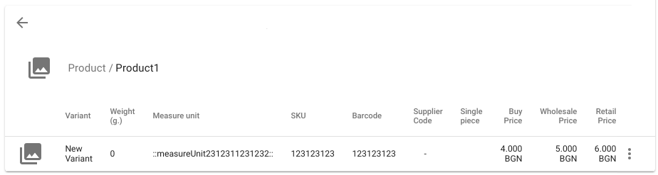

After initially creating a variant, the button for the new variant moves to the bottom right corner of the screen.

#### Variant edit

Editing a variant is done in one of the following ways:
* option *Edit* is selected from product details.

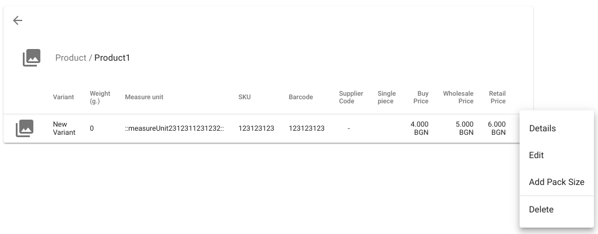

* the *Edit* option for the variant is selected from the product catalog

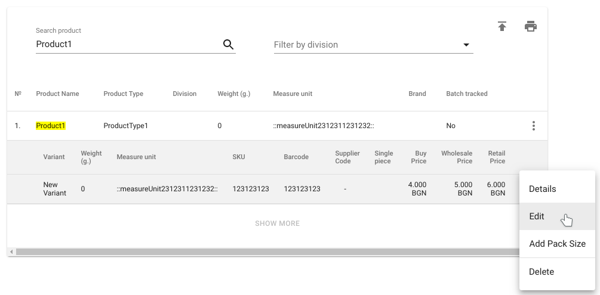

If the command is successfully executed, a variant edit form is loaded.

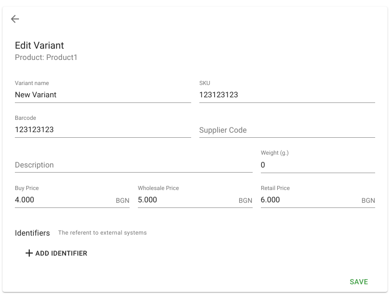

After making the necessary changes, press the *Save* button. When successfully saved, product details are displayed.

#### Variant deletion

Deleting a variant can be done in one of the following ways:
* from the product details select *Delete* option for the respective variant

* the *Delete* option for the appropriate variant is selected from the product catalog

When selecting the **Delete** option, a confirmation screen is displayed:

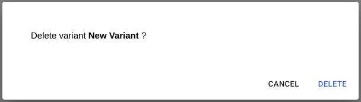

**Note:** - deleting a variant or pack requires that there is no stock of the product in the warehouses.

### Packs
#### Add a pack size

Adding a pack size can be done in one of the following ways:
* option is selected from product details *Add pack size*

* select *Add pack size* option from product catalog

When the command is successfully executed, a new pack size form is loaded.

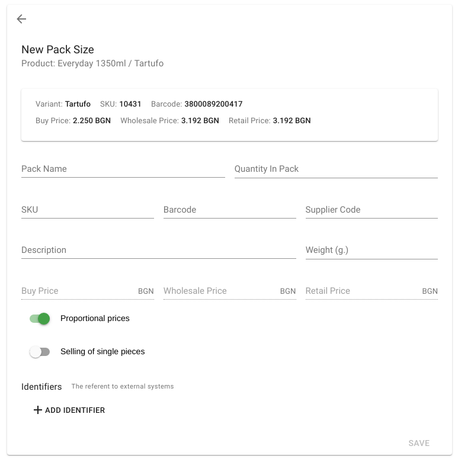

The new pack size form allows you to fill in the following options:
* **Size name** - pack name. This field is *required*.
* **Quantity in the pack** - number of items in the pack. This field is *required*.
* **SKU** - SKU (Stock Keeping Unit) is a unique identifier for a stock unit.
* **Barcode** - Barcode of the pack. This is the barcode that is on the pack - box, carton, pallet, etc.
* **Provider code** - unique number by which the pack is entered into the system. A vendor code can be used to search for pack.
* **Description** - additional pack information.
* **Weight (g)** - weight of the pack in grams.
* **Purchase price** - the price at which the pack is purchased from a supplier. This field is *required* if the *Proportional Prices* option is off.
* **Wholesale price** - the price at which the pack is sold at wholesale. This field is *required* if the *Proportional Prices* option is off.
* **Retail price** - the price at which the pack is sold at retail. This field is *required* if the *Proportional Prices* option is off.
* **Proportional prices** - the prices of the pack are formed automatically by multiplying the quantity of the pack by the corresponding prices in the variant. When this option is off, the pack prices must be entered manually. This option is enabled by default.
* **Partial Sale** - This option is suitable for packs that can be unpacked and sold in partial quantities.
* **Identifiers** - for connection to external systems

#### Editing a pack size

Editing a pack can be done in one of the following ways:
* from the product details select *Edit* for the pack

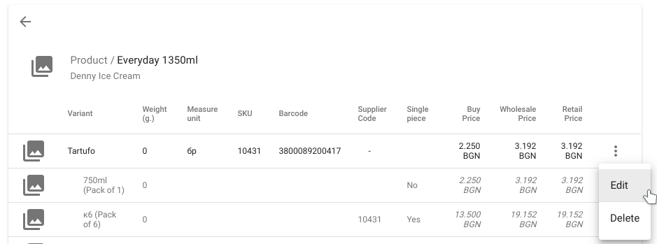

* the *Edit* option for the pack is selected from the product catalog

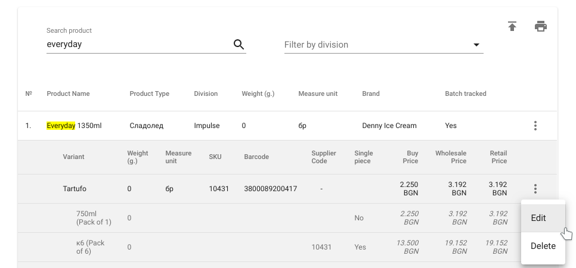

When the command is successfully executed, a pack edit form is loaded.

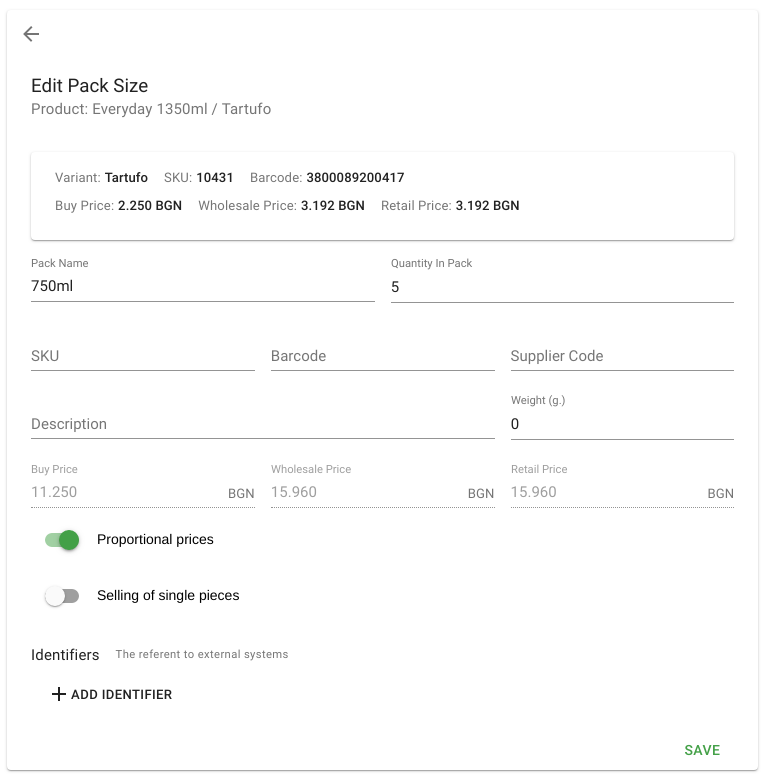

After making the necessary changes, press the *Save* button. When successfully saved, product details are displayed.

#### Deleting a pack size

Deleting a pack size can be done in one of the following ways:
* from the product details select *Delete* option for the respective pack

* от продуктовия каталог се избере опция *Изтрий* за съответния пакет
* the *Delete* option for the relevant pack is selected from the product catalog

When selecting the delete option, a confirmation screen is displayed:

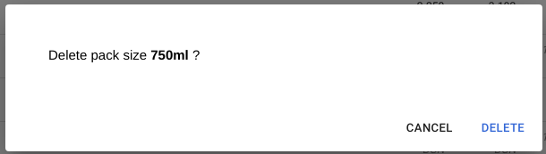

**Note:** - deleting a variant or pack requires that there is no stock of the product in the warehouses.
