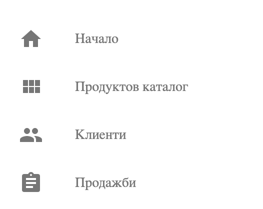
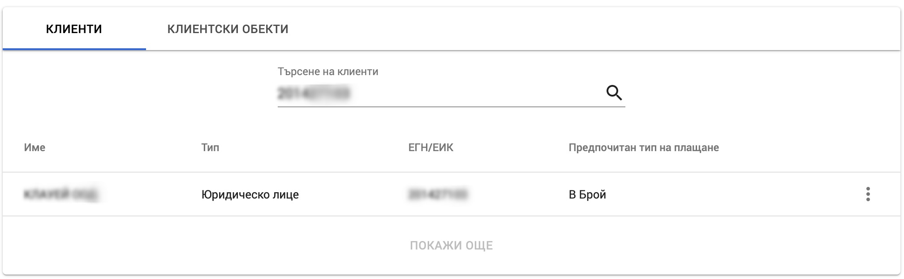
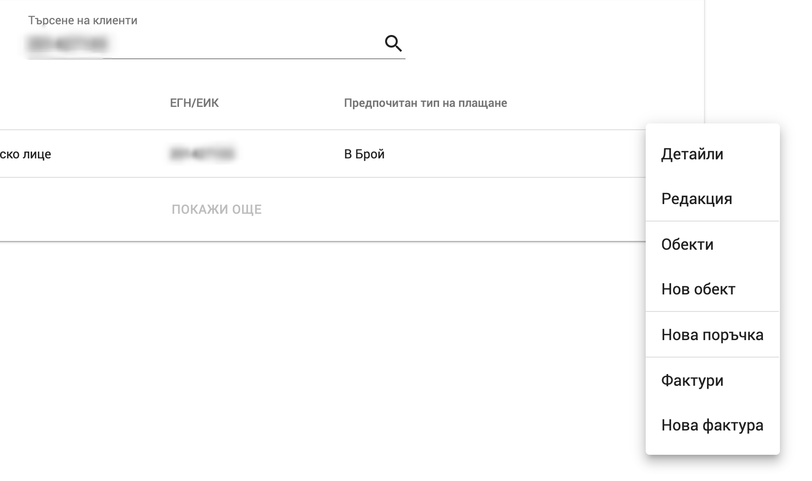
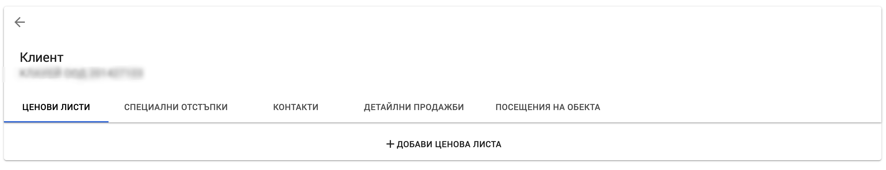
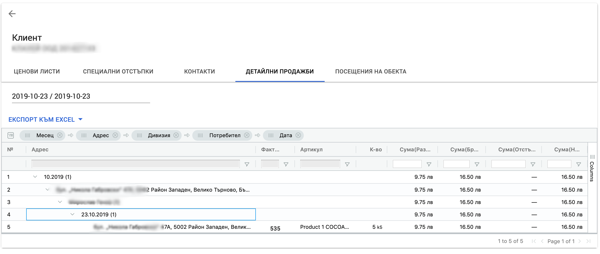
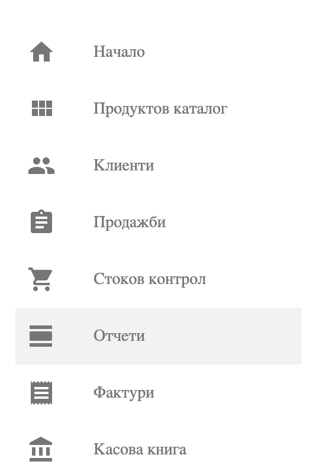
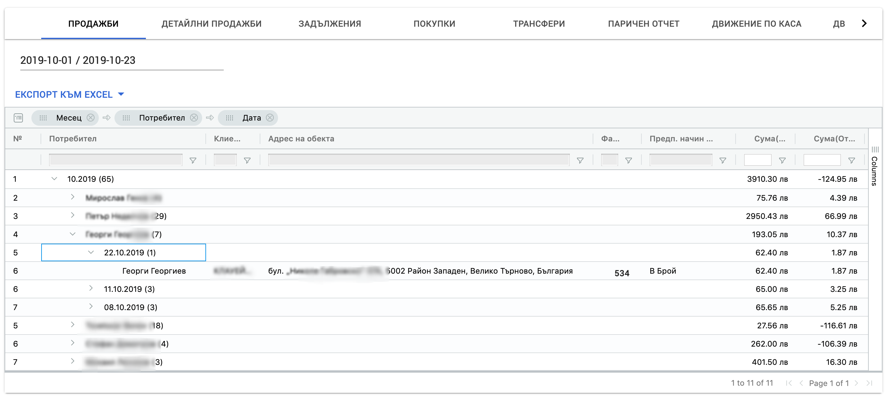
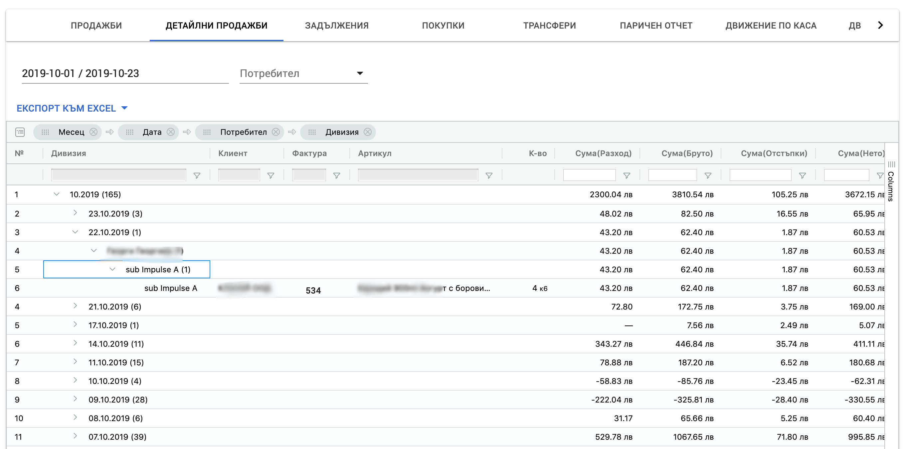

<h1 align="center">
  Отчети
</h1>

### Отчет Продажби

Отчетите за продажби на клиента 

####  За Конкретен Клиент

За да се изготви отчета за продажби на конкретен клиент, трябва от главното меню да се избере "Клиенти".

Има възможност да се намери съответния, за който да се изготви отчет. Примерна визуализация за такъв клиент е показана на екрана по-долу.

От менюто на избрания клиент, се избират "Детайли"

При което се показват детайлите на клиента. 

След избиране на таба "Детайлни Продажби" се показва отчета за детайлни продажби за сътоветния клиент, в който след задаване на периода на продажбите се визуализа информацията за извършените такива.

#### За Множество Клиенти

Отчетът продажби за множество клиенти се визуализира в отчет "Продажби" и отчет "Детайлни Продажби" на главно меню "Отчети". В детайлния отчет се визуализират продажбите по редове и това дава възможност за по-детайлен анализ.

За да достигнете до този вид отчети трябва да изберете главно меню "Отчети":

След което трябва да се визуализира таба "Продажби" за съответния ден. В тази страница има възможност да се зададе период за отчитане и данните се зареждат автоматично за съответния период.

**Примерен отчет "Продажби":**

**Примерен отчет "Детайлни Продажби":**
