<h1 align="center">
  Фирмени детайли
</h1>

В настройки на фирмени детайли потребителите имат възможност за управление на работни обекти, управление на номенклатури на доставчици и управление на дивизии на продукти.

За достъп до функционалности свързани с фирмени детайли от главното меню се избира *Настройки* и след това подменю *Фирмени детайли*.

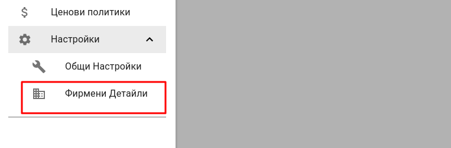

### Работни обекти

Раздел управление на работни обекти дава възможност за организиране на местата, от които компанията извършва следните дейности: *фактуриране*, *доставки*, *складови наличности*.

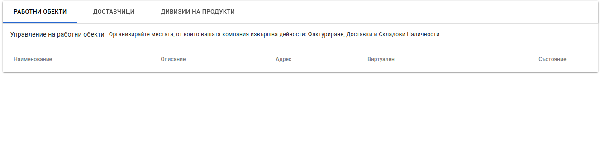

#### Създаване на ново място на потребление (работен обект)

Създаване на ново място на потребление се осъществява чрез натискане на бутон, който се намира в долния десен ъгъл на екрана.

На екрана се визуализира форма за ново място на потребление.

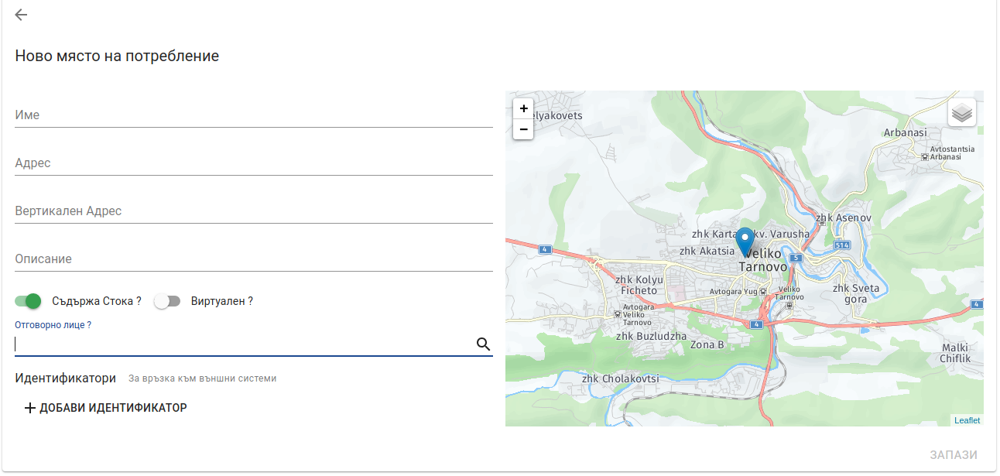

* ***Име*** - име на мястото на потребление. Това поле е **задължително**.
* ***Адрес*** - адрес на мястото на потребление. Това поле е **задължително**.
* ***Вертикален адрес*** - пояснение към адреса, например етаж, вход.
* ***Описание*** - описание на мястото на потребление. Може да бъде регистрационен номер на автомобил, когато склада е виртуален. Това поле се печата в документ "Стокова разписка" от мобилното приложение.
* ***Съдържа стока*** - настройка, която указва дали мястото на потребление съдържа стока (тип склад). *По подразбиране тази настройка е включена*.
* ***Виртуален*** - настройка, която маркира мястото на потребление като виртуално. Виртуалните места на потребление нямат фиксиран адрес. Виртуално място на потребление е например товарен автомобил за превозване/продаване на стока. Местата на потребление използвани при екс-ван търговия трябва да се маркират като виртуални. *По подразбиране тази настройка е изключена*.
* ***Отговорно лице*** - един или много потребители, които отговарят за мястото на потребление. Отговорното лице при екс-ван модел е потребителя, който използва Politis мобилно приложение за извършване на търговска дейност.
* ***Идентификатори*** - индентификатори за връзка с външни системи. Пример: идентификатори за връзка с АЖУР.

След попълване на необходимата информация се натиска бутон *Запази*. При успешно създаване на място на потребление се визуализира списък с места на потребление.

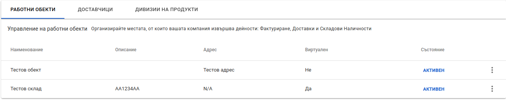

#### Операции с места на потребление

Операциите с места на потребление са достъпни при натиска на бутон (вертикално многоточие) в края на всеки ред от списъка с места на потребление. Politis предоставя възможност за следните операции:

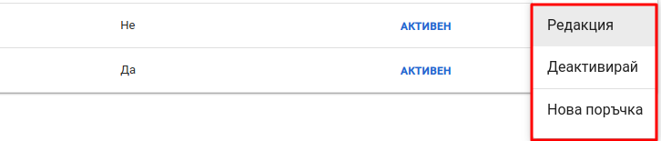

* **Редакция** - предоставя възможност за редакция на място на потребление. 
* **Деактивиране** - предоставя възможност за деактивация, когато мястото на потребление няма да бъде използвано. При деактивация, мястото на потребление няма да се визуализира при операции свързани със стоков контрол или продажби. При деактивиране се премахват всички отговорни лица от съответното място на потребление. При избиране на тази операция се визуализира модален прозорец да потвърждение на операцията.

* **Нова поръчка** - предоставя възможност за създаване на нова поръчка към съответното място на потребление.

### Доставчици

Раздел доставчици дава възможност за организиране на доставчиците на продукти за компанията.

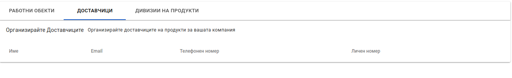

#### Регистриране на нов доставчик

Регистриране на нов доставчик се осъществява чрез натискане на бутон, който се намира в долния десен ъгъл на екрана.

На екрана се визуализира форма за нов доставчик.

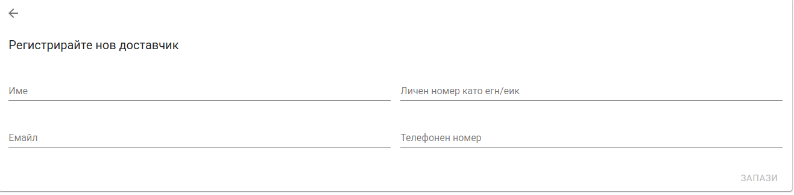

* **Име** - име на доставчика. Това поле е **задължително**.
* **Личен номер ЕГН/ЕИК** - идентификационен номер на доставчика - ЕГН или ЕИК.
* **Имейл** - адрес на електронна поща.
* **Телефонен номер** - телефонен номер за контакт.

След попълване на необходимата информация се натиска бутон *Запази*. При успешно създаване на доставчик се визуализира списък с доставчици.

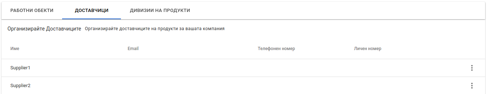

#### Операции с доставчици

Операциите с доставчици са достъпни при натиска на бутон (вертикално многоточие) в края на всеки ред от списъка доставчици. Politis предоставя възможност за следните операции:

* **Редакция** - предоставя възожност за редакция на доставчик.
* **Barcode Patterns** - предоставя възможност за задаване шаблони за баркодове, които доставчика използва, за да се извлече информация като дата на годност, код на доставчик, дата на производство, номер на партида.

### Дивизии на продукти

Раздел дивизии на продукти дава възможност за групиране на продуктите за по-лесна обработка и в ценообразуването.

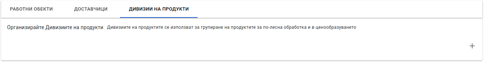

#### Създаване на дивизия

Регистриране на нова дивизия се осъществява чрез натискане на бутон, който се намира в горния десен ъгъл на списъка с дивизии.

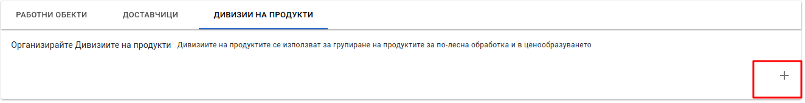

На екрана се визуализира поле за име за нова дивизия.

След попълване на име на дивизия се натиска бутона за потвърждение от дясно на полето. При успешно създаване, дивизията се добавя към списъка с дивизии.

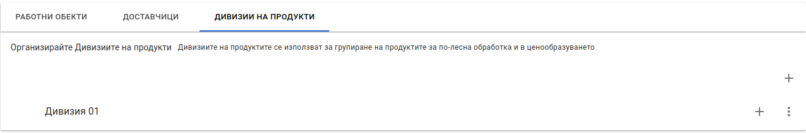

#### Операции с дивизии

Операциите с дивизии са достъпни при натиска на бутоните (вертикално многоточие и плюс) в края на всеки ред от списъка доставчици. Politis предоставя възможност за следните операции:

* **Редакция** - предоставя възожност за редакция на име на дивизия.
* **Изтриване** - предоставя възожност за изтриване на дивизия. При избиране на операция изтриване се визуализира модален прозорец за потвърждение на операцията.
* **Добавяне на поддивизия** - предоставя възможност за добавяне на нова дивизия, която е поддивизия на текущата. Организирането на големи по обем дивизии в поддивизии служи за лесно навигация в продуктовия каталог при извършване на  продажби от мобилното приложение.