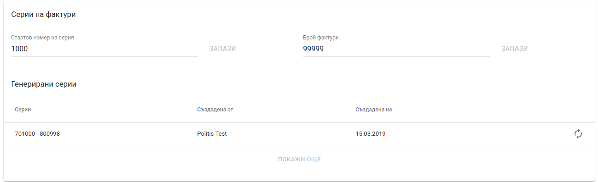
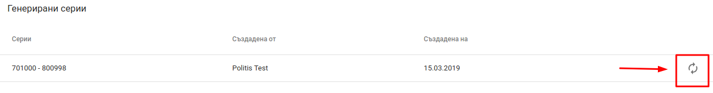

<h1 align="center">
  Общи настройки
</h1>

В раздел *Общи настройки* потребителите имат възможност за управление на серии на фактури и настройки за партиди.

За достъп до функционалности свързани с фирмени детайли от главното меню се избира *Настройки* и след това подменю *Общи настройки*.

#### Фактури

Раздел *Фактури* дава възможност за настройване на серии на системни фактури и серии на отделните потребители. 

#### Серии на системни фактури

Серии на системни фактури се отнасят до номера на фактурите, дебитни и кредитни известия издадени чрез уеб версията на Politis.

* **Стартов номер на системна серия** - номера, от който започва серията на системните документи (фактури, кредитни и дебитни известия.)

#### Серии на фактури

Серии на фактури се отнасят до индивидуалните номера на фактури, които всеки потребител може да създаде.

* **Стартов номер на серия** - номера, от който започват да се генерират серии за потребителите.
* **Брой фактури**  - брой фактури в една серия.
* **Генерирани серии** - списък с текущите генерирани серии за потребителите.

Генериране на нова серия за потребител се осъществява чрез натискане на бутон в края на реда.

За потребителите на Politis мобилно приложение сериите се генерират при първоначално влизане в приложението.
 
#### Партиди

Раздел "Партиди" дава възможност да се избере начина на изписване на партидите в Politis мобилно приложение.

* **Автоматично избиране на най-старата партида** - когато тази настройка е активна при добавяне на продукти за продажба в Politis мобилно приложение партидата, която се добавя автоматично към продукта е най-старата активна партида, чийто срок на годност не е изтекъл.
* **Ръчно избиране на партида** - когато тази настройка е активна при добавяне на продукти за продажба в Politis мобилно приложение, партидите на продуктите, трябва да се изберат ръчно от потребителя.