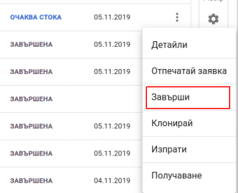
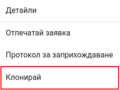

<h1 align="center">
  Директно заприхождаване 
</h1>

### Заприхождаване

Типът на заприхождаване, който се разглежда в този раздел е с "Директно заприхождаване",
това дава възножност директно да се заприходи стоката получена от Доставчика. 

<split-panel>
  <panel>
    <bullet></bullet> За да се направи "Директно заприхождаване" на стоки, трябва от главното меню да се избере "Стоков контрол".
  </panel>
  <panel>
    
  </panel>
</split-panel>

 

* След което се визуализира екран с всички направени заприхождавания и информация за всяко едно.

<split-panel>
  <panel>
    <bullet></bullet> Hово заприхождаване се извършва от бутона в долната част на екрана "Заприхождаване".
  </panel>
  <panel>
    
  </panel>
</split-panel>

 

След натискане на бутона се зарежда форма за заприхождаване.
Основните полета за въвеждане са:
* Доставчик
* Дестинация - мястото за доставка на артикулите
* Артикул - добавяна на артикул
* Количество - за да бъде поръчан даден артикул трябва да му се зададе стойност различна от 0
* Партида - трябва да се отбележи партидата и срока на годност

Формата, трябва да се "ЗАПАЗИ" след попълване на всички полета.

 

<split-panel>
  <panel>
    След това заприхождаването може да бъде:
       <bullet></bullet> Редактирано
       <bullet></bullet> Потвърдено
       <bullet></bullet> Анулирано
       След като се потвърди заприхождаването, то преминава в статус "Очаква стока".
  </panel>
  <panel>
    
  </panel>
</split-panel>

 

<split-panel>
  <panel>
    Когато заприхождаването е потвърдено, от контекстното меню има възможност за преглед на "Детайли".
  </panel>
  <panel>
    
  </panel>
</split-panel>

 

При избор на дадената опция, потребителят е пренасочен към екрана за детайли

След като "Получаването" е приключило напълно, заявката трябва да се "Завърши".
Това става от контекстното меню на заявка, където се избира "Завърши". 
След което заявката преминава в статус "ЗАВЪРШЕНА".

<split-panel>
  <panel>
    
  </panel>
  <panel>
    
  </panel>
</split-panel>

 

### Създаване на ново заприхождаване от съществуващо

Всяко заприхождаване може да бъде копирано, за да не се налага същите артикули да се въвеждат повторно.
Това се осъществява от контекстното меню на заприхождаването, където се избира "Клониране". 
След потвърждение на операцията, ще се създаде ново заприхождаване от съществуващато.

<split-panel>
  <panel>
    
  </panel>
  <panel>
    
  </panel>
</split-panel>
