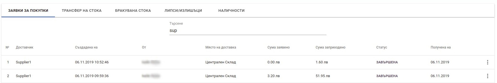
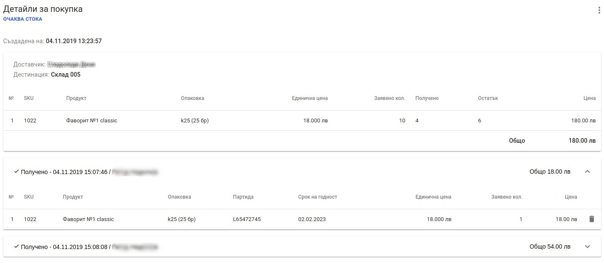

<h1 align="center">
  Директно заприхождаване 
</h1>

### Заприхождаване

Типът на заприхождаване, който се разглежда в този раздел е *Директно заприхождаване*. Тази операция създава заявка за поръчка автоматично и приема стока по нея на една стъпка.
За да се направи *Директно заприхождаване* на стоки, трябва от главното меню да се избере *Стоков контрол*

След което се визуализира екран с всички направени заявки за покупка и заприхождавания и информация за всяко едно.

<split-panel>
  <panel>
    <bullet></bullet> Hово заприхождаване се извършва от бутона в долната част на екрана <i>Заприхождаване</i>.
  </panel>
  <panel>
    
  </panel>
</split-panel>

 

След натискане на бутона се зарежда форма за заприхождаване.

Основните полета за въвеждане са:   
**Доставчик** - доставчикът, от който се заприхождава стоката.   
**Дестинация** - склада, към който се заприхождава стоката.   
**Артикул** - поле за добавяне на артикули. Полето дава възможност за търсене на артикули по следните параметри: *SKU, име на артикул*.   
**Количество** - количество на артикул. *За да бъде поръчан даден артикул трябва да му се зададе стойност по-голяма от 0*.   
**Партида** - полето дава възможност за избиране на вече съществуваща партида от списък с предложения или регистрация на нова партида за даден артикул.

 

Основни операции със директно заприхождаване според статуса са следните:

<split-panel>
  <panel>
    <b>ОЧАКВА СТОКА</b>
       <bullet></bullet> <b>Детайли</b> - детайли за заприхождаването. Списък с артикули, дата и час на заприхождаване и потребител извършил операцията.
       <bullet></bullet> <b>Отпечатай заявка</b> - отваря диалогов прозорец с документ <i>Заявка на покупка</i>, който може да бъде отпечатан или запазен във файл.
       <bullet></bullet> <b>Завърши</b> - завършва заприхождаването. При тази операция се сменя статуса на  <i>ЗАВЪРШЕНА</i>.
       <bullet></bullet> <b>Клонирай</b> - създава нова зявка за покупка с артикулите, участващи в заприхождаването. Създадената заявка е със статус <i>РАБОТЕН ВАРИАНТ</i> и може да бъде редактирана.
       <bullet></bullet> <b>Изпрати</b> - изпраща заявка по имейл на доставчика. Имейлът на доставчика трябва да бъде добавен към доставчика в настройките.
       <bullet></bullet> <b>Получаване</b> - дава възможност за допълване на текущото заприхождаване с още артикули.
  </panel>
  <panel>
    
  </panel>
</split-panel>

 

<split-panel>
  <panel>
    <b>ЗАВЪРШЕНА</b>
       <bullet></bullet> <b>Детайли</b> - детайли за заприхождаването. Списък с артикули, дата и час на заприхождаване и потребител извършил операцията.
       <bullet></bullet> <b>Отпечатай заявка</b> - отваря диалогов прозорец с документ <i>Заявка на покупка</i>, който може да бъде отпечатан или запазен във файл.
        <bullet></bullet> <b>Протокол за заприхождаване</b> - отваря диалогов прозорец с документ <i>Протокол за заприхождаване</i>, който съдържа списък с всички артикули, които са били заприходени. Протокола може да бъде разпечатан или запазен във файл.
       <bullet></bullet> <b>Клонирай</b> - създава нова зявка за покупка с артикулите, участващи в заприхождаването. Създадената заявка е със статус <i>РАБОТЕН ВАРИАНТ</i> и може да бъде редактирана.
     </panel>
  <panel>
    
  </panel>
</split-panel>

  

Екранът с детайли за покупка дава информация за всички заприхождавания направени към дадена заявка за покупка.  

След като получаването е приключило напълно, заявката трябва да се завърши. Това става от контекстното меню на заявка, където се избира *Завърши*.
След което заявката преминава в статус *ЗАВЪРШЕНА*.

<split-panel>
  <panel>
    
  </panel>
  <panel>
    
  </panel>
</split-panel>

 

## Нова заявка от съществуващо заприхождаване

Всяко заприхождаване може да бъде копирано, за да не се налага същите артикули да се въвеждат повторно. Това се осъществява от контекстното меню на заприхождаването, където се избира *Клониране*. След потвърждение на операцията, ще се създаде нова заявка за покупка от съществуващато заприхождаване.

<split-panel>
  <panel>
    
  </panel>
  <panel>
    
  </panel>
</split-panel>
