<h1 align="center">
  Покупка със заявка
</h1>

### Създаване на заявка
Управлението на поръчки в Politis Ви помагат да спестите време и ви осигурява точност на информацията,
след като зарежда автоматично стоката в склада при приемането и.

Типът на заприхождаване, който се разглежда в този раздел е със "Заявка",
който дава възможност да се изпрати документ за заявка към Доставчик.
        
<split-panel>
  <panel>
    <bullet></bullet> За да се направи "Заявка за покупка" на стоки, трябва от главното меню да се избере "Стоков контрол".
  </panel>
  <panel>
    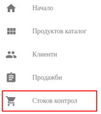
  </panel>
</split-panel>

 

* След което се визуализира екран с всички направени заявки и информация за всяка една.

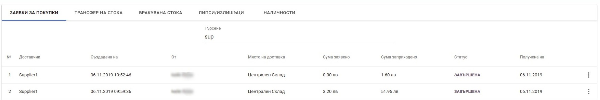

<split-panel>
  <panel>
    <bullet></bullet> Създаването на нова заявка за покупка се извършва от бутона в долната част на екрана "Заявка за покупка".
  </panel>
  <panel>
    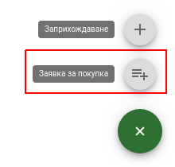
  </panel>
</split-panel>

 

След натискане на бутона се зарежда форма за нова заявка.
Основните полета за въвеждане са:
* Доставчик
* Дестинация - мястото за доставка на артикулите
* Количество - за да бъде поръчан даден артикул трябва да му се зададе стойност различна от 0

Формата, трябва да се "ЗАПАЗИ" след попълване на всички полета.

 

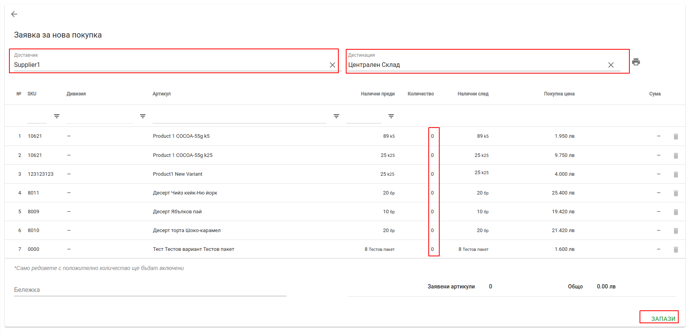

<split-panel>
  <panel>
    След това заявката може да бъде:
       <bullet></bullet> Редактирана
       <bullet></bullet> Потвърдена
       <bullet></bullet> Анулирана
       След потвърждаване на заявката, тя преминава в статус "Очаква стока".
  </panel>
  <panel>
    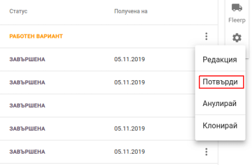
  </panel>
</split-panel>

 

### Изпращане на заявката към производителя

Вече създадената "Заявка за покупка" трябва да бъде изпратена на производителя. Един от начините е, чрез email.
Това е възможно от контекстното меню на заявката, където се избира "Изпрати".

<split-panel>
  <panel>
    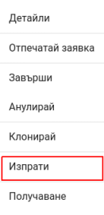
    </panel>
  <panel>
    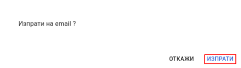
  </panel>
</split-panel>

 

### Получаване на стока

<split-panel>
  <panel>
    Получаването на дадена стока се извършва, като от контекстното меню на конкретната заявката се избира "Получаване".
  </panel>
  <panel>
    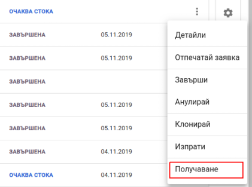
  </panel>
</split-panel>

 

Във формата за "Получаване на стока" трябва да се попълнят следните полета:
* Количество - трябва да се отбележи, какво количество се приема от дадения продукт;
* Партида - трябва да се отбележи партидата и срока на годност;

След като бъдат избрани съответените количества и партиди на стоката, 
преминаването към изпълняването на автоматичното й заприхождаване става чрез натискането на бутона "ЗАПАЗИ".

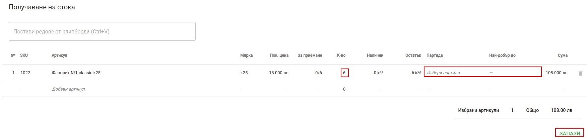

Когато стоката е получена се визуализира екран с детайлите за "Поръчката" и "Получаването" на стоката.

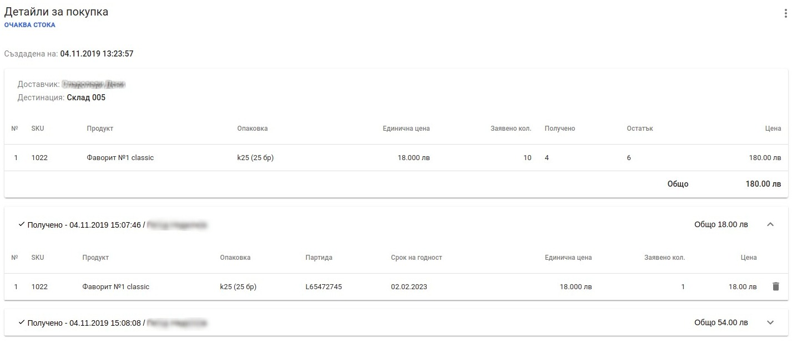

След като "Получаването" е приключило напълно, заявката трябва да се "Завърши".
Това става от контекстното меню на заявка, където се избира "Завърши". 
След което заявката преминава в статус "ЗАВЪРШЕНА".

<split-panel>
  <panel>
    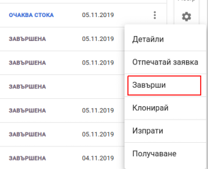
  </panel>
  <panel>
    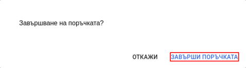
  </panel>
</split-panel>

 

### Създаване на нова заявка от съществуваща

Всяка заявка може да бъде копирана, за да не се налага същите артикули да се въвеждат повторно.
Това се осъществява от контекстното меню на заявката, където се избира "Клониране". 
След потвърждени на операцията, ще се създаде нова заявка от съществуващата.

<split-panel>
  <panel>
    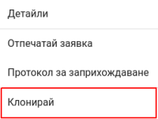
  </panel>
  <panel>
    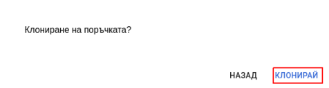
  </panel>
</split-panel>