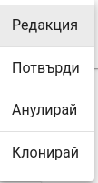
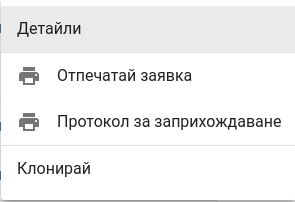
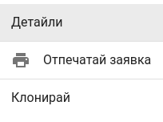

<h1 align="center">
  Покупка със заявка
</h1>

### Създаване на заявка
Управлението на поръчки в Политис зарежда автоматично стоката в склада при приемането ѝ и осигурява точност на информацията.

Типът на заприхождаване, който се разглежда в този раздел е със *Заявка*, който дава възможност да се изпрати документ *Заявка за поръчка* към доставчик.
        
<split-panel>
  <panel>
    <bullet></bullet> За да се направи <i>Заявка за покупка</i> на стоки, трябва от главното меню да се избере <i>Стоков контрол</i>.
  </panel>
  <panel>
    
  </panel>
</split-panel>

 

След което на екрана се визуализира  списък с всички направени заявки за покупка и информация за всяка една.

<split-panel>
  <panel>
    <bullet></bullet> Създаването на нова заявка за покупка се извършва от бутона в долната част на екрана <i>Заявка за покупка</i>.
  </panel>
  <panel>
    
  </panel>
</split-panel>

 

След натискане на бутона се зарежда форма за нова заявка за покупка.

Формата предоставя следните полета за попълване:
* **Доставчик** - доставчика, към който се прави заявка за покупка.
* **Дестинация** - склада, към който се заприхождават артикулите.
* **Количество** - количетво на артикул. *За да бъде поръчан даден артикул трябва да му се зададе стойност различна от 0*.

След попълване на всички необходими полета се натиска бутон *Запази*. Създава се нова заявка за покупка със статус *РАБОТЕН ВАРИАНТ*. За да се извърши заприхождаване на стока по заявката тя трябва да бъде потвърдена. След потвърждение заявката променя статуса си на *ОЧАКВА СТОКА*.

Възможните операции със заявки за покупка според статуса са следните:

<split-panel>
  <panel>
    <b>РАБОТЕН ВАРИАНТ</b>
       <bullet></bullet> <b>Редакция</b> - дава възможност за корекции по поръчката.
       <bullet></bullet> <b>Потвърди</b> - потвърждава поръчката и сменя статуса ѝ на <i>ОЧАКВА СТОКА</i>. След потвърждение заявката не може да бъде редактирана.
       <bullet></bullet> <b>Анулирай</b> - отказва заявката и сменя статуса ѝ на <i>АНУЛИРАНА</i>
       <bullet></bullet> <b>Клонирай</b> - създава нова заявка, съдържаща всички артикули от текущата.
  </panel>
  <panel>
    
  </panel>
</split-panel>

 

<split-panel>
  <panel>
    <b>ОЧАКВА СТОКА</b>
       <bullet></bullet> <b>Детайли</b> - детайли за заявката. Списък с артикули, дата и час на заприхождаване и потребител извършил операцията.
       <bullet></bullet> <b>Отпечатай заявка</b> - отваря диалогов прозорец с документ <i>Заявка на покупка</i>, който може да бъде отпечатан или запазен във файл.
       <bullet></bullet> <b>Завърши</b> - завършва заявката. При тази операция се сменя статуса на  <i>ЗАВЪРШЕНА</i>.
       <bullet></bullet> <b>Клонирай</b> - създава нова зявка за покупка с артикулите, участващи в заприхождаването. Създадената заявка е със статус <i>РАБОТЕН ВАРИАНТ</i> и може да бъде редактирана.
       <bullet></bullet> <b>Изпрати</b> - изпраща заявка по имейл на доставчика. Имейлът на доставчика трябва да бъде добавен към доставчика в настройките.
       <bullet></bullet> <b>Получаване</b> - дава възможност за получаване на стока по текуща заявка.
  </panel>
  <panel>
    
  </panel>
</split-panel>

 

<split-panel>
  <panel>
    <b>ЗАВЪРШЕНА</b>
       <bullet></bullet> <b>Детайли</b> - детайли за заявката. Списък с артикули, дата и час на заприхождаване и потребител извършил операцията.
       <bullet></bullet> <b>Отпечатай заявка</b> - отваря диалогов прозорец с документ <i>Заявка на покупка</i>, който може да бъде отпечатан или запазен във файл.
       <bullet></bullet> <b>Протокол за заприхождаване</b> - отваря диалогов прозорец с документ <i>Протокол за заприхождаване</i>, който може да бъде отпечатан или запазен във файл. Протоколът съдържа всички заприходени артикули до момента.
       <bullet></bullet> <b>Клонирай</b> - създава нова зявка за покупка с артикулите, участващи в заприхождаването. Създадената заявка е със статус <i>РАБОТЕН ВАРИАНТ</i> и може да бъде редактирана.
  </panel>
  <panel>
    
  </panel>
</split-panel>

 

<split-panel>
  <panel>
    <b>АНУЛИРАНА</b>
       <bullet></bullet> <b>Детайли</b> - детайли за заявката. Списък с артикули, дата и час на заприхождаване и потребител извършил операцията.
       <bullet></bullet> <b>Отпечатай заявка</b> - отваря диалогов прозорец с документ <i>Заявка на покупка</i>, който може да бъде отпечатан или запазен във файл.
       <bullet></bullet> <b>Клонирай</b> - създава нова зявка за покупка с артикулите, участващи в заприхождаването. Създадената заявка е със статус <i>РАБОТЕН ВАРИАНТ</i> и може да бъде редактирана.
  </panel>
  <panel>
    
  </panel>
</split-panel>

 

### Изпращане на заявката към производителя

Вече създадената *Заявка за покупка* трябва да бъде изпратена на производителя. Един от начините е, чрез имейл.
Това е възможно от контекстното меню на заявката, където се избира *Изпрати*. Имейлът на доставчика трябва да е предварително конфигуриран от таб *Доставчици* в настройките на Политис.

<split-panel>
  <panel>
    
    </panel>
  <panel>
    
  </panel>
</split-panel>

 

### Получаване на стока
Получаването на стока се извършва, като от контекстното меню на конкретната заявка се избере операция *Получаване*.

На екрана се визуализира форма за получаване на стока.

Формата предоставя следните полета за попълване.

* **Артикул** - полето дава възможност за добавяне на артикули, които не участват с заявката. Артикулите в полето може да се търсят по следните параметри: *SKU, име на артикул*.
* **Количество** - количество на артикул.
* **Партида** - полето дава възможност за избиране на партида за даден артикул от списък с вече регистрирани партиди или регистрация на нова партида.

След като бъдат избрани съответените количества и партиди на стоката, преминаването към изпълняването на автоматичното ѝ заприхождаване става чрез натискането на бутон *ЗАПАЗИ*.

Когато стоката е получена се визуализира екран с детайли за покупка. Екранът съдържа информация за заявката, както и всички получавания направени по нея, потребител извършил операциите с дата и час.

След като получаването е приключило напълно, заявката трябва да се завърши. Това става от контекстното меню на заявка, където се избира *Завърши*. След което заявката преминава в статус *ЗАВЪРШЕНА*.

<split-panel>
  <panel>
    
  </panel>
  <panel>
    
  </panel>
</split-panel>

 

### Създаване на нова заявка от съществуваща

Всяко заприхождаване може да бъде копирано, за да не се налага същите артикули да се въвеждат повторно. Това се осъществява от контекстното меню на заявката, където се избира *Клониране*. След потвърждение на операцията, ще се създаде нова заявка за покупка от съществуващата.

<split-panel>
  <panel>
    
  </panel>
  <panel>
    
  </panel>
</split-panel>