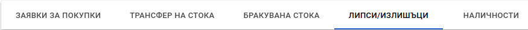
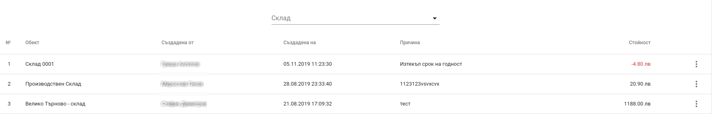
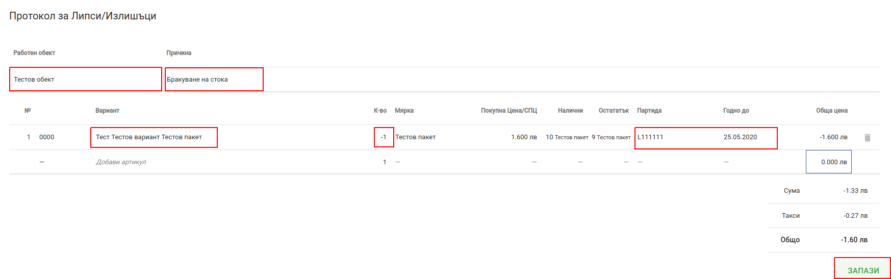
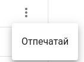
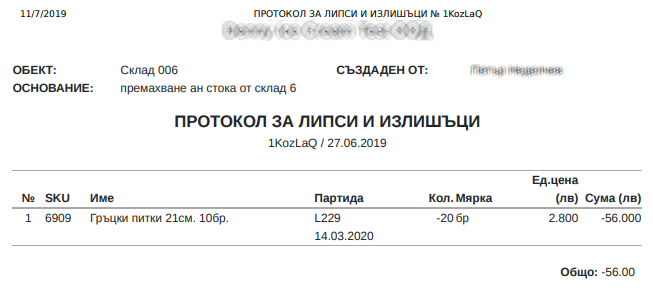

<h1 align="center">
  Липси/Излишъци
</h1>

Приложението Politis предоставя възножност за лесно и проследимо извършване на корекция на количства в даден скалд.

 

<split-panel>
  <panel>
    Ресгистрирането на липса или излищък на дадена стока, е достъпно през главното меню "Липси/Излишъци".
  </panel>
  <panel>
    
  </panel>
</split-panel>

 

<bullet></bullet> След което се визуализира екран с всички регистрирани липси и излишъци.
 
<bullet></bullet> Също така има възможност за търсене на липси и излишъци в конкретен склад.

<split-panel>
  <panel>
    Hова корекция се извършва чрез бутона в долната част на екрана.
  </panel>
  <panel>
    
  </panel>
</split-panel>

 

След натискане на бутона се зарежда "Протокол за Липси/Излишъци".
Основните полета за въвеждане са:
* Работен обект - обектът, за който ще се прави корекция
* Причина - причината поради която се прави корекцията
* Вариант - продукта, за който се прави корекция
* Количество - трябва да се зададе, положителна стойност при излишък или отрицателна при липса.
* Партида - трябва да се отбележи партидата и срока на годност;

Формата, трябва да се "ЗАПАЗИ" след попълване на всички полета.

<split-panel>
  <panel>
    Всяка коркция може да бъде "Отпечатана" от контекстното меню.
  </panel>
  <panel>
    
  </panel>
</split-panel>

 

