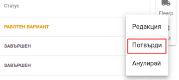
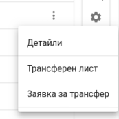

<h1 align="center">
  Трансфер на стока
</h1>

### Нов трансфер

Приложението Politis предоставя възножност за лесен и проследим трансфер на стоки от едни скалд в друг.

<split-panel>
  <panel>
    За да се направи "Трансфер на стока", трябва от главното меню да се избере "Стоков контрол".
  </panel>
  <panel>
    
  </panel>
</split-panel>

 

<split-panel>
  <panel>
    В горната част на екрана има меню с табове, от където се избира "Трансфер на стока".
  </panel>
  <panel>
    
  </panel>
</split-panel>

 

<bullet></bullet> След което се визуализира екран с всички направени трансфери и информация за всеки един.
 
<bullet></bullet> Има възможност за търсене на трансфери по локация.

<split-panel>
  <panel>
    Hов трансфер се извършва от бутона в долната част на екрана.
  </panel>
  <panel>
    
  </panel>
</split-panel>

 

След натискане на бутона се зарежда форма за трансфер.
Основните полета за въвеждане са:
* От
* Към
* Артикул - добавяна на артикул
* Количество - за да бъде поръчан даден артикул трябва да му се зададе стойност различна от 0

Формата, трябва да се "ЗАПАЗИ" след попълване на всички полета.

 

<split-panel>
  <panel>
    След това трансфера може да бъде:
       <bullet></bullet> Редактирана
       <bullet></bullet> Потвърдена
       <bullet></bullet> Анулирана
       След потвърждаване на трансфера, той преминава в статус "Очаква стока".
  </panel>
  <panel>
    
  </panel>
</split-panel>

 

### Получаване на стока от трансфер

<split-panel>
  <panel>
    За получаване на даден трансфер, трябва да се избира от контекстното меню "Получаване".
  </panel>
  <panel>
    
  </panel>
</split-panel>

 

Във формата за "Получаване на стока" трябва да се попълнят следните полета:
* Количество - трябва да се отбележи, какво количество се приема от дадения продукт;
* Партида - трябва да се отбележи партидата и срока на годност;

След като бъде попълнена формата, трябва да се "ЗАПАЗИ".

Когато стоката е получена се визуализира екран с детайлите за "Поръчката" и "Получаването" на стоката.

След като "Получаването" е приключило напълно, трансфера трябва да се "Завърши".
Това става от контекстното меню на трансфера, където се избира "Завърши". 
След което трансфера преминава в статус "ЗАВЪРШЕН".

<split-panel>
  <panel>
    
  </panel>
  <panel>
    
  </panel>
</split-panel>

 

### Детайли за трансфер

<split-panel>
  <panel>
    За всеки завършен трансфер, са достъпни следните функционалности от контекстното меню:
      <bullet></bullet> Детайли - детайли за трансфера (поръчка , получаване)
      <bullet></bullet> Трансферен лист - дава възможност за принтиране
      <bullet></bullet> Заявка за трансфер - дава възможност за принтиране
  </panel>
  <panel>
    
  </panel>
</split-panel>

 

<split-panel>
  <panel>
    
  </panel>
  <panel>
    
  </panel>
</split-panel>
