<h1 align="center">
  Трансфер на стока
</h1>

### Нов трансфер

Политис предлага възможност за проследяване на стока и трансфери от един склад на компанията в друг.

<split-panel>
  <panel>
    За да се направи <i>Трансфер на стока</i>, трябва от главното меню да се избере <i>Стоков контрол</i>.
  </panel>
  <panel>
    
  </panel>
</split-panel>

 

<split-panel>
  <panel>
    В горната част на екрана има меню с табове, от където се избира <i>Трансфер на стока</i>.
  </panel>
  <panel>
    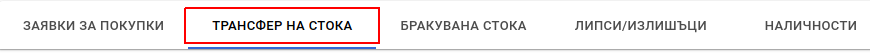
  </panel>
</split-panel>

 

На екрана се визуализира списък с всички трансфери и информация за всеки един от тях. Има възможност за търсене на трансфери.

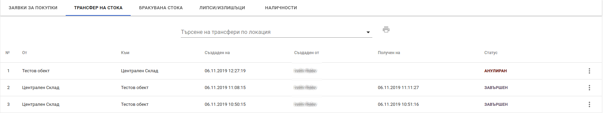

<split-panel>
  <panel>
    Hов трансфер се създава от бутон, който се намира в долната част на екрана.
  </panel>
  <panel>
    
  </panel>
</split-panel>

 

След натискане на бутона се зарежда форма за трансфер.

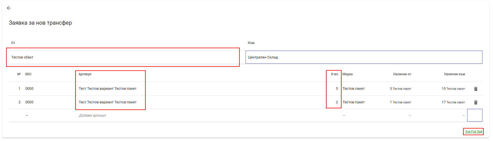

Формата предоставя следните полета за попълване:

* **От** - склада, от който ще се вземе стоката.
* **Към** - склада, към който ще се прехвърли стоката.
* **Артикул** - поле за добавяне на артикул към трансфера. В полето могат да се търсят артикули по следните параметри: *SKU, име на артикул*.
* **Количество** - количество на артикул. *За да бъде трансфериран даден артикул трябва да му се зададе стойност по-голяма от 0*.

След попълване на всички необходими полета се натиска бутон *Запази*, след което се създава нова заявка за трансфер със статус *РАБОТЕН ВАРИАНТ*. **За да се извърши получаване на стока заявката за трансфер трябва да се потвърди**, което сменя статуса ѝ на *ОЧАКВА СТОКА*.

Възможните операции с трансфери според статуса са:

<split-panel>
  <panel>
     <b>РАБОТЕН ВАРИАНТ</b>
       <bullet></bullet> <b>Редакция</b> - предоставя възможност за редакция на заявката за трансфер.
       <bullet></bullet> <b>Потвърди</b> - потвърждава заявката, като сменя статуса ѝ на <i>ОЧАКВА СТОКА</i>. Потвърдените заявки не могат да бъдат редактирани.
       <bullet></bullet> <b>Анулирай</b> - отменя заявката, като сменя статуса на трансфера на <i>АНУЛИРАН</i>.
  </panel>
  <panel>
    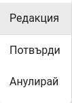
  </panel>
</split-panel>

 

<split-panel>
  <panel>
     <b>ОЧАКВА СТОКА</b>
       <bullet></bullet> <b>Детайли</b> - дава възможност да се видят артикулите в заявката, всички получавания до момента, дата и час на получаване и потребител извършил операциите.
       <bullet></bullet> <b>Заявка за трансфер</b> - отваря диалогов прозорец, съдържащ документ <i>Заявка за трансфер</i>. Документа може да бъде отпечатан или запазен във файл. 
       <bullet></bullet> <b>Завърши</b> - завършва заявката за трансфер и сменя статуса ѝ на <i>ЗАВЪРШЕН</i>.
        <bullet></bullet> <b>Получаване</b> - дава възможност за получаване на стока по текущата заявка.
  </panel>
  <panel>   
     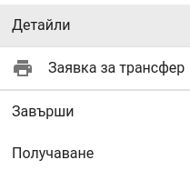
  </panel>
</split-panel>

 

<split-panel>
  <panel>
     <b>ЗАВЪРШЕН</b>
       <bullet></bullet> <b>Детайли</b> - дава възможност да се видят артикулите в заявката, всички получавания до момента, дата и час на получаване и потребител извършил операциите.
       <bullet></bullet> <b>Трансферен лист</b> - отваря диалогов прозорец, съдържащ документ <i>Трансферен лист</i>, съдържащ всички артикули трансферирани до момента. Документа може да бъде отпечатан или запазен във файл.
       <bullet></bullet> <b>Заявка за трансфер</b> - отваря диалогов прозорец, съдържащ документ *Заявка за трансфер*. Документа може да бъде отпечатан или запазен във файл.
       <bullet></bullet> <b>Активирай отново</b> - отменя операция <i>Завърши</i> и сменя статуса на заявката на <i>ОЧАКВА СТОКА</i>
  </panel>
  <panel>
    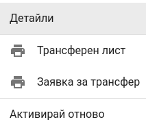
  </panel>
</split-panel>

 

<split-panel>
  <panel>
     <b>АНУЛИРАН</b>
       <bullet></bullet> <b>Детайли</b> - дава възможност да се видят артикулите в заявката, всички получавания до момента, дата и час на получаване и потребител извършил операциите.
       <bullet></bullet> <b>Заявка за трансфер</b> - отваря диалогов прозорец, съдържащ документ *Заявка за трансфер*. Документа може да бъде отпечатан или запазен във файл.
  </panel>
  <panel>
    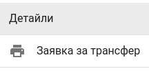
  </panel>
</split-panel>

 

### Получаване на стока от трансфер

Получаване на стока по даден трансфер се осъществява чрез избиране на опция *Получаване* от контекстното меню на всеки трансфер от списъка със заявки за трансфер.

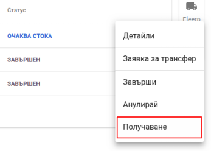

На екрана се визуализира форма за приемане на стока.

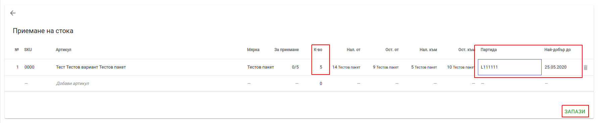

Формата предоставя следните полета за попълване:

* **Артикул** - дава възможност да се добавят артикули, които не участват в заявката за трансфер. Полето предлага търсене на артикули по следните параметри: *SKU, име на артикул*.
* **Количество** - количество ото даден артикул. което да се прехвърли.
* **Партида** - дава възможност да се избере партида и срок на годност за даден артикул. Полето предлага списък с предложения за вече съществуващи партиди за артикула.

След като бъде попълнена формата, се натиска бутон *Запази*.  Когато стоката е получена се визуализира екран с детайли за трансфер.

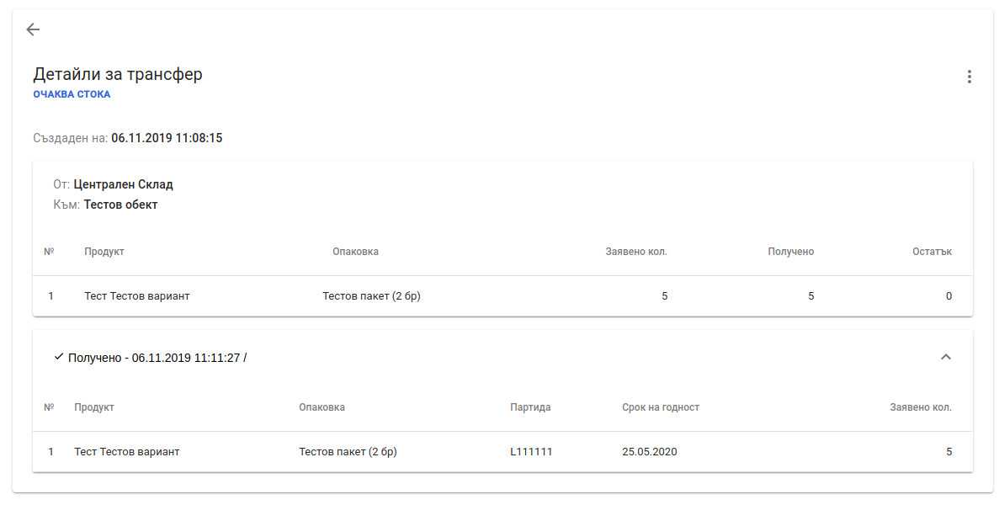

След като получаването е приключило напълно, трансфера трябва да се завърши. Това става от контекстното меню на трансфера, където се избира *Завърши*.  След което трансфера преминава в статус "ЗАВЪРШЕН".

<split-panel>
  <panel>
    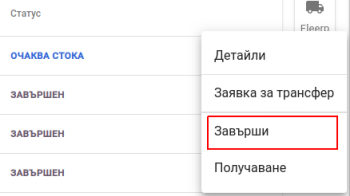
  </panel>
  <panel>
    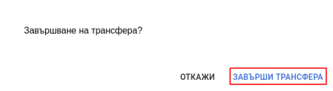
  </panel>
</split-panel>

 

Работата със трансфери генерира следните документи: 

<split-panel>
  <panel>
    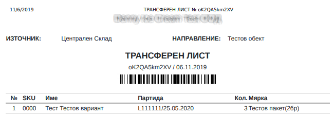
  </panel>
  <panel>
    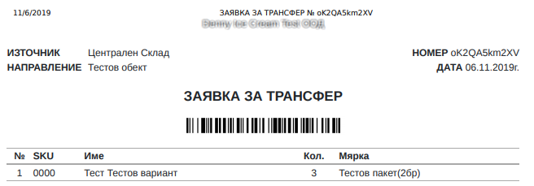
  </panel>
</split-panel>
