<h1 align="center">
  Връщане на стока
</h1>

Политис предлага функционалности за връщане на стока по вече завършена доставка. Върната стока чрез тази фунционалност се заприхождава обратно в склада, от който е направена доставката и се издават кредитни известия за съответните фактури. За доставки на клиенти с рамково споразумение, за които все още не е издадена колективна фактура се извърша само обратно заприхождаване в склада. 

Връщане на стока се осъществява от екрана с детайли за доставка и от списъка с доставки. Има няклко начина за достъп до него:

1. **Списък с фактури** - когато за доставката има издадена фактура.

За достъп до списъка с фактури от главното меню се избира *Фактури*.

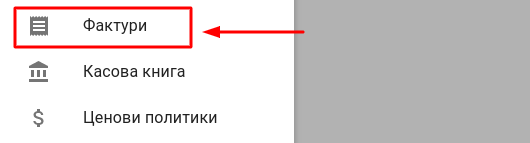

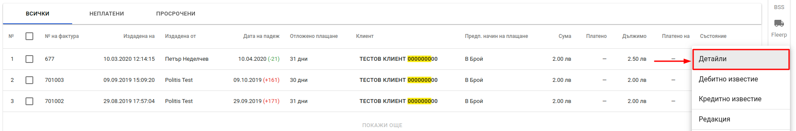

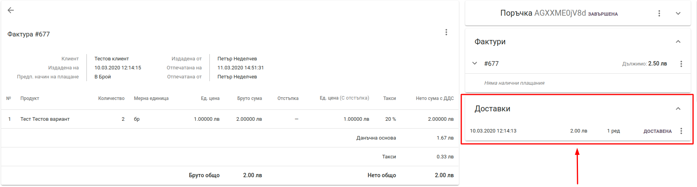

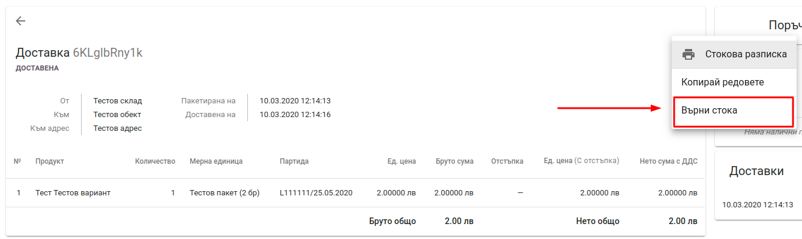

2. **Списък с поръчки**

За достъп до списъка с поръчки се избира *Продажби* от главното меню.

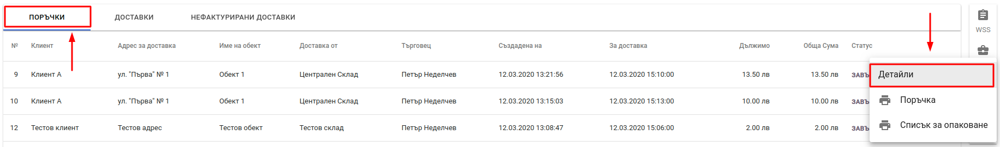

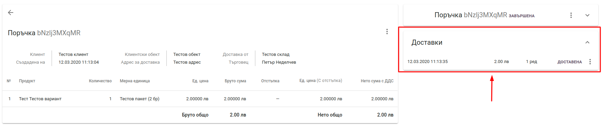

3. **Списък с доставки**

За достъп до списъка с поръчки се избира *Продажби* от главното меню.

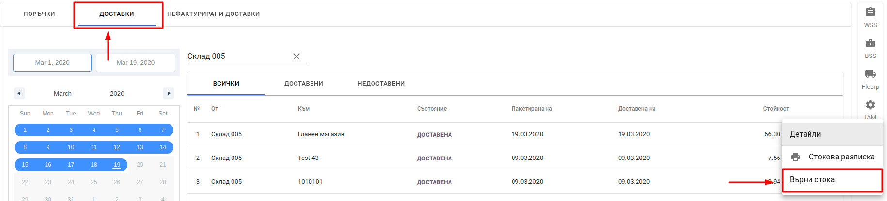

## Връщане на стока

При избор на опцията *Върни стока* към дадена доставка на екрана се визуализира *Връщане на доставена стока*.

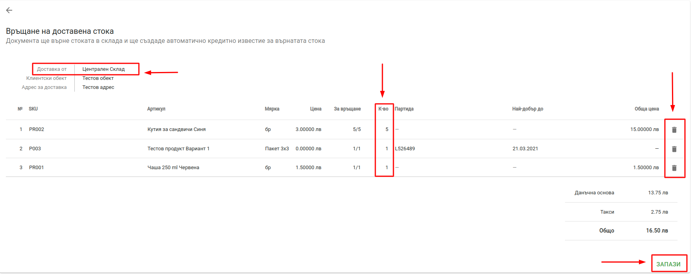

Трябва да се обърне внимание на следните компоненти:

* **Доставка от** - склада, от който е доставена стоката и към който ще бъде заприходена при връщане.
* **К-во** - количество от артикул, което да остане се върне в склада. Разликата между първоначалната стойност и въведената остава доставена.
* **Бутон за премахване на ред** - премахва ред от документа за връщане. **Премахването на ред означава че той няма да бъде върнат и ще остане в доставката.**
* **Запази** - запазва направените промени. **При натискане на *Запази* без да се изполват бутоните за премахване или промяна на количество се изпълнява ПЪЛНО ВРЪЩАНЕ на стоката към склада. Това анулира напълно доставката.**

След избор на редовете, които трябва да останат в доставката и запазване на промените на екрана се визуализират детайли за доставка. Върнатите количества са отбелязани като нови редове оцветени в червено.

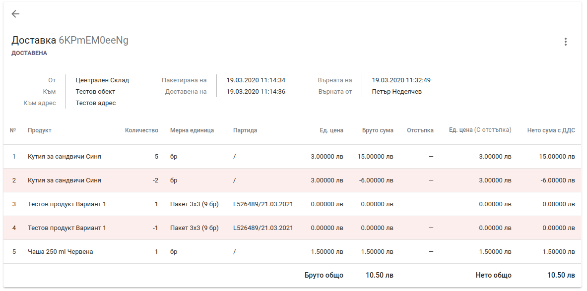

Връщането на стока се отразява в документ *Стокова разписка* чрез редове с отрицателни количества.

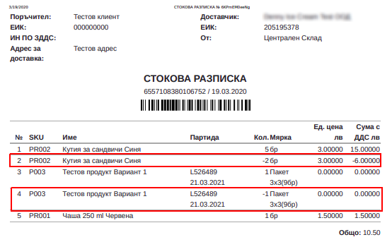

При наличие на фактура се генерира документ *Кредитно известие* към съответната фактура.

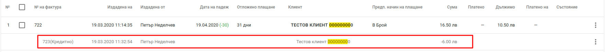

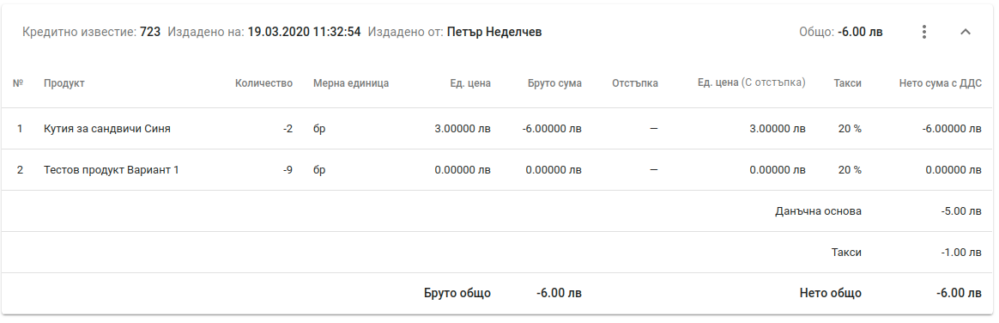
