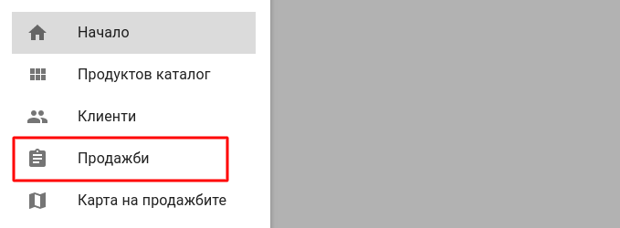
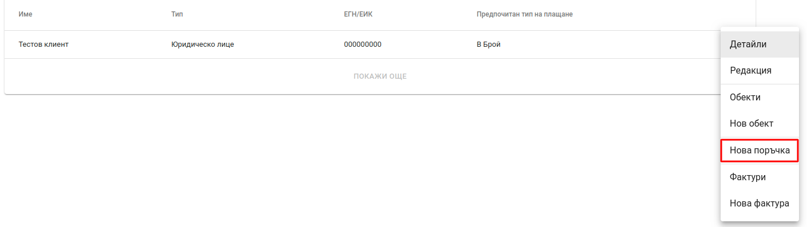
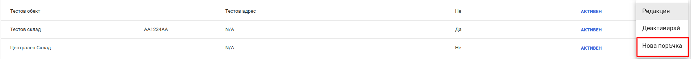
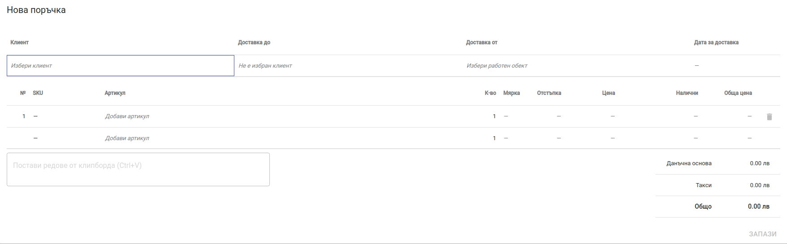
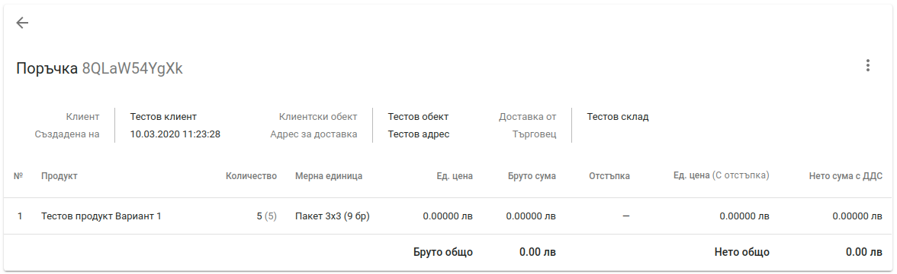
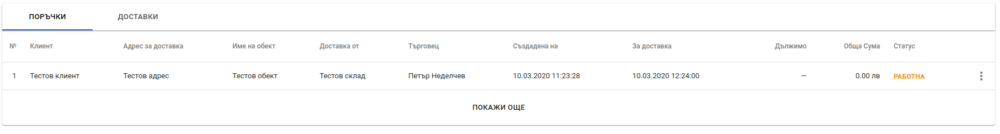
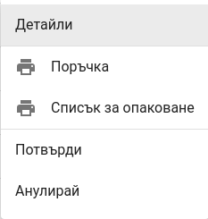
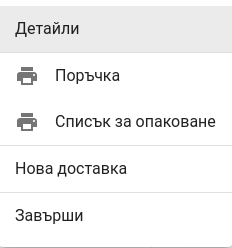
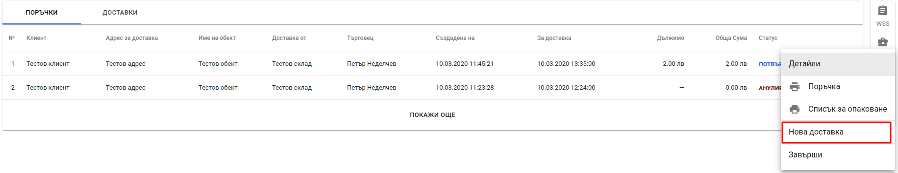
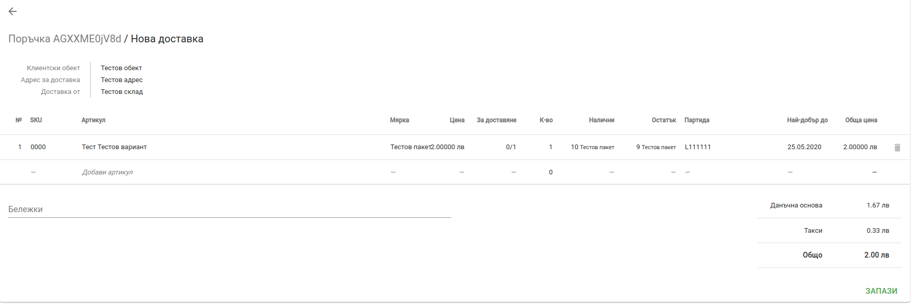

<h1 align="center">
    Регистриране на продажби
</h1>

Продажбите през Политис се осъществяват чрез модела поръчка-доставка. За функционалности свързани с поръчки от главното меню се избира *Продажби*.

## Нова поръчка

Създаването на нова поръчка може да се осъществи от няколко различни места.   
<bullet></bullet> **Продажби** - за създаване на нова поръчка от меню *Продажби* се изполава бутона на нова поръчка, който се намира в долния десен ъгъл на екрана.

<bullet></bullet> **Клиенти** - нова поръчка за конкретен клиент може да се направи като от главното меню се избере *Клиенти*, след което клиента се намира чрез полето за търсене и от контекстното меню на намерения клиент се избира *Нова поръчка*.

<bullet></bullet> **Работни обекти** - нова поръчка от конкретен склад може да се направи като от главното меню се избере *Настройски/Фирмени детайли* и в раздел *Работни обекти* се избере опцията *Нова поръчка* за конкретния склад.

След натискане на бутона за нова поръчка на екрана се визуализира форма за нова поръчка.

Формата съдържа следните полета:
* **Клиент** - клиента, за който се прави поръчката.
* **Доставка до** - адреса на клиентския обект, до който да се извърши доставка.
* **Доставка от** - склада, от който ще бъде направена доставката.
* **Дата за доставка** - дата за доставка.
* **Артикул** - поле за търсене на актикули, които да бъдат добавени към поръчката. Артикулите могат да бъдат търсени по име, SKU, код при доставчик.
* **К-во** - количеството от даден артикул, което да бъде доставено.

След попълване на необходимите полета се натиска бутон *Запази*. При успешно създаване на нова поръчка на екрана се визуализират детайли за поръчката.

Създадената поръчка се добавя към списъка с поръчки със статус *РАБОТНА*.

**Важно** - поръчките създаде от уеб версията на Политис могат да бъдат доставени чрез мобилното приложение.

## Операции с поръчки

Операциите с поръчки са достъпни от списъка с поръчки. В края на всеки ред от списъка има бутон, чрез който са достъпни следните операции според статуса на поръчката.

<split-panel>
  <panel>
    <b>РАБОТНА</b>
       <bullet></bullet> Детайли - показва детайлна информация за поръчката.
       <bullet></bullet> Поръчка - тази операция не може да бъде изпълнена за поръчки с този статус.
       <bullet></bullet> Списък за опаковане - тази операция не може да бъде изпълнена за поръчки с този статус.
       <bullet></bullet> Потвърди - потвърждава поръчката като сменя статуса ѝ на <i>ПОТВЪРДЕНА</i>.
       <bullet></bullet> Анулирай - отказва поръчката като сменя статуса ѝ на <i>АНУЛИРАНА</i>. При избиране на тази операция на екрана се показва диалогов прозорец с поле за причина за анулиране на поръчката. След попълване на причината и потвърждение поръчката се анулира.
  </panel>
  <panel>
    
  </panel>
</split-panel>

  

<split-panel>
  <panel>
    <b>ПОТВЪРДЕНА</b>
       <bullet></bullet> Детайли - показва детайлна информация за поръчката.
       <bullet></bullet> Поръчка - създава документ <i>Поръчка</i> и дава възможност за печат или запазване във файл.
       <bullet></bullet> Списък за опаковане - създава документ <i>Списък за опаковане</i> и дава възможност за печат или запазване във файл. Този документ може да се използва за доставка в мобилното приложение чрез сканиране.
       <bullet></bullet> Нова доставка - създава нова доставка за текущата поръчка. При избиране на тази операция се визуализира формата за нова доставка.
       <bullet></bullet> Завърши - завършва поръчката след като всички доставки за направени и сменя статуса ѝ на <i>ЗАВЪРШЕНА</i>
  </panel>
  <panel>
    
  </panel>
</split-panel>

  

<split-panel>
  <panel>
    <b>ЗАВЪРШЕНА</b>
       <bullet></bullet> Детайли - показва детайлна информация за поръчката.
       <bullet></bullet> Поръчка - създава документ <i>Поръчка</i> и дава възможност за печат или запазване във файл.
       <bullet></bullet> Списък за опаковане - създава документ <i>Списък за опаковане</i> и дава възможност за печат или запазване във файл.
  </panel>
  <panel>
    
  </panel>
</split-panel>

## Нова доставка

Създаването на нова доставка се осъществява през списъка с поръчки за поръчки със статус *ПОТВЪРДЕНА*. За започване на нова доставка се избира операция *Нова доставка* за конкретна поръчка.

На екрана се визуализира формата за нова доставка.

Формата за нова доставка съдържа следните полета:

* **Артикул** - поле за търсене на актикули, които да бъдат добавени към поръчката. Артикулите могат да бъдат търсени по име, SKU, код при доставчик. Чрез това поле може да се добавят артикули към доставката, които не участват в поръчката.
* **К-во** - количество от артикула, което да бъде доставено.
* **Партида** - партида на артикула. В това поле се показват като предложения всички активни партиди за актикула, чиито срок на годност не е изтекъл.
* **Бележки** - допълнителна информация за доставката
* **За доставяне** - това поле дава информация какво количесто от поръчката е добавено за доставяне.

След като всички необходими полета са попълнени се натиска бутон *Запази*. На екрана се визуализират детайли за поръчката. Създаването на доставка генерира следните търговски документи - *Стокова разписка* и *Фактура*.
