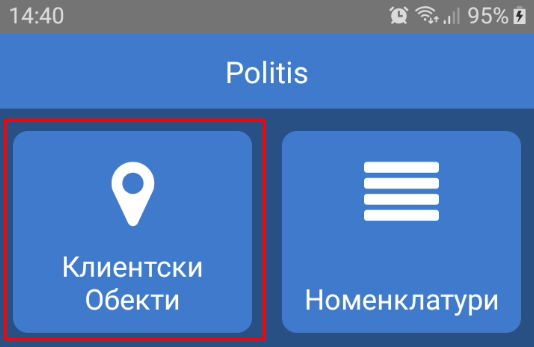
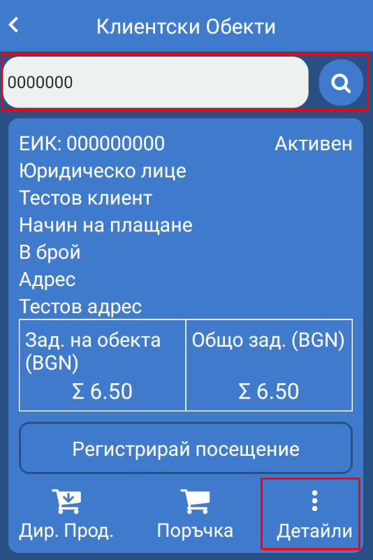
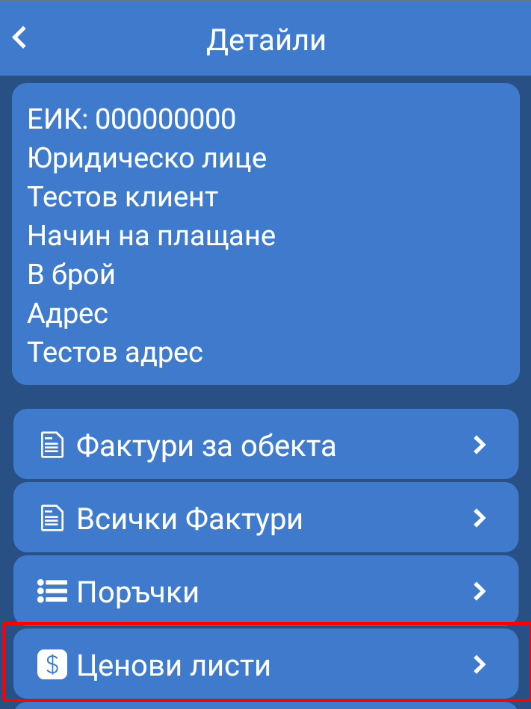
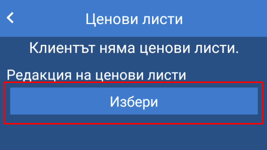
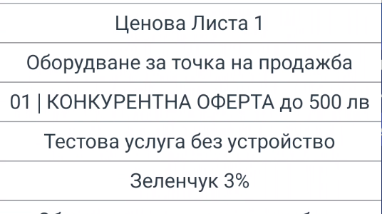
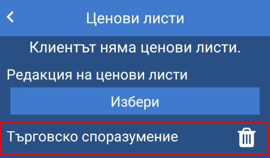
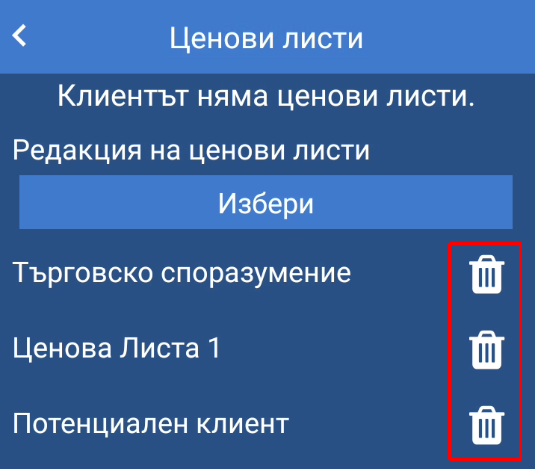
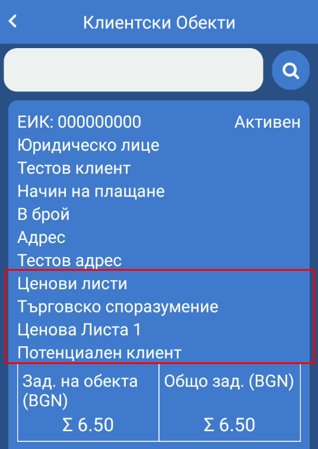

<h1 align="center">
    Управление на ценови листи
</h1>

ПОЛИТИС мобилно приложение предлага възможност за управление на ценови листи към клиент. Добавяне и/или промяна на ценови листи към клиент са възможни по един от следните начини:

## Номенклатура на клиенти 
   
Подробно описание на работа с номенклатура на клиенти и промяна на ценови листи - <link to="/politis/mobile/relationship-management/relationship-management/" name="Управление на Клиенти - мобилно приложение" ></link>

  

## Детайли за клиентски обект   
    
За достъп до детайли за клиентски обект от главното меню се избира *Клиентски обекти*. На дисплея на устройството се визуализира екран за търсене на клиентски обекти.

<split-panel>
    <panel>
        
    </panel>
     <panel>
        
    </panel>
</split-panel>

  

Търсене на клиентски обект се осъществява чрез поле, което се намира в горната част на екрана, по следните параметри:

* **ЕИК** - Единен Идентификационен Код за търговците и техните клонове, и клоновете на чуждестранните търговци, вписани в търговския регистър на Република България.
* **ЕГН** - Единен Граждански Номер за физически лица.
* **Наименование** - наименование на физическо или юридическо лице.
* **Мета данни** - допълнителна информация към клиентски обект.

Търсенето на клиентски обекти може да се направи по частично или пълно изписване на един от критериите за търсене. При частично изписване се визуализират до десет (10) резултата, които отговарят на избрания критерий.

Резултатите от търсенето се визуализират в отделни блокове, съдържащи основна информация за клиентския обект. За достъп до управление на ценовите листи се избира *Детайли* за съответния клиентски обект.   

На дисплея на устройството се визуализират детайли за клиентски обект. За достъп до ценови листи се избира *Ценови листи* от списъка с операции. След избиране на операцията се визуализира екран за управление на ценови листи.

<split-panel>
    <panel>
        
    </panel>
     <panel>
        
    </panel>
</split-panel>и

  

### Добавяне на ценова листа

Добавяне на нова ценова листа се извърва с натискане на бутон *Избери*, при което се отваря диалогов прозорец с всички регистрирани ценови листи. Ако дадена ценова листа е вече добавена, то тя няма да се визуализира в този списък.

<split-panel>
    <panel>
        
    </panel>
     <panel>
        
    </panel>
</split-panel>

  

При избор ценовата листа се добавя в списъка с ценови листи, намиращ се под бутона за добавяне.

### Премахване на ценова листа

Премахването на даден ценова листа се осъществява чрез бутон, който се намира отдясно на името на ценовата листа.

**След добавяне и/или премахване на ценовите листи се натиска бутон *Потвърждаване* за запазване на промените**

## Информация за активни ценови листи

Информация за текущите активни ценови листи може да се види от екрана за търсене на клиентски обекти. След потвърждаване на промяна на ценовите листи от детайли на клиентски обект потребителя се пренасочва към този екран.

За **подробни настройки на ценови листи и ценообразуване** - <link to="/politis/guide/pricelist-management/pricelist-management/" name="Управление на ценови политики - уеб" ></link>

При промяна на ценови листи на клиент от мобилното приложение на Политис трябва да се вземе под внимание **приоритета за прилагане на ценови листи и специални отстъпки към клиенти и клиентски обекти** - <link to="/politis/guide/pricelist-management/pricelist-management/#отправни-точки-при-ценообразуване" name="Отправни точки при ценообразуване" ></link>