<h1 align="center">
    Управление на клиенти
</h1>

Мобилното приложение на POLITIS предоставя функционалности свързани с управление на клиенти. За достъп до функционалностите се натиска бутон *Нуменклатури* в главното меню.

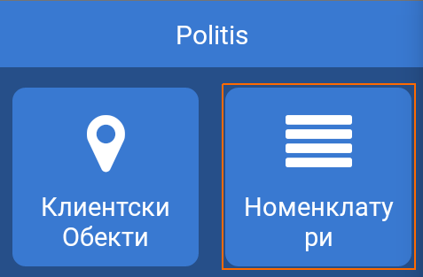

След като се зареди екрана с номенклатури се натиска бутон *Клиенти*

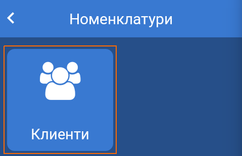

На дисплея на устройството се зарежда основния екран за работа с клиенти.

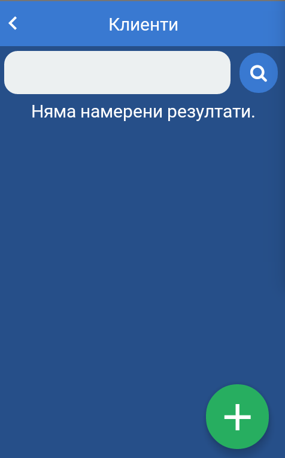

### Основни операции с клиенти

Основните операции с клиенти включват:
1. Търсене на клиент
2. Създаване на нов клиент

#### Търсене на клиент

Търсенето на клиенти се осъществява чрез поле в горната половина на екрана. 

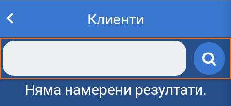

Критериите за търсене на клиент са:
* ***ЕИК*** - Единен Идентификационен Код за търговците и техните клонове, и клоновете на чуждестранните търговци, вписани в търговския регистър на Република България.
* ***ЕГН*** - Единен Граждански Номер за физически лица.
* ***Наименование*** - наименование на физическо или юридическо лице.

Търсенето на клиент може да се направи по частично или пълно изписване на един от критериите за търсене. При частично изписване се визуализират до десет (10) резултата, които отговарят на избрания критерий.

Резултатите от търсенето се визуализират в отделни блокове, съдържащи основна информация за клиента и даващи достъп до допълнителни функционалности.

Допълнителни функционалности са:
1. Редакция на клиент
2. Управление на ценови листи
3. Управление на обекти
4. Контакти

#### Създаване на нов клиент

Създаване на нов клиент се осъществява чрез натискане на бутона за нов клиент в долния десен ъгъл на екрана.

На дисплея се зарежда форма за регистрация на нов клиент.

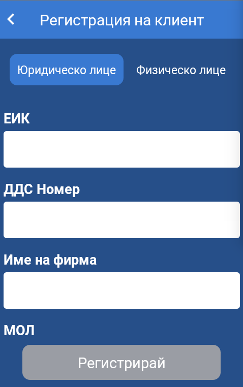

Формата има два варианта - за юридическо лице и за физическо лице. Преминаването от единия вариант към друг се осъществява чрез навигация с табове в горната част на екрана.

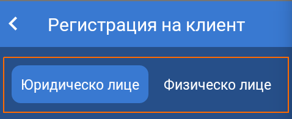

##### Юридическо лице

Формата за регистрация на юридическо лице предлага следните опции:
* *ЕИК* - Единен Идентификационен Код за търговците и техните клонове, и клоновете на чуждестранните търговци, вписани в търговския регистър на Република България. Това поле е ***задължително***. **При попълване на ЕИК се извършва справка с търговския регистър и получените данни се попълват автоматично във формата.** Ако информация за фирмата не е намерена потребителя може да въведе липсващата информация.
* *ДДС номер* - за вписаните по зДДС юридически лица. За Република България ДДС номера се получава като към ЕИК се добави префикс *BG*. За юридически лица в Европейския Съюз това поле отговаря на VIES (ВИЕС) номер.
* *Име на фирма* - наименование на юридическо лице в търговския регистър.
* *МОЛ* - материално отговорно лице.
* *Адрес* - адрес по регистрация на юридическото лице.
* *Начин на плащане* - предпочитан начин на плащане. От падащ списък може да се избере една от следните възможности - *В брой*, *По банков път*, *По интернет*, *С кредитна карта*.

След попълване на формата се натиска бутон *Регистрирай*. При успешна регистрация потребителя се пренасочва към екрана за търсене, където е зареден регистрирания клиент.

##### Физическо лице

Формата за регистрация на физическо лице предлага следните опции:
* *ЕГН* - Единен Граждански Номер на физическото лице.
* *Име* - Име по лична карта или друг документ за самоличност.
* *Начин на плащане* - предпочитан начин на плащане. От падащ списък може да се избере една от следните възможности - *В брой*, *По банков път*, *По интернет*, *С кредитна карта*.

След попълване на формата се натиска бутон *Регистрирай*. При успешна регистрация потребителя се пренасочва към екрана за търсене, където е зареден регистрирания клиент.

### Допълнителни операции с клиенти

Допълнителните операции с клиенти са налични при успешно търсене на клиент.

#### Редакция на клиент

За редакция на клиент се натиска бутон с формата на молив в горния десен ъгъл за съответния клиент.

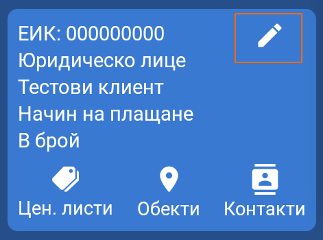

На дисплея се зарежда форма за редакция на клиент.

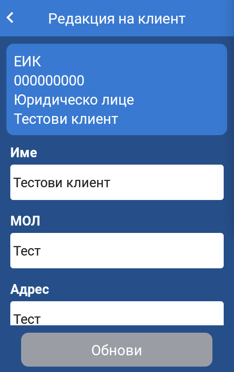

Формата за редакция на клиент дава възможност за промяна на следните полета:
* *Име* - наименование на клиента. 
* *МОЛ* - материално отговорно лице. Само за *юридическо лице*.
* *Адрес* - адрес на клиента. Само за *юридическо лице*.
* *Начин на плащане* - предпочитан начин на плащане. От падащ списък може да се избере една от следните възможности - *В брой*, *По банков път*, *По интернет*, *С кредитна карта*.

След нанасяне на необходимите промени се натиска бутон *Обнови*.

#### Управление на ценови листи

За управление на ценови листи се натиска бутон *Цен. листи* за съответния клиент.

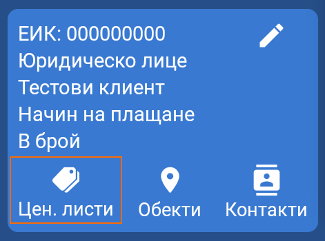

На дисплея се визуализира екрана за управление на ценови листи.

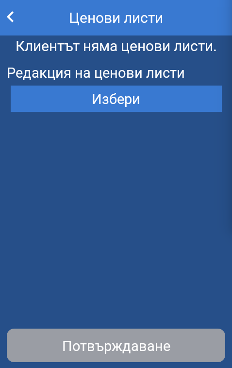

За добавяне на нова ценова листа се натиска бутон *Избери*, при което се показва модален прозорец със списък с ценови листи. При избор ценовата листа се добавя на екрана под бутон *Избери*. Тази операция се повтаря докато се добавят необходимите ценови листи. При добавяне на всички възможни ценови листи бутона *Избери* се деактивира.

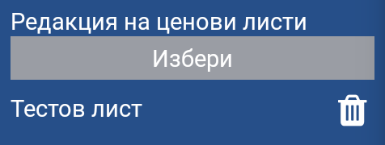

За премахване на дадена ценова листа се натиска бутон за изтриване вдясно от името на ценовата листа.

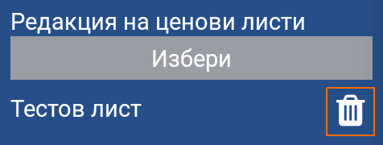

За запазване на промените се натиска бутон *Потвърждаване*.

#### Управление на клиентски обекти

За управление на клиентски обекти се натиска бутон *Обекти* за съответния клиент.

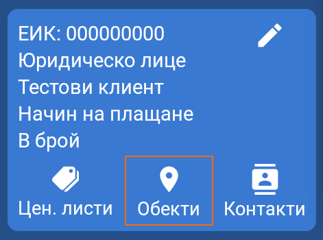

На дисплея се зарежда екрана за клиентски обекти.

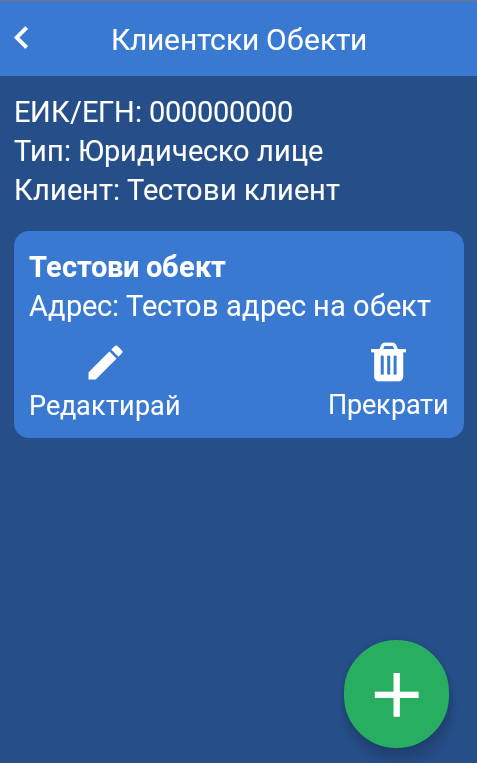

##### Регистрация на нов клиентски обект

Регистрация на нов обект се осъществява чрез натискане на бутона за нов клиентски обект в долния десен ъгъл на екрана.

На дисплея се зарежда форма за регистрация на нов клиентски обект.

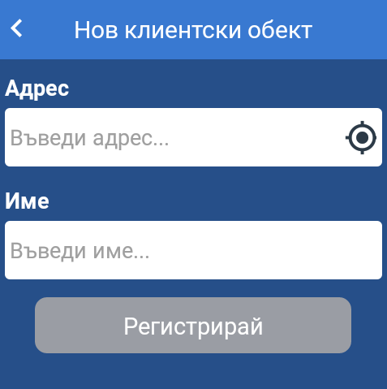

Формата за регистрация на клиентски обект предлага следните опции:
* *Адрес* - адрес на клиентски обект. Това поле дава възможнот за автоматично геолокиране на местополението на обекта чрез вградения GSP модул в мобилните устройства. Тази функционалност е налична при натискане на бутона в края на полето.
* *Име* - име на клиентски обект.

След попълване на формата се натиска бутон *Регистрирай*

##### Редакция на клиентски обект

За редакция на клиентски обект се натиска бутон *Редактирай* за съответния обект.

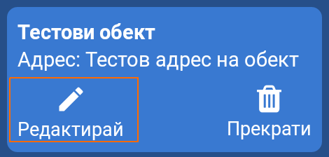

На дисплея се визуализира форма за редакция на клиентски обект.

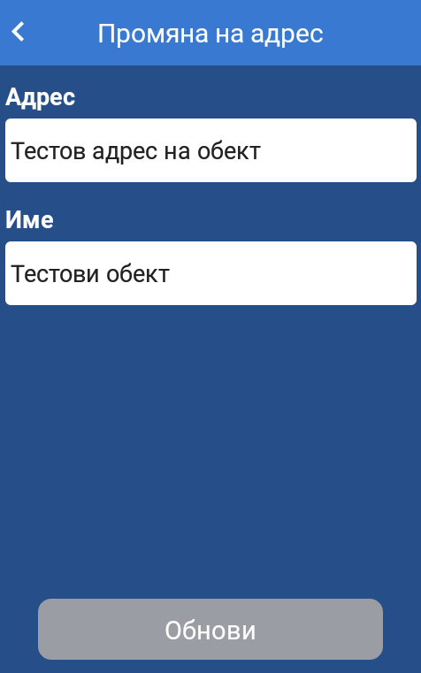

Формата за редакция на клиентски обект предлага следните опции:
* *Адрес* - адрес на клиентски обект.
* *Име* - име на клиентски обект.

След нанасяне на необходимите промени се натиска бутон *Обнови*

##### Прекратяване на клиентски обект

За прекратяване на клиентски обект се натиска бутон *Прекрати* за съответния обект.

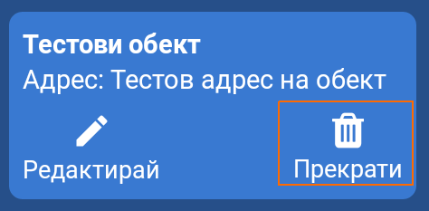

На дисплея се визуализира модал за потвърждение на операцията.

При прекратяване на клиентски обект се забранява извършването на търговска дейност със съответния обект.

#### Контакти

За достъп до контакти към клиент се натиска бутон *Контакти* за съответния клиент.

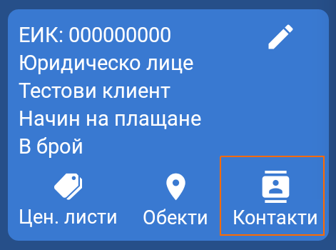

На дисплея се визуализира екрана с контакти към клиент.

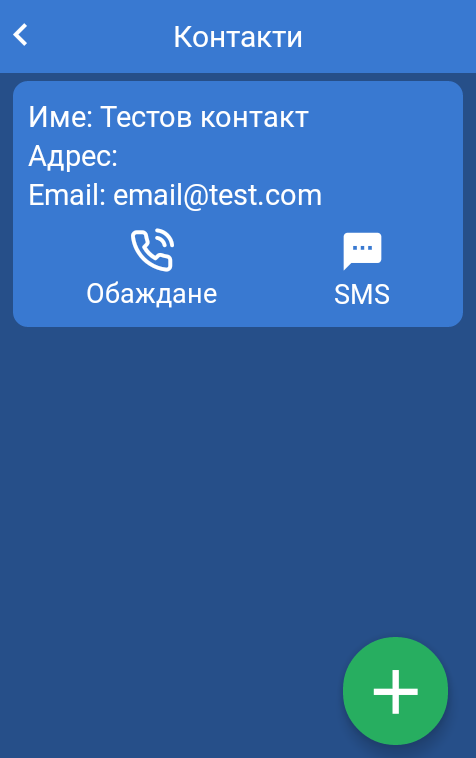

За всеки контакт при въведен телефонен номер има възможност за бързо набиране или изпращане на SMS.

##### Добавяне на нов контакт

Добавяне на нов контакт се осъществява чрез натискане на бутона за нов контакт в долния десен ъгъл на екрана.

На дисплея се визуализира форма добавяне за нов контакт.

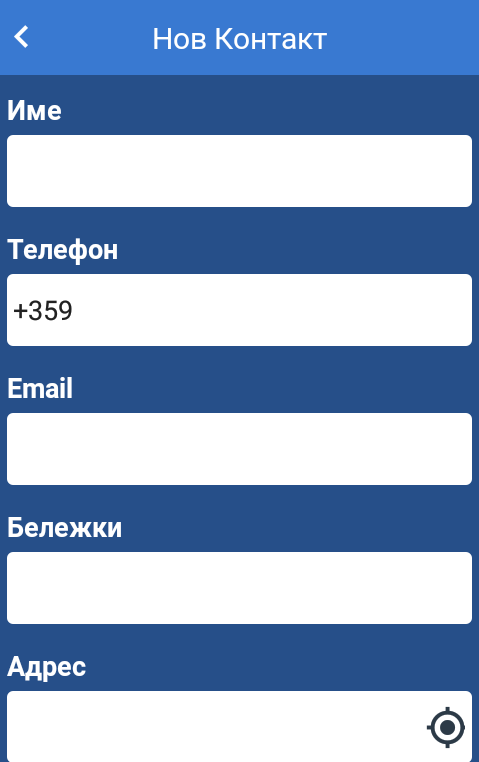

Формата добавяне за нов контакт предлага следните опции:
* *Име* - име на контакта. Това поле е *задължително*.
* *Телефон* - телефонен номер. В полето по подразбиране е попълнен кода на Република България (+359). При необходимост може да се редактира. Номера се въвежда без водещи нули. Пример: ако номера е *088 8888 888* в полето се въвежда *88 8888 888*. Това поле е *задължително*.
* *Email* - адрес на електронна поща.
* *Бележки* - допълнителна информация за контакта.
* *Адрес* - адрес на контакта. Това поле дава възможнот за автоматично геолокиране на местополението на обекта чрез вградения GSP модул в мобилните устройства. Тази функционалност е налична при натискане на бутона в края на полето.

След попълване на необходимите полета се натиска бутон *Регистрирай*.