<h1 align="center">
    Регистриране на продажби
</h1>

Регистрирането на продажби в мобилното приложение POLITIS се осъществява по два начина:
1. *Директна продажба* - при директна продажба се създават автоматично документите фактура и стокова разписка.
2. *Поръчка - Доставка* - този начин е разделен на две фази. Първо се прави заявка за продажба, от която може да се генерира списък за опаковане. След това стоката се доставя на клиента, при което се генерира стокова разписка и фактура.

## Търсене на клиентски обекти

Регистрацията на продажби се извършва от екрана за *Клиентски обекти*.

 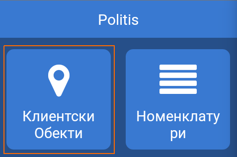

 След натискане на бутона се зарежда екран за търсене на клиенски обекти.

 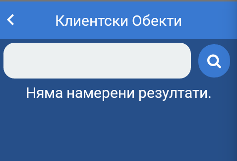

 Търсенето на клиентски обекти се осъществява чрез поле за търсене в горната част на екрана.

 Критериите за търсене на клиентски обекти са:
 * ***ЕИК*** - Единен Идентификационен Код за търговците и техните клонове, и клоновете на чуждестранните търговци, вписани в търговския регистър на Република България.
 * ***ЕГН*** - Единен Граждански Номер за физически лица.
 * ***Наименование*** - наименование на физическо или юридическо лице.
 * ***Мета данни*** - допълнителна информация към клиентски обект. 

 Търсенето на клиентски обекти може да се направи по частично или пълно изписване на един от критериите за търсене. При частично изписване се визуализират до десет (10) резултата, които отговарят на избрания критерий.

Резултатите от търсенето се визуализират в отделни блокове, съдържащи основна информация за клиентския обект и даващи достъп до допълнителни функционалности.
 
 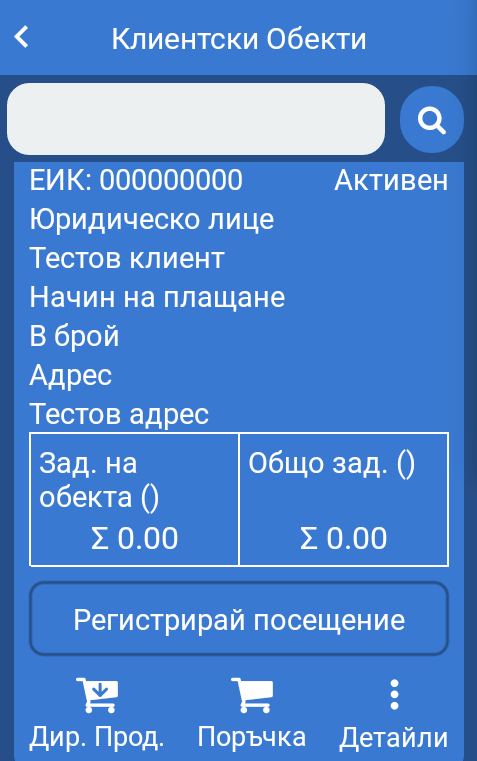

 ## Директна продажба

 За започване на директна продажба се натиска бутон *Дир. Прод.* за съответния клиентски обект.

 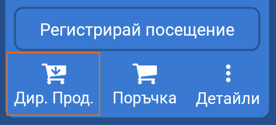

 На на дисплея се зарежда екрана за директна продажба

 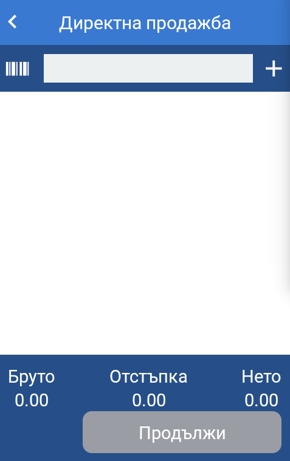

### Търсене на Артикул / Сканиране

Търсене на артикули в директна продажба се осъществява чрез поле в горната част на екрана.

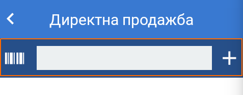

Критериите за търсене на артикул са:
* ***Име на артикула*** - наименование на артикул.
* ***Код при доставчик*** - уникален номер, чрез които варианта се завежда в системата.
* ***SKU*** - SKU (Stock Keeping Unit) уникален идентификатор на складовата единица.
* ***Баркод*** - баркод на единична опаковка или пакет.

При пълно съвпадение от търсене артикула се добавя автоматично в кошницата. При повече от едно съвпадение се показва падащо меню с предложение.

Търсенето по баркод може да се осъществи чрез камерата на мобилното устройство или чрез вграден модул за сканиране на някои устройства.

Партида се добавя автоматично към реда, ако в POLITIS е избрана настройка *Автоматично избиране на най-старата партида*. Ако няма валидна партида на реда се визуализира индикатор за липсваща партида.

Ако е избрана настройка *Ръчно избиране на партида*, то трябва да бъде избрана от детайли за реда. 

### Странично меню

Страничното меню е предназначено за ръчно добавяне на артикули. Менюто се намира в лявата част на екрана и се показва чрез издърпване.

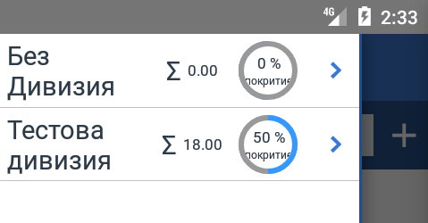

В страничното меню артикулите са организирани по дивизии. Артикулите без дивизия се намират в дивизия *Без дивизия*. До името на дивизията се показва общата сума на наличните артикулите в съответната дивизия. Също така има индикатор каква част от всички артикули в дивизията се покриват от наличните артикули.

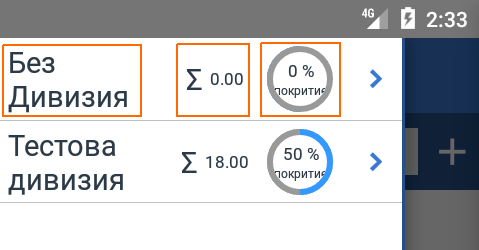

Навигацията в страничното меню се извърва чрез натискане върху името на дивизията. За да се навигира обратно до списъка с дивизиии се натиска отново върху името на дивизията, което се намира най-отгоре на списъка с артикули в зелен цвят.

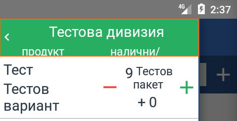

В списъка с артикули се виждат наличностите за всеки артикул. Добавяне и премахване на количество за даден артикул от кошницата се осъществява чрез бутоните *плюс* и *минус*. Бутона "плюс" добавя артикула към кошницата и увеличва количеството на добавения артикул с *1* за артикули, които се продава на цели количества или с *0,100* за артикули, които имат активирана опция *Дробни числа за количество* от продуктовия каталог. Когато даден продукт е добавен към кошницата се оцветява в зелен цвят.

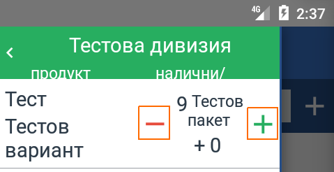

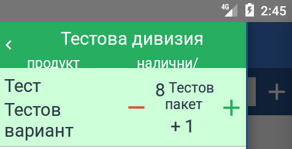

Партида се добавя автоматично към реда, ако в POLITIS е избрана настройка *Автоматично избиране на най-старата партида*. Ако няма валидна партида на реда се визуализира индикатор за липсваща партида.

Ако е избрана настройка *Ръчно избиране на партида*, то трябва да бъде избрана от детайли за реда. 

### Информация и редакция на ред

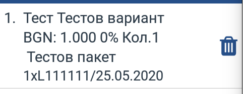

Всеки ред от кошницата за директна продажба съдържа следната информация:
* ***Име на продукта***
* ***Име на варианта***
* ***Цена за единична бройка*** - код на валута и цена до трети знак след десетичната запетая.
* ***Отстъпка*** - отстъпка в проценти.
* ***Количество*** 
* ***Партида*** - количество от партидата, номер и срок на годност.

За редакция се натиска върху съответния ред. На дисплея се визуализират *Детайли* за реда. 

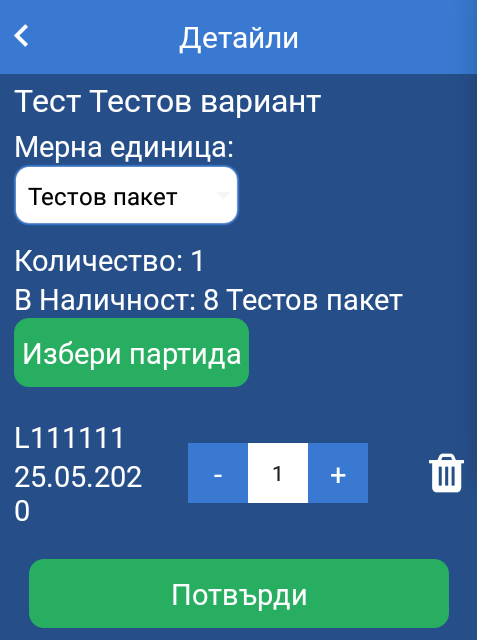

От детайли за реда може да се редактират следните параметри:
* ***Мерна единица*** - единицата, в която се продава съответния артикул.
* ***Избор на партида*** - отваря модален прозорец със списък с валидните партиди за артикула. Партидите, които не са валидни съдържат червен *Х* вдясно от срока на годност.
* ***Наличност*** - текуща наличност в склада на потребителя.
* ***Количество на партида*** - промяната на количество се осъществява чрез натискане на бутонитр *плюс* и *минус* на полето за количество или чрез директно изписване на необходимите бройки от клавиатурата на устройството.
* ***Премахване на партида*** - чрез натискане на бутона за изтриване вдясно от полето за количество на партида.

За премахване на ред от кошницата се натиска бутона за изтриване в края на реда.

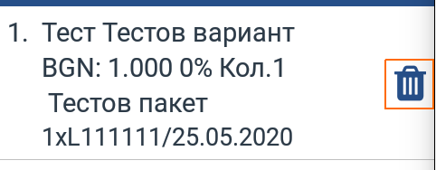

### Завършване на директна продажба

След добавяне на всички артикули към кошницата за директна продажба се натиска бутон *Продължи*. 

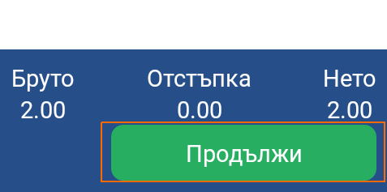

На дисплея на устройството се визуализира екрана за *Финализиране на продажба*

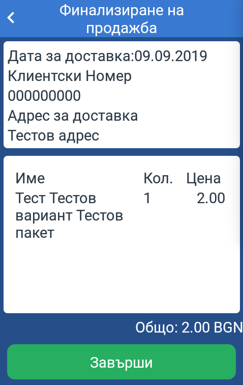

Екрана съдържа информация за дата и адрес на доставката, информация за артикулите в кошницата и общата сума на продажбата. След проверка за несъответствия се натиска бутон *Завърши*. На дисплея се показва модален прозорец с общата сума на доставката и поле за подпис на отговорното лице получаващо артикулите. 

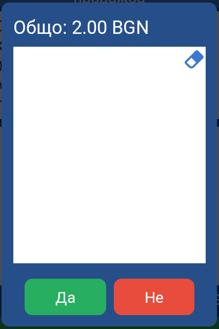

При натискане на бутон *Да* на екрана се показва съобщение *Директната продажба е създадена успешно*. При тази операция се създават документите *Стокова разписка* и *Фактура*. На екрана се визуализират *Детайли за поръчка*.

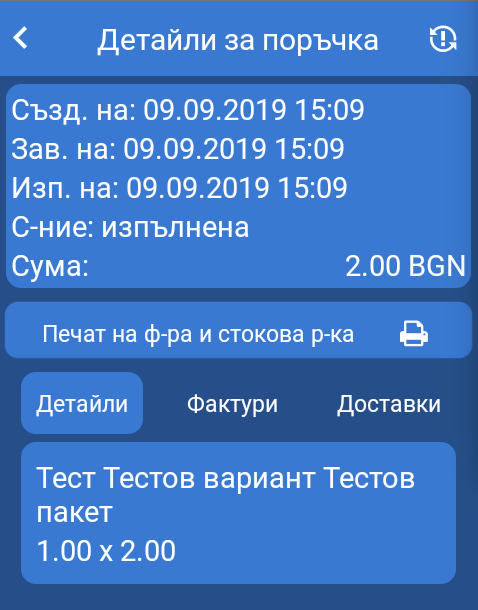

*Важно!* При директна продажба се създава **само една** *Фактура* и **само една** *Стокова разписка*. Сумата на *Фактура* и *Стокова разписка* при директна продажба са равни.

## Поръчка - Доставка

### Поръчка

За започване на поръчка се натиска бутон *Поръчка* за съответния клиентски обект. 

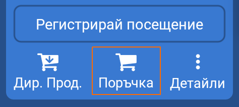

На на дисплея се зарежда екрана за поръчка.

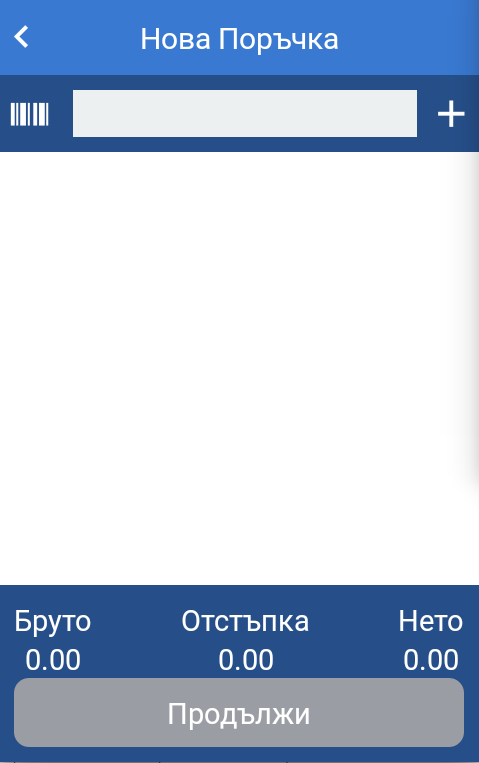

####Търсене на Артикул / Сканиране

Търсене на артикули в поръчката се осъществява чрез поле в горната част на екрана.

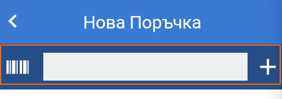

Критериите за търсене на артикул са:
* ***Име на артикула*** - наименование на артикул.
* ***Код при доставчик*** - уникален номер, чрез които варианта се завежда в системата.
* ***SKU*** - SKU (Stock Keeping Unit) уникален идентификатор на складовата единица.
* ***Баркод*** - баркод на единична опаковка или пакет.

При пълно съвпадение от търсене артикула се добавя автоматично в кошницата. При повече от едно съвпадение се показва падащо меню с предложение.

Търсенето по баркод може да се осъществи чрез камерата на мобилното устройство или чрез вграден модул за сканиране на някои устройства.

#### Странично меню

Страничното меню е предназначено за ръчно добавяне на артикули. Менюто се намира в лявата част на екрана и се показва чрез издърпване.

В страничното меню артикулите са организирани по дивизии. Артикулите без дивизия се намират в дивизия *Без дивизия*. До името на дивизията се показва общата сума на наличните артикулите в съответната дивизия. Също така има индикатор каква част от всички артикули в дивизията се покриват от наличните артикули.

Навигацията в страничното меню се извърва чрез натискане върху името на дивизията. За да се навигира обратно до списъка с дивизиии се натиска отново върху името на дивизията, което се намира най-отгоре на списъка с артикули в зелен цвят.

В списъка с артикули се виждат наличностите за всеки артикул. Добавяне и премахване на количество за даден артикул от кошницата се осъществява чрез бутоните *плюс* и *минус*. Бутона "плюс" добавя артикула към кошницата и увеличва количеството на добавения артикул с *1* за артикули, които се продава на цели количества или с *0,100* за артикули, които имат активирана опция *Дробни числа за количество* от продуктовия каталог. Когато даден продукт е добавен към кошницата се оцветява в зелен цвят.

#### Информация и редакция на ред

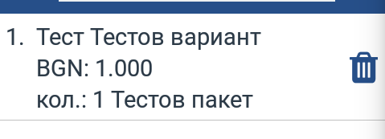

Всеки ред от кошницата за директна продажба съдържа следната информация:
* ***Име на продукта***
* ***Име на варианта***
* ***Име на пакета***
* ***Цена за единична бройка*** - код на валута и цена до трети знак след десетичната запетая.
* ***Количество*** 

За редакция се натиска върху съответния ред. На дисплея се визуализират *Детайли* за реда. 

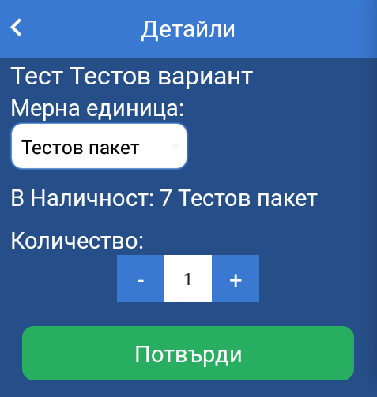

От детайли за реда може да се редактират следните параметри:
* ***Мерна единица*** - единицата, в която се продава съответния артикул.
* ***Наличност*** - текуща наличност на артикул в слада на потребителя.
* ***Количество***

За премахване на ред от кошницата се натиска бутона за изтриване в края на реда.

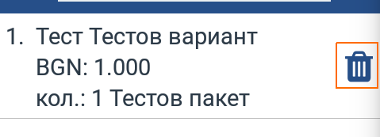

#### Завършване на поръчка

След добавяне на всички артикули към кошницата за поръчка се натиска бутон *Продължи*.

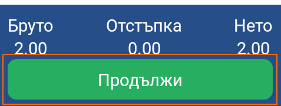

На дисплея на устройството се визуализира екрана за *Финализиране на поръчка*

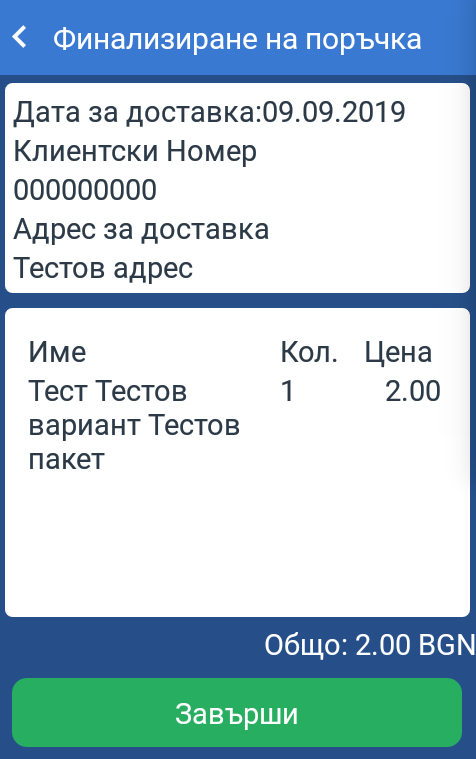

Екрана съдържа информация за дата и адрес на доставката, информация за артикулите в кошницата и общата сума на поръчката.

След проверка за несъответствия се натиска бутон *Завърши*. На дисплея се показва модален прозорец с общата сума на поръчката и поле за подпис на отговорното лице.

При натискане на бутон *Да* на екрана се визуализират *Детайли за поръчка*.

### Доставка

За доставка към вече направена поръчка се натиска бутон *Детайли* за съответния клиентски обект.

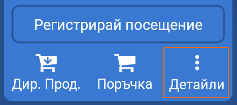

На дисплея се показват детайли за клиентски обект и бутони с допълнителни функционалности.
Доставка се прави от екрана за поръчки, който е достъпен при натискане на бутон *Поръчки*.

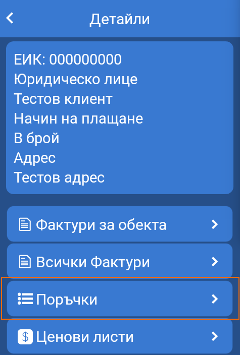

На дисплея се зарежда списък с поръчки. 

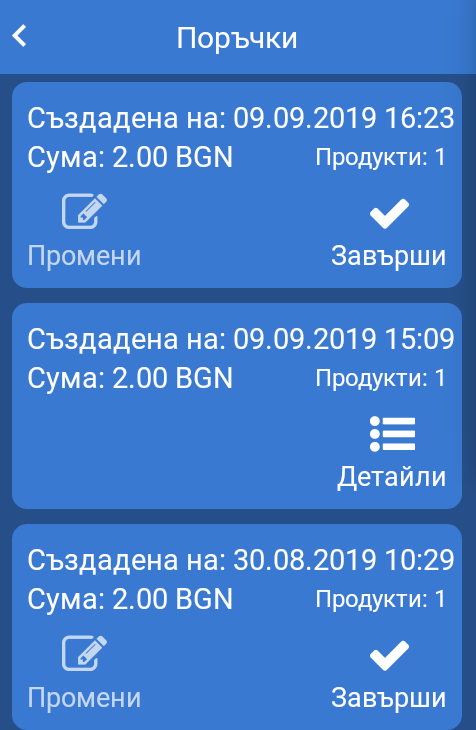

За да може да се направи доставка поръчката трябва да се потвърди чрез натискане на бутон *Завърши*.

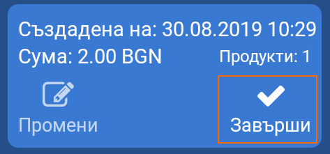

За нова доставка към поръчка се натиска бутон *Доставка* за съответната поръчка.

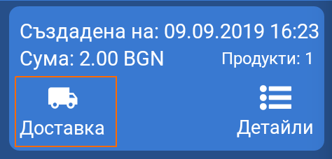

На дисплея на устройството се зарежда екран за нова доставка. Ако артикулите в поръчкара са налични с склада на потребителя те се добавят автоматично към кошницата за доставка.

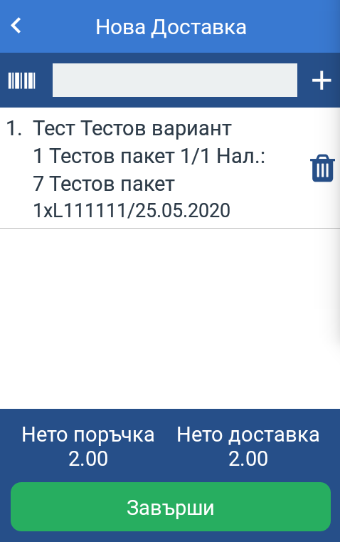

При лиспа на артикули от поръчката в склада на потребителя те не се добавят. 

Партида се добавя автоматично към реда, ако в POLITIS е избрана настройка *Автоматично избиране на най-старата партида*. Ако няма валидна партида на реда се визуализира индикатор за липсваща партида. 

*Важно!* Доставката през мобилното приложение не може да съдържа артикули, които не учатват в поръчката и количествата на артикулите не може да надхвърлят съответните количества от поръчката.

За премахване на ред от кошницата се натиска бутона за изтриване в края на реда.

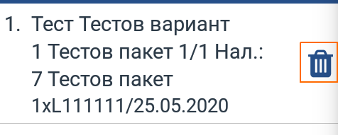

## Детайли за поръчка

Екрана за детайли за поръчка дава възможност да се отпечатат документи *Стокова разписка* и *Фактура*. Документите могат да бъдат отпечатани заедно и поотделно. За отпчатване на двата документа се натиска бутона *Печат на ф-ра и стокова р-ка*.

На екрана има три таба:
* ***Детайли*** - списък с артикулите участващи в поръчката.
* ***Фактури*** - съдържа информация за номер на фактура, дължима сума и платена сума по фактура. Таба дава възможност за отпечатване на документ *Фактура* (*Печат*), преглед на плащанията по фактура (*Плащания*) и създаване на ново плащане (*Плати*).
* ***Доставки*** - съдържа информация за сума на доставката и брой редове. Таба дава възможност за отпечатване на документ *Стокова разписка*.
