<h1 align="center">
    Получаване на стока
</h1>

Операциите свързани с покупка на стока в мобилното приложение на Политис са следните: *Получаване, Печат, Завърши*.   
Достъп до фунционалностите свързани с получаване на стока се осъществява като от главното меню се избере *Стоков контрол* и след това *Получаване на стока*.

<split-panel>
    <panel>
        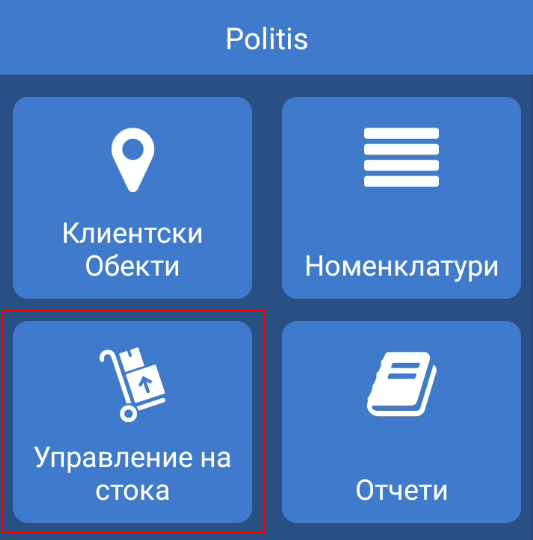
    </panel>
    <panel>
        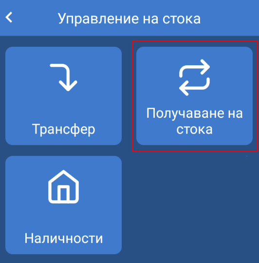
    </panel>
</split-panel>

  

На дисплея на устройството се визуализира списък със заявки за покупка. Списъкът съдържа само заявки направени към склада, към който потребителят е назначен. Приемането на стока може да се осъществи само за заявки със статус *Очаква стока*.

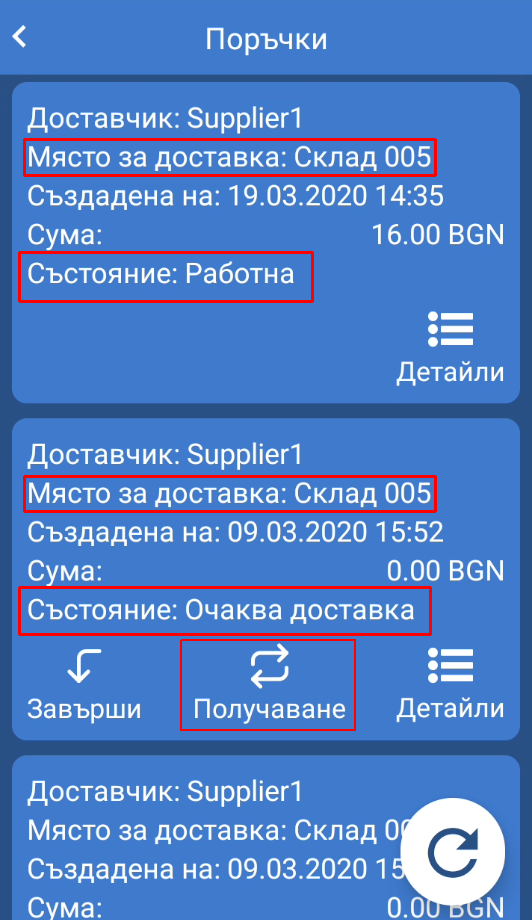

## Добавяне на артикул 

При натискане на бутон *Получване* на дисплея се зарежда форма за получаване на стока.
Приемането на артикули може да се осъществи по два начина: *ръчно* и чрез *сканиране на баркод*. Артикули се въвеждат ръчно чрез поле за търсене в горната част на екрана. При писане се поява списък с предложения. При пълно съвпадение артикула се добавя автоматично. Сканиране се осъществява чрез баркод скенер в устройството.   

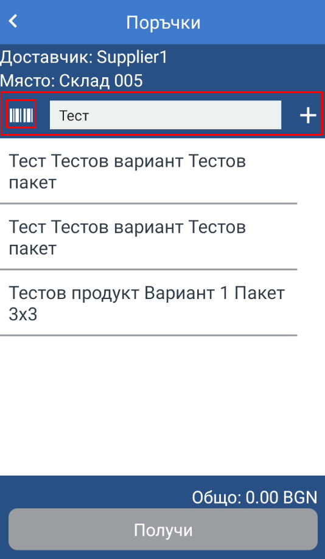

При избор/сканиране на даден артикул той се добавя към списъка с артикули. **Името на артикула** във всеки ред от списъка е бутон, който препраща потребителя към екрана с *детайли за артикул*, където може да се извършат следните операции: *избиране на партиди*, *промяна на количество*, *регистрация на партида*.   
**Икона с отворена кутия с въпрос** - артикула е настроен за проследяване на партиди и трябва да бъде избрана или регистрирана партида за артикул.

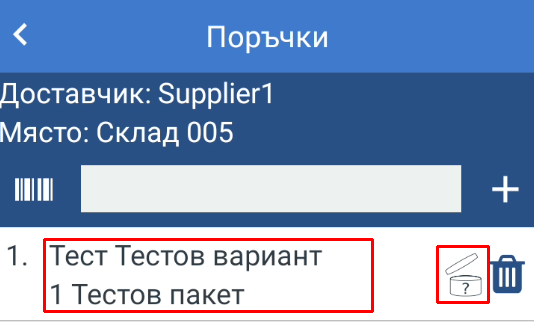

## Избор и регистрация на партиди

Избора и/или регистрация на нова партида за артикул се осъществява през екрана с детайли за артикул.

### Избор на партида

За избор на партида от вече регистрирани партиди за артикула се натиска бутон *Избери партида*. На дисплея се визуализира диалогов прозорец с всички регистрирани партиди за избрания артикул. 

<split-panel>
    <panel>
        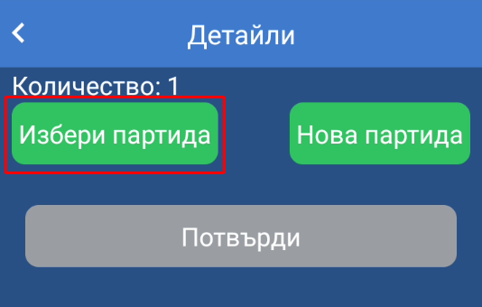
    </panel>
    <panel>
        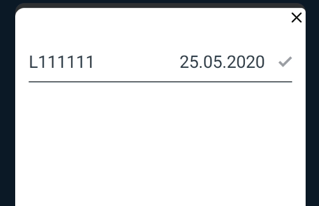
    </panel>
</split-panel>

  

След избор на партидата се добавя към артикула и има възможност за промяна на количество или премахване на партидата. Един артикул може да има повече от една партиди.

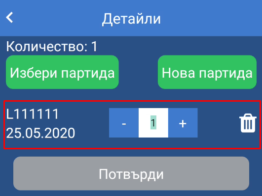

### Регистрация на нова партида

При необходимост или при липса на валидна партида за артикула може да се регистрира нова партида от екрана с детайли за артикула, където се избира *Нова партида*.

<split-panel>
    <panel>
        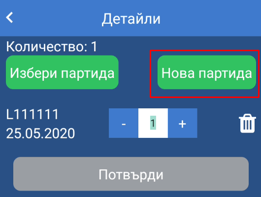
    </panel>
    <panel>
        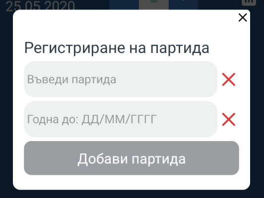
    </panel>
</split-panel>

  

Формата за регистриране предлага следните полета:

* **Въведи партида** - номер на партида. Например: L141414
* **Годна до** - срок на годност на партида. Дата се въвежда без разделители или знаци във формат *ДДММГГГГ*. Например: 21.03.2021 г. се въвежда 22032021.

След попълване на полетата се натиска бутон *Добави партида*.

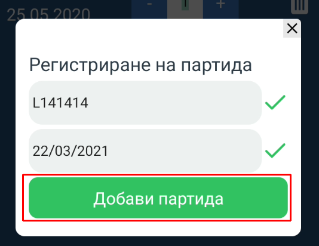

## Потвърждаване на получаване и завършване на заявка за покупка

След добавяне на всички артикули за приемане се натиска бутон *Получи*, при което се визуализира екран със статистика за заявени, получени и чакащи получаване артикули.

<split-panel>
    <panel>
        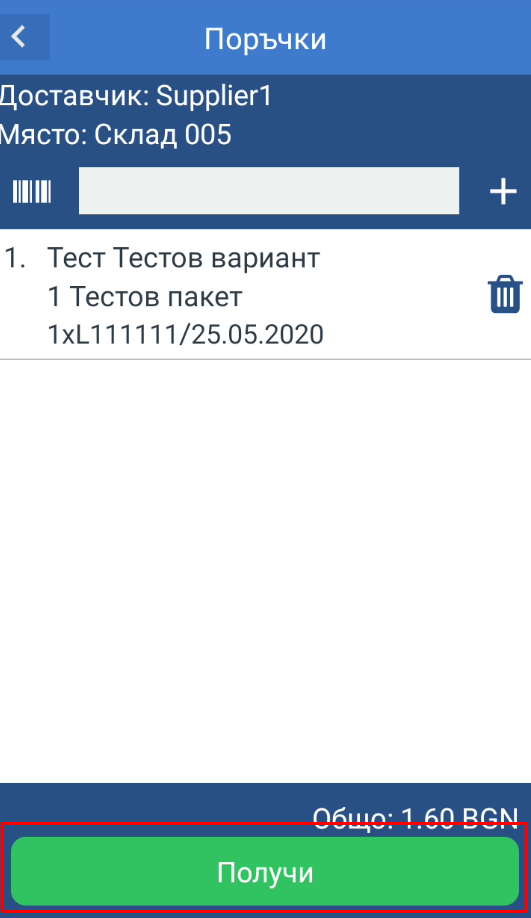
    </panel>
    <panel>
        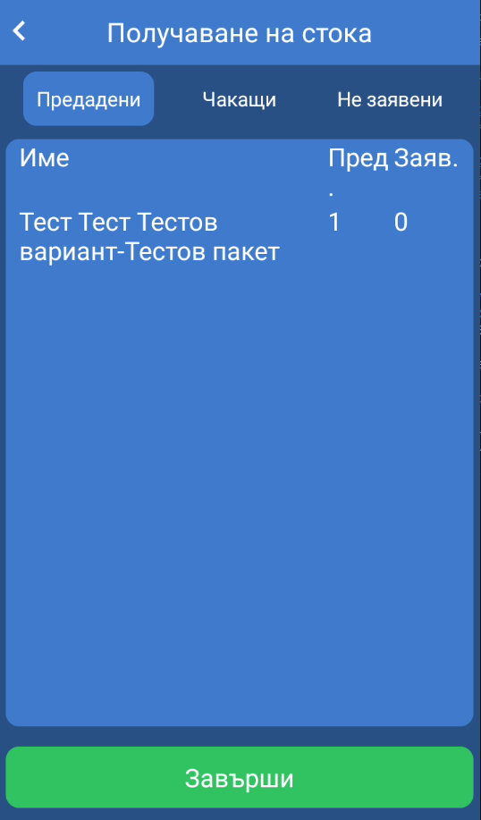
    </panel>
</split-panel>

  

След проверка на артикулите се натиска бутон *Завърши*.  

От списъка със заявки за покупка може да се проверят детайлите за заявката.

<split-panel>
    <panel>
        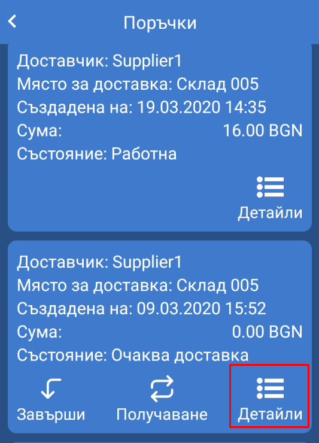
    </panel>
    <panel>
        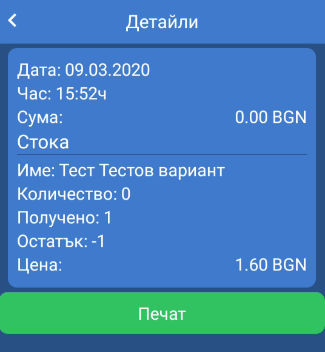
    </panel>
</split-panel>

  

След като получаването на стока е завършено заявката за поръчка трябва да се завърши от бутон *Завърши* от списъка със заявки.

<split-panel>
    <panel>
        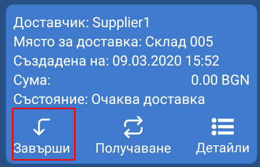
    </panel>
    <panel>
        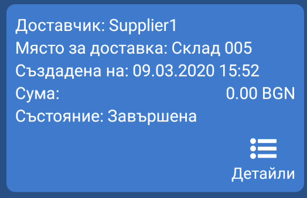
    </panel>
</split-panel>

  
