<h1 align="center">
    Трансфер на стока
</h1>

Политис мобилно приложение позволява трансфериране на стока от и към склада на текущия потребител. За да се направи *Трансфер на стока* от главното меню се избира *Управление на стока* и след това *Трансфер*.

<split-panel>
    <panel>
        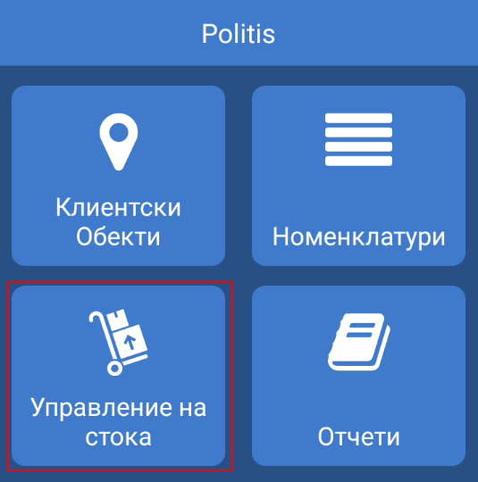
    </panel>
    <panel>
        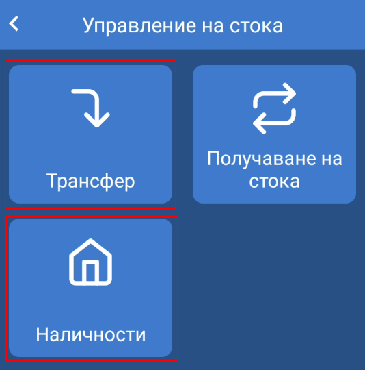
    </panel>
</split-panel>

  

На дисплея на устройството се зарежда екран със списък с трансфери.

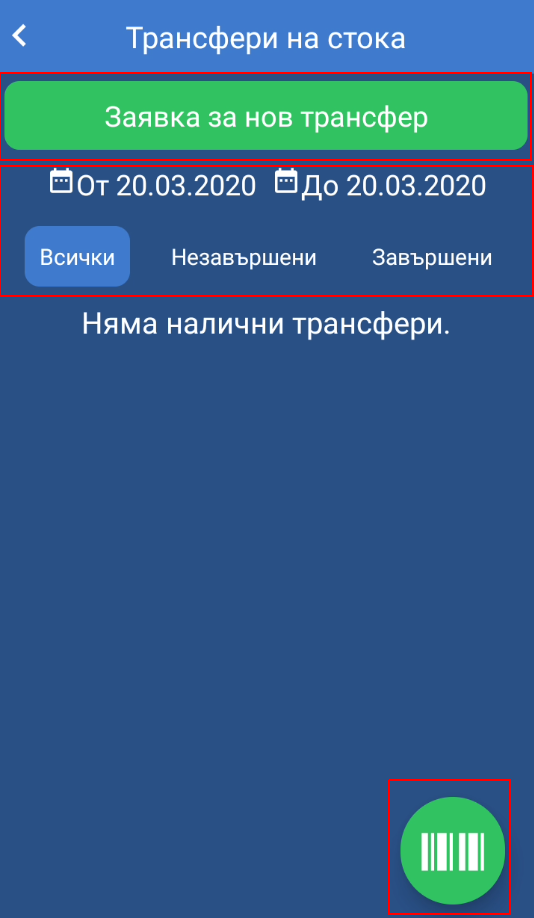

Екрана се състои от следните компоненти:

* **Заявка за нов трансфер** - създава нова заявка за трансфер
* **Филтри** - филтър по дата и филтър по статус на трансфер
* **Бутон за сканиране на заявка** - намира се в долния десен ъгъл на екрана и служи за сканиране на баркод от документ *Заявка за трансфер*.

## Нов трансфер

Нов трансфер се създава чрез натискане на бутон *Заявка за нов трансфер*

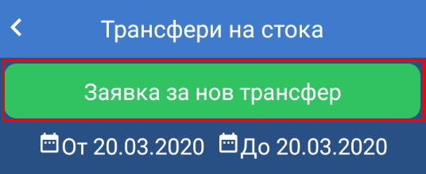

На дисплея на устойството се зарежда екран за нова заявка за трансфер.

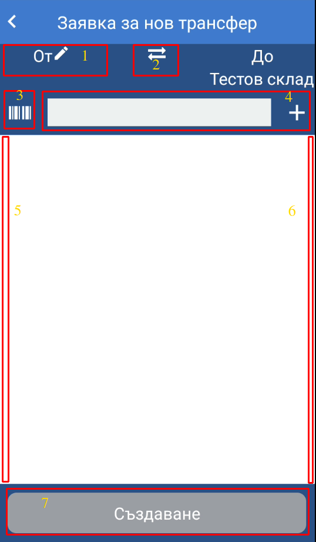

Екранът съдържа следните компоненти:

1. **1. От** - склада, от който се заявява стока. При натискане се появява списък със възможните складове.
2. **2. Бутон за размяна на складове** - обръща посоката на трансфера. По подразбиране заявката е за получаване на стока към склада на потребителя. При настискането на бутона заявката е за предаване на стока от склада на потребителя.
3. **3. Бутон за сканиране** - бутон за сканиране на баркод.
4. **4. Поле за търсене на артикул** - поле за ръчно въвеждане на артикули. Артикул може да се търси по следните параметри: *име, код при доставчик*.
5. **5. Ляво странично меню** - улеснява добавянето на артикули и показва текущата **наличност на склада на потребителя** и наличността, която ще е налична в склада след получаване на трансфера.

<split-panel>
    <panel>
        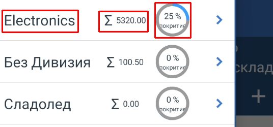
    </panel>
    <panel>
        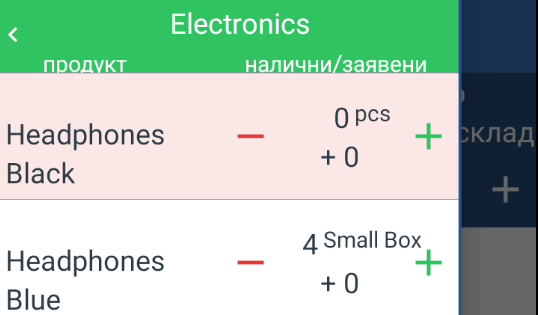
    </panel>
</split-panel>

  

Артикулите в менюто са организирани по дивизии. За всяка дивизия може да се види следната информация:
- *име на дивизия*
- *обща стойност на наличните артикули от дивизия*
- *% покритие* - колко процента от всички артикули от дивизията са текущо налични

6. **6. Дясно странично меню** - препоръчани артикули за трансфер. Съдържа списък от артикули, които са били доставени предишния ден.

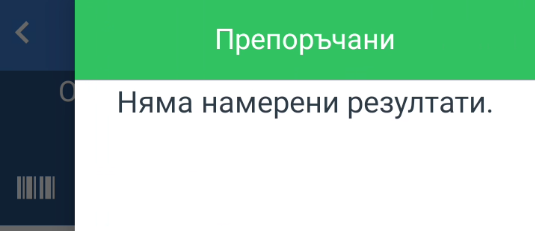

7. **7. Бутон за създаване на заявка**

След създаване на заявкат потребителя се пренасочва към списъка с трансфери. **За да се приема/предава стока заявката за трансфер трябва да се потвърди**. Отпечатване на заявка за трансфер е възможно от детайли за трансфера.

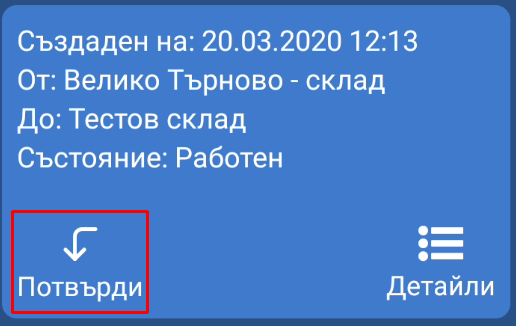

  

## Предаване на стока от трансфер

За предаване на стока се избира *Предаване* за съответния трансфер от списъка с трансфери.

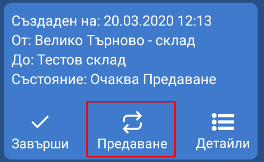

На дисплея на устройството се визуализира екран за предаване на стока от трансфер.

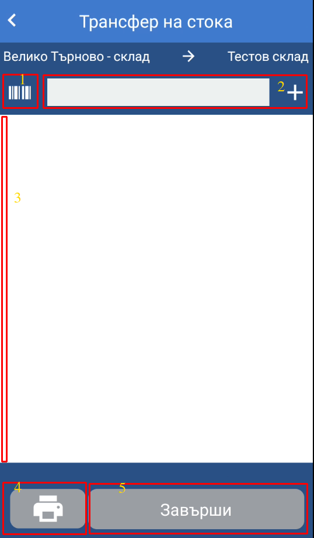

Екранът съдържа следните компоненти:

1. **1. Бутон за сканиране** - бутон за сканиране на баркод.
2. **2. Поле за търсене на артикул** - поле за ръчно въвеждане на артикули. Артикул може да се търси по следните параметри: *име, код при доставчик*.
3. **3. Странично меню** - улеснява добавянето на артикули и показва текущата **наличност на склада, към който е транфера** и наличността, която ще е налична в склада след получаване на трансфера. Артикулите в страничното меню за организирани по дивизии.
4. **4. Бутон за печат** - бутон за отпечатване на текущо добавени артикули.
5. **5. Бутон за завършване** - завършване на добавянето на артикули и пренасочване към екран за проверка и потвърждаване.

При избиране на артикул той се добавя към текущите артикули за предаване. 

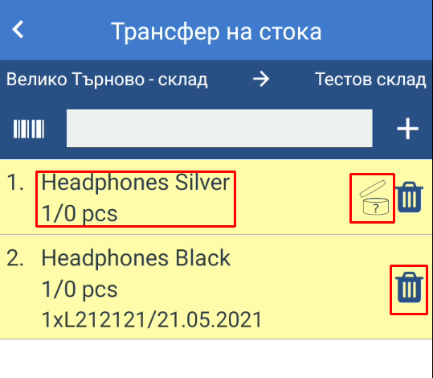

**Отворена кутия с въпрос** - този символ означава, че артикула е маркиран за проследяване на партида и трябва да се добави партида преди да се предаде трансфера.
**Име на артикул** - името на артикула е препратка към детайли за артикул.

### Избиране на партида

Избирането на партида към артикул е възможна от детайли за артикула, където се избира *Избери партида*. На дисплея се визуализира списък с текущо активните партиди за артикула.  

<split-panel>
    <panel>
        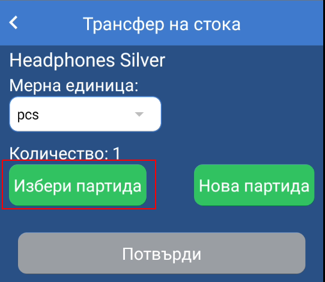
    </panel>
    <panel>
        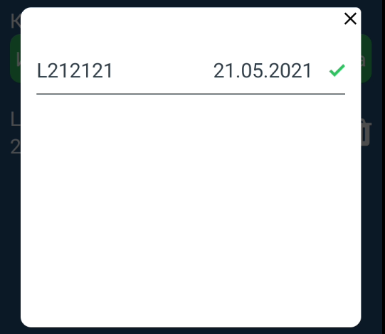
    </panel>
</split-panel>

  

При избор на партида от списъка тя се добавя към артикула и има възможност за промяна на количеството на артикула от тази партида или премахването ѝ.

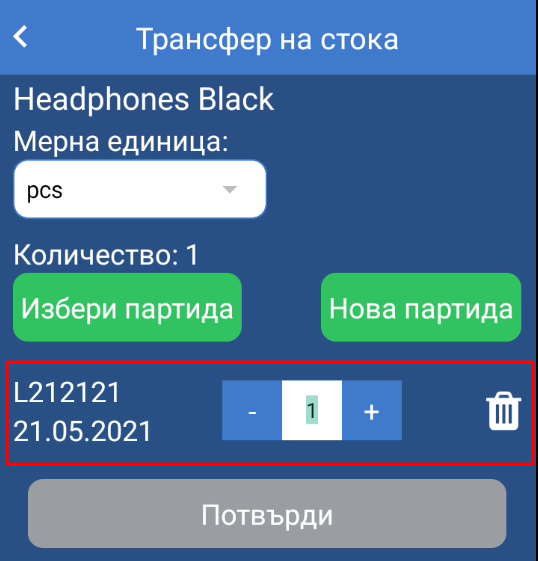

Към един артикул може да се добавят повече от една партиди за едно предаване.

### Регистриране на партида

Политис мобилно приложение дава възможност за регистриране на нова партида за артикул при трансфер, когато е необходимо или няма налична активна партида, която може да се избере от списъка с партиди.   
За регистриране на нова партида от детайли за артикул се избира *Нова партида*. На дисплея се визуализира форма за регистриране на нова партида.

<split-panel>
    <panel>
        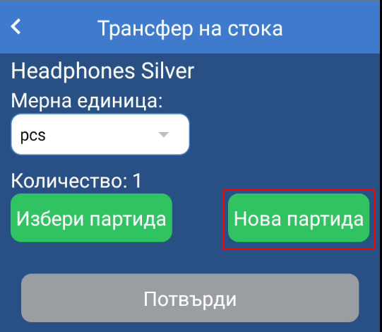
    </panel>
    <panel>
        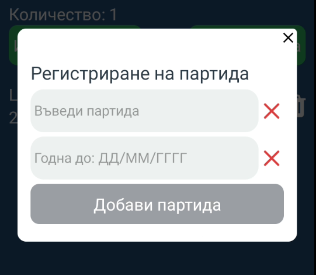
    </panel>
</split-panel>

  

Формата съдържа следните полета:

* **Въведи партида** - номер на партида. Например: L141414
* **Годна до** - срок на годност на партида. Дата се въвежда без разделители или знаци във формат *ДДММГГГГ*. Например: 21.03.2021 г. се въвежда 22032021.

След попълване на полетата се натиска бутон *Добави партида*.

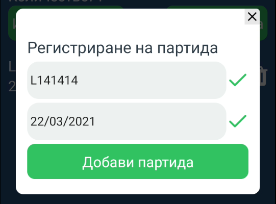

Партидата се регистрира и добавя към артикула и има възможност за промяна на количеството на артикула от тази партида или премахването ѝ.

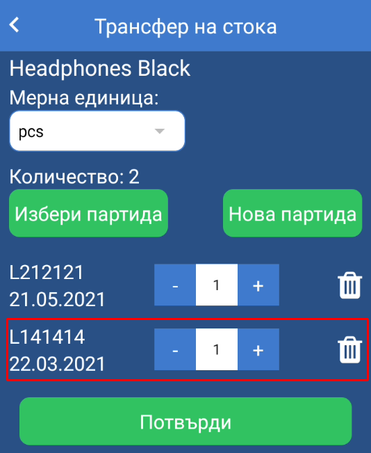

### Потвърждаване на предаване и завършване на трансфер

След добавяне на всички артикули към предаването се натиска бутон *Завърши*. На дисплея на устройството се визуализира екран за потвърждение на предаване със статистика за получените, чакащите и добавените не заявени артикули към текущия трансфер. За потвърждение на предаването се натиска бутон *Завърши предаването*.

<split-panel>
    <panel>
        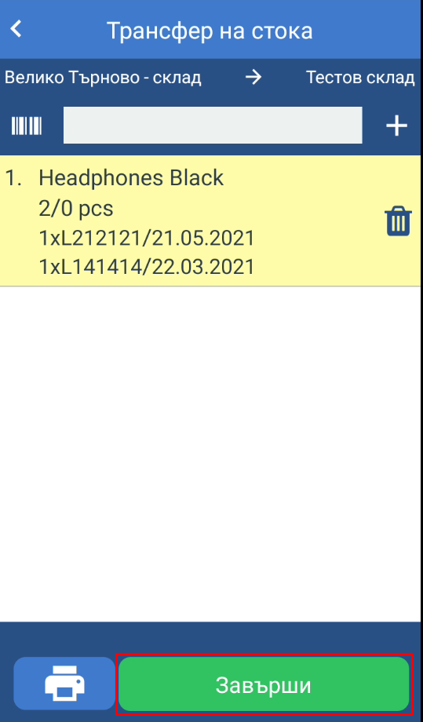
    </panel>
    <panel>
        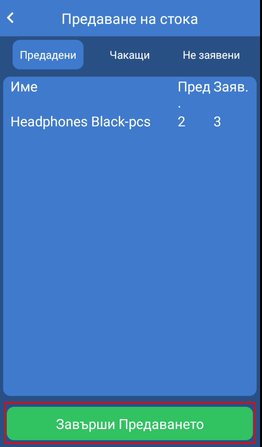
    </panel>
</split-panel>

  

По един трансфер може да се направят няколко предавания. **Когато голям обем от стока се трансферира от един склад в друг е препоръчително да се направи на няколко части за по-лесна проследимост при предаване**. Всяко следващо предаване се добавя към предишните и може да се отпечата документ с текущо предадени артикули до момента.

От списъка с трансфери може да се проверят детайли за трансфера и да се отпечата документ с предадените артикули по трансфера до момента.

<split-panel>
    <panel>
        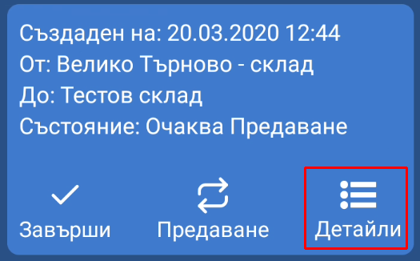
    </panel>
    <panel>
        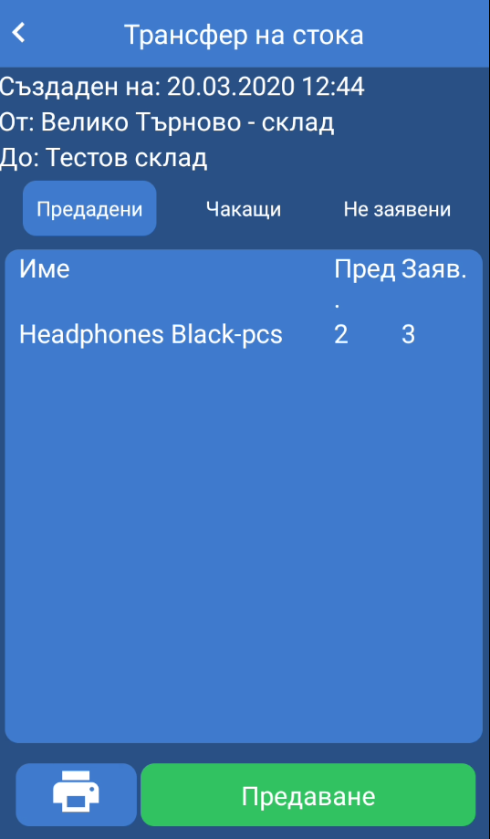
    </panel>
</split-panel>

  

След като предаването на стока е завършено напълно трансферът трябва да се завърши от бутон *Завърши* от списъка с трансфери.

<split-panel>
    <panel>
        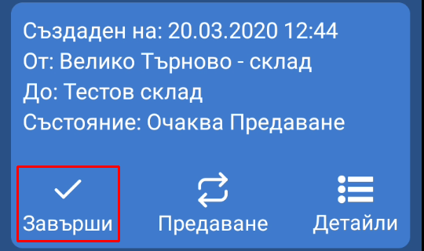
    </panel>
    <panel>
        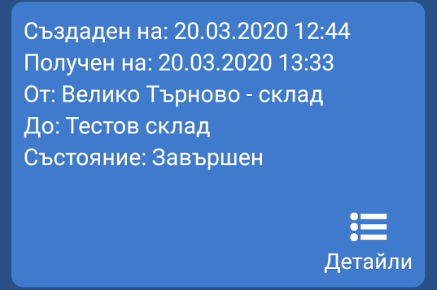
    </panel>
</split-panel>

  